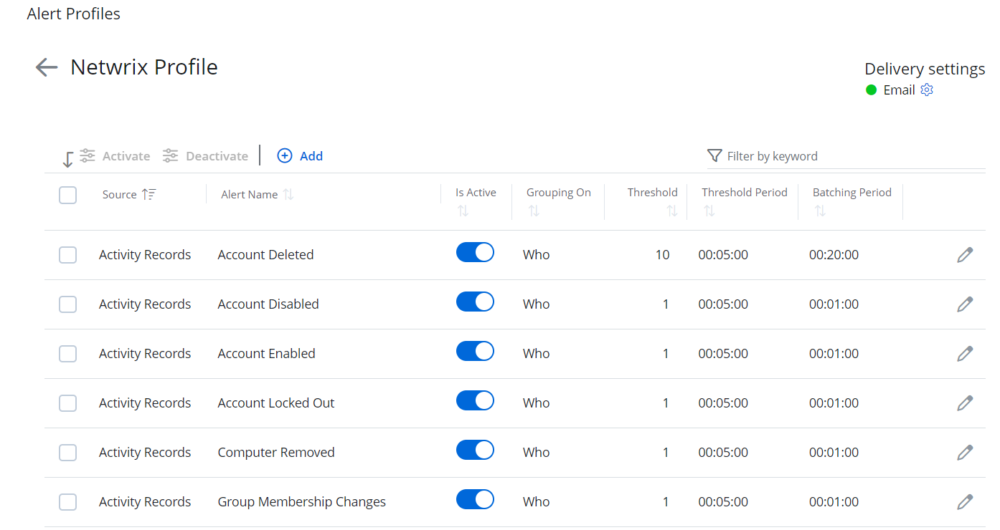
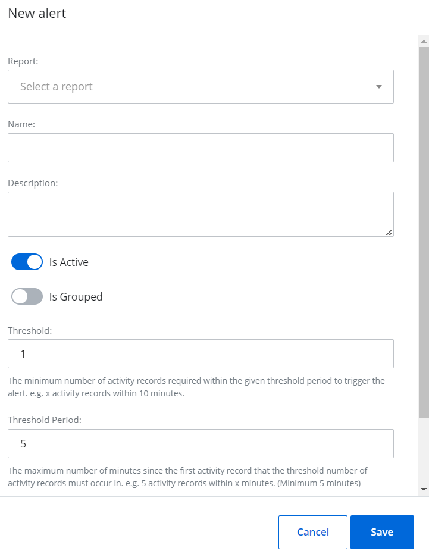

Filter: 

* All Files

Submit Search

# Alerts

When you create an alert profile, several alerts are preconfigured for it. You can, however, choose to enable or disable them as well as add custom alerts to the profile. These alerts are triggered by specific events. This means that when the defined action (event) is detected within the organization the alert profile is assigned to, an alert is generated. Alerts notify you of critical actions that impact your organization's security, enabling you to respond swiftly to potential risks.

You can access the generated alerts in the following ways:

* View the alerts generated for an organization on the Netwrix 1Secure dashboard. See the [1Secure Dashboard](../Dashboard/Overview "1Secure Dashboard") topic for additional information.
* Receive alerts as email notifications sent to the specified email address(es). See the [Manage Delivery Settings for an Alert Profile](Overview#Manage "Manage Delivery Settings for an Alert Profile") topic for setting up email notifications.

Follow the steps to view the alerts within an alert profile.

**Step 1 –** Navigate to Configuration > Alerts.

**Step 2 –** Click an alert profile. The alerts for the profile are displayed in a list.

You can view the following for each alert in the list:

* Source – Indicates the origin or type of data that triggers the alert. For example, Activity Records.
* Alert Name – The name of the alert
* Is Active – Indicates whether the alert is activated. You can toggle it ON or OFF as required.
* Grouping On – Indicates whether grouping is applied to the alert. If yes, then it displays the criteria, such as What, Who, Where, etc.
* Threshold – The threshold value set for the alert. The threshold is the minimum number of activity records that must occur within a specified time frame (threshold period) to trigger an alert.
* Threshold Period – The threshold period set for the alert. The threshold period is the maximum duration, starting from the first activity record, within which the specified number of activity records (threshold) must occur to trigger an alert.
* Batching Period – The batching period set for the alert. The batching period feature allows you to receive a single notification that includes all alerts triggered during the specified period.

## Add a Custom Alert

Follow the steps to add a custom alert.

**Step 1 –** Navigate to Configuration > Alerts.

**Step 2 –** Click an alert profile. The alerts for the profile are displayed in a list.

**Step 3 –** Click **Add**. The New Alert pane is displayed.

**Step 4 –** Select a custom report from the Report drop-down menu to trigger the alert when a new record is generated for the report. See the  [Custom Reports](../SearchAndReports/CustomReports "Custom Reports") topic for additional information.

**Step 5 –** Specify a name and description for the alert.

**Step 6 –** Toggle the **Is Active** switch to ON to activate the alert. Notifications are sent for active alerts only.

**Step 7 –** Toggle the **Is Grouped** switch to ON, which displays the Grouped On drop-down menu. When grouping is enabled, alerts are organized based on the criteria you select in the *Grouped On* drop-down menu.

**Step 8 –** Select one of the following options from the **Grouped On** drop-down menu:

* Who – Groups alerts with respect to the user who performed the activity (deleted an account, created a record, etc.)
* Where – Groups alerts with respect to the location where the activity is performed. For example, SharePoint Online site, file server, etc.
* What – Groups alerts with respect to the object the activity is performed on, such as a computer, file, etc.

Example: You have two users, User 1 and User 2, each performing different actions. By setting "Grouped On" to "Who", alerts will be generated per user, resulting in two separate alerts — one for User 1 and another for User 2. Each alert will include only the activity associated with that specific user. If grouping is not enabled, all activities will be consolidated into a single alert based on the specified *threshold* and *threshold period*.

**Step 9 –** In the Threshold field, specify a threshold for the alert. The threshold is the minimum number of activity records that must occur within a specified time frame (threshold period) to trigger an alert. For example, if the threshold is set to 3, an alert will be triggered when at least 3 activity records are generated within the specified time frame.

**Step 10 –** In the Threshold Period field, specify a threshold period for the alert. The threshold period is the maximum duration, starting from the first activity record, within which the specified number of activity records (threshold) must occur to trigger an alert. For example, if the threshold is set to 5 and the threshold period is 10 minutes, at least 5 activity records must be generated within 10 minutes to trigger an alert.

**Step 11 –** If you do not want alert notifications to be sent to you each time an alert is generated, there is a batching period option. In the Batching Period field, specify a batching period for the alert. The batching period feature allows you to receive a single notification that includes all alerts triggered during the specified period. For example, if the batching period is set to 30 minutes (00:30:00) for an alert such as "Computer removed," you will receive a single notification for the alerts generated during that time frame, rather than receiving individual notifications for each alert.

**Step 12 –** Click **Save**.

The alert is configured and added to the list.

## Modify an Alert

Follow the steps to modify a preconfigured or custom alert.

**Step 1 –** Navigate to Configuration > Alerts.

**Step 2 –** Click an alert profile. The alerts for the profile are displayed in a list.

**Step 3 –** Click the **Edit** icon for an alert. The Edit alert pane is displayed.

**Step 4 –** Modify the required information. See the [Add a Custom Alert](#Adding "Add a Custom Alert") topic, starting from Step 4 for additional information.

**Step 5 –** Click **Save**.

## Delete a Custom Alert

Follow the steps to delete a custom alert.

**Step 1 –** Navigate to Configuration > Alerts.

**Step 2 –** Click an alert profile. The alerts for the profile are displayed in a list.

**Step 3 –** Click the **Delete** icon for an alert to delete it. A dialog box is displayed, prompting you to confirm the deletion of the alert.

**Step 4 –** Click **Yes**. The alert is deleted from the system.