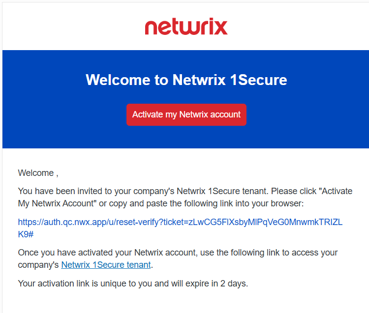
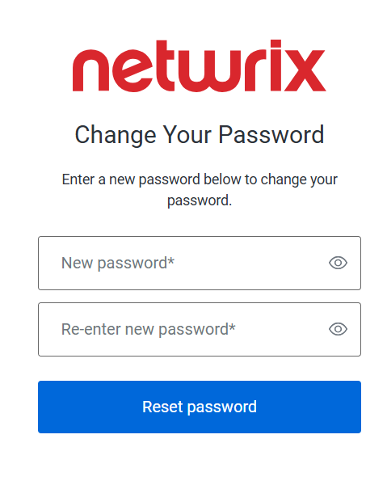
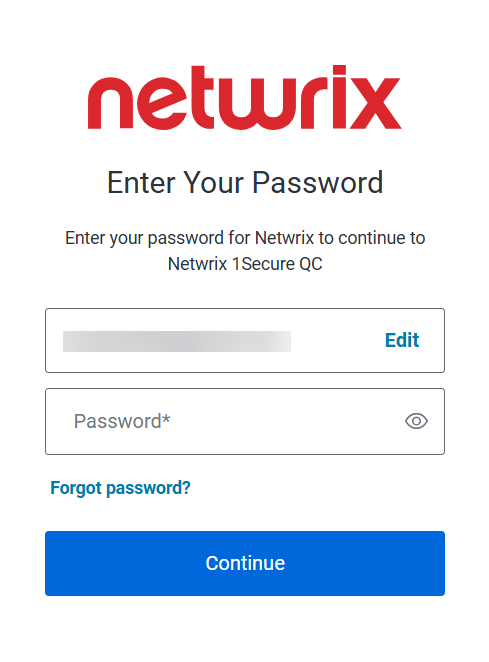
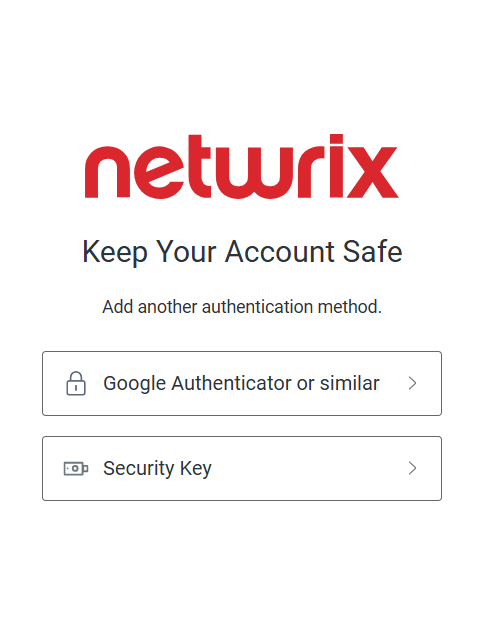

Filter: 

* All Files

Submit Search

# First Login to 1Secure

This topic describes how an MSP can access the 1Secure tenant for the first time, activate their account, and complete the initial login. After logging in, the MSP can add users to the tenant and assign them roles based on the required access levels.

When the Netwrix team adds a new user account for your organization, you will receive an email invitation. This email will be sent from "noreply-account@netwrix.com" and will have the subject "Welcome to Netwrix 1Secure".

This email includes a unique access link to product’s web portal. You need to activate your account via the link within 2 days. If it expires, you will need to follow the link and request a new activation link.

## Activate an Account

Follow the steps to activate an account:

**Step 1 –** Open the invitation email and do one of the following:

* Click the **Activate my Netwrix account** button
* Click the account activation link included in the email.

The Change Your Password page is displayed.

**Step 2 –** In the **New password** field, enter a password to set for your account.

**Step 3 –** In the **Re-enter new password** field, enter the same password again to confirm.

**Step 4 –** Click the **Reset Password** button. The account is now activated, and your password has been set.

Once you have set your account password, log in to 1Secure with your credentials. See the [Log In](#Log "Log In") topic for additional information.

## Log In

Follow the steps to log in to 1Secure.

**Step 1 –** Open the invitation email and click the Netwrix 1Secure tenant link. You are navigated to the 1Secure login page.

**Step 2 –** On the login page, click the **Log In** button.

**Step 3 –** In the Email address field, specify a valid email address registered with 1Secure, then click **Continue**. The Enter Your Password page is displayed.

**Step 4 –** In the Password field, specify the valid password for the email address, then click **Continue**. The Keep Your Account Safe page is displayed, prompting you to choose an authentication method. When logging in for the first time, you must authorize your account using multi-factor authentication.

**Step 5 –** Click **Google Authenticator or Similar** or **Security Key** to select an authentication method. After that, one of the following happens:

* If you selected Google Authenticator or Similar option, you will be navigated to Secure Your Account page. Scan the QR code using your preferred authenticator app and then enter the provided one time code in the **Enter one time code** field. See the documentation of your authenticator app for additional information.
* If you selected Security Key option, you will be navigated to the Adding Your Security Key page. See the [Set up a security key as your verification method](https://support.microsoft.com/en-us/account-billing/set-up-a-security-key-as-your-verification-method-2911cacd-efa5-4593-ae22-e09ae14c6698 "Set up a security key as your verification method") article for additional information.

After successful authorization, You are redirected to the dashboard. See the [1Secure Dashboard](../Dashboard/Overview "1Secure Dashboard") topic for additional information.

Once the initial login is completed, an MSP can configure Single Sign On (SSO) using supported authentication services, including Entra ID, 1Secure Authentication, or OpenID Connect. See the [SSO Configuration with Authentication Services](SSO#SSO "SSO Configuration with Authentication Services") topic for additional information.

## Reset Password

Follow the steps to reset the password of an account:

**Step 1 –** Navigate to the company's login page.

**Step 2 –** On the login page, click the **Log In** button.

**Step 3 –** In the Email address field, specify a valid email address registered with 1Secure, then click **Continue**. The Enter Your Password page is displayed.

**Step 4 –** Click the **Forgot password** link. The Change Your Password page is displayed.

**Step 5 –** In the **New password** field, enter a password to set for your account.

**Step 6 –** In the **Re-enter new password** field, enter the same password again to confirm.

**Step 7 –** Click the **Reset Password** button. The password of the account has been reset.

Once you have reset your account password, log in to 1Secure with your new credentials.