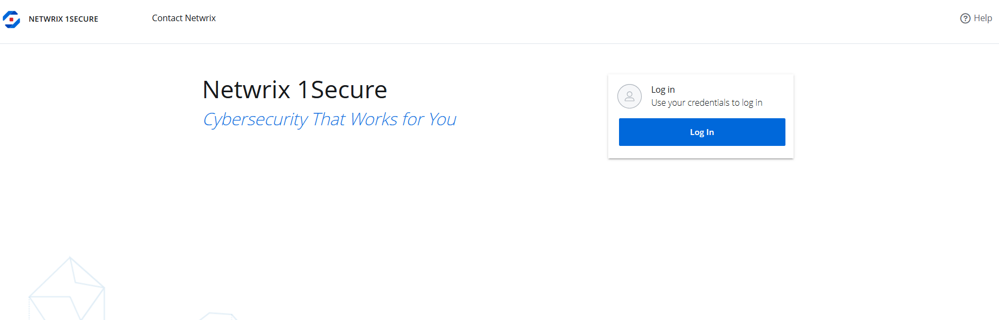
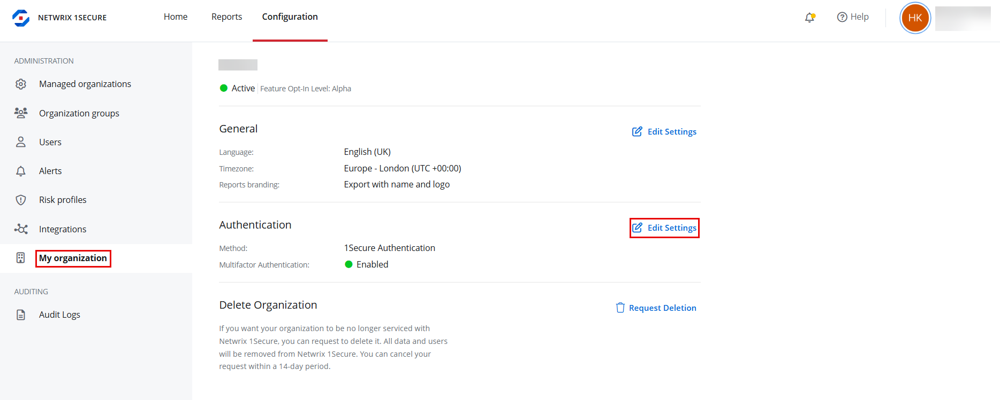
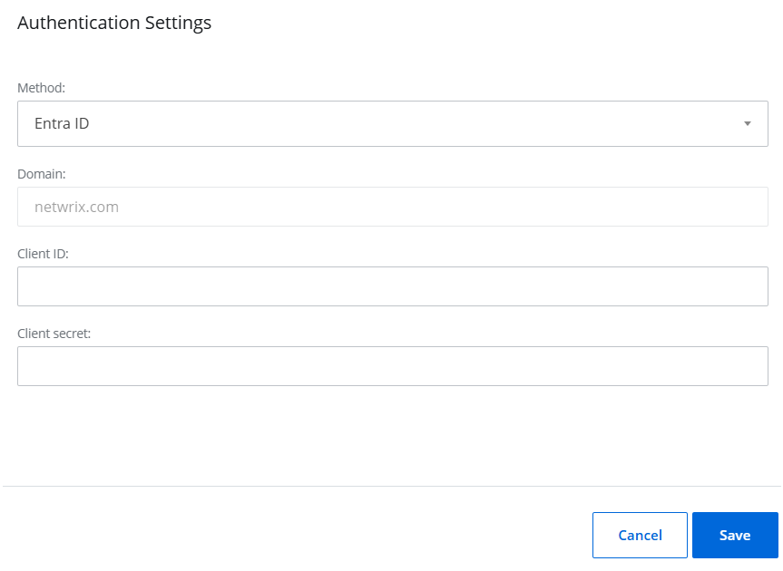
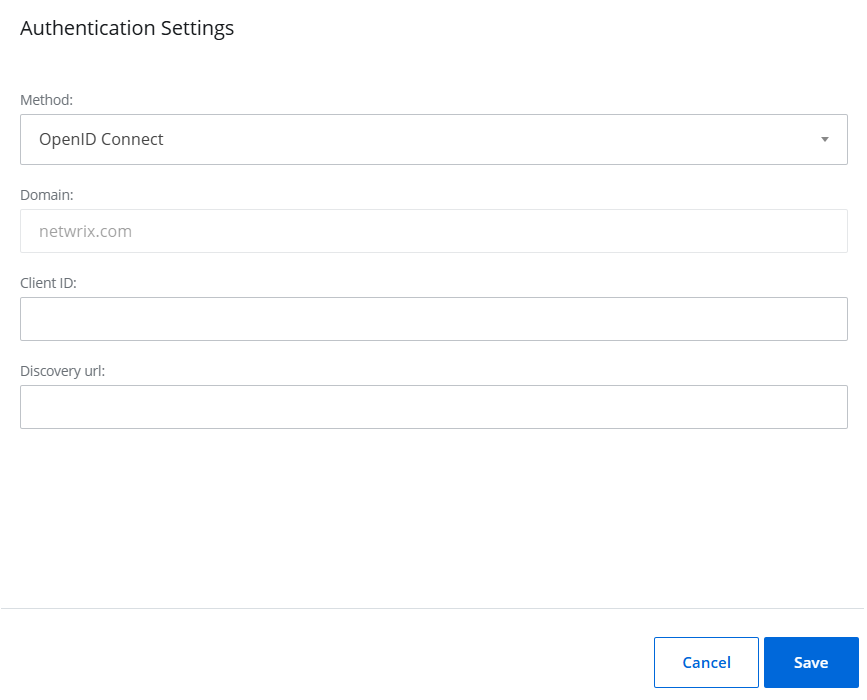

Filter: 

* All Files

Submit Search

# Single Sign On

Single Sign On (SSO) is a powerful authentication process that enhances security and improves user experience by allowing users to access multiple applications with a single set of login credentials. Single Sign On (SSO) allows you to log in to 1Secure using Microsoft Entra ID or Open ID Connect credentials. It enhances the user experience by enabling access with existing organizational credentials.

## Log In Through Single Sign On

Users can log in to the 1Secure tenant using Single Sign On (SSO) if their accounts are added to the authentication provider configured for the tenant. For example, if Microsoft Entra ID is configured as the authentication provider and its users are added to 1Secure, they can log in to the 1Secure tenant with their Microsoft Entra ID credentials.

When the Netwrix team adds a new user account for your organization, you will receive an email invitation. This email will be sent from "noreply-account@netwrix.com" and will have the subject "Welcome to Netwrix 1Secure".

.png "1Secure Invitation Email")

**Step 1 –** Click **Access 1Secure** button in the invitation email. You are navigated to the 1Secure login page.

**Step 2 –** On the login page, click the **Log In** button.

**Step 3 –** In the Email address field, specify a valid email address registered with 1Secure, then click **Continue**. Based on your authentication status, one of the following will occur:

* If you are logged out of your authentication provider, you will be redirected to the authentication provider's login page. For example, if you are using Microsoft Entra ID, you will be redirected to the Microsoft Entra ID login page. Authenticate using your credentials. After successful authentication, you will be logged in to 1Secure.
* If you are already logged in to your authentication provider, then you will be directly logged in to 1Secure application.

## SSO Configuration with Authentication Services

To enable Single Sign-On (SSO) for tenant users, an MSP must configure SSO using one of the following authentication services:

* [Configure SSO with Microsoft Entra ID Authentication](#Configur "Configure SSO with Microsoft Entra ID Authentication")
* [Configure SSO with OpenID Connect Authentication](#Configur2 "Configure SSO with OpenID Connect Authentication")

**NOTE:** When you first log in to 1Secure, SSO is not enabled, and 1Secure Authentication is applied by default. This method requires Multi-factor authentication (MFA) to verify your identity for secure access. See the [Log In](LogIn#Log "Log In") topic for additional information on Multi-factor authentication.

### Configure SSO with Microsoft Entra ID Authentication

Follow the steps to configure SSO with Microsoft Entra ID authentication.

**Step 1 –** Click **Configuration** in the top bar. The Managed organizations page is displayed, that lists the managed organizations defined in 1Secure.

**Step 2 –** In the left pane, click **My organization**. The My organization page is displayed

**Step 3 –** Under Authentication section, click **Edit Settings**. The Authentication settings pane is displayed.

**Step 4 –** In Method drop-down menu, select **Entra ID**.

**Step 5 –** In Client ID field, specify the client ID of the app registered in Microsoft Entra ID. See the [Register an App in Microsoft Entra ID For Authentication](#Step1 "Register an App in Microsoft Entra ID For Authentication") topic for additional information.

**Step 6 –** Click **Save**. The Single Sing-On (SSO) is configured with Microsoft Entra ID authentication.

### Configure SSO with OpenID Connect Authentication

Follow the steps to configure SSO with OpenID Connect authentication.

**Step 1 –** Click **Configuration** in the top bar. The Managed organizations page is displayed, that lists the managed organizations defined in 1Secure.

**Step 2 –** In the left pane, click **My organization**. The My organization page is displayed

**Step 3 –** Under Authentication section, click **Edit Settings**. The Authentication settings pane is displayed.

**Step 4 –** In Method drop-down menu, select **OpenID Connect**.

**Step 5 –** In Client ID field, specify the client ID of the OpenID application that 1Secure uses to communicate with the OpenID provider.

**Step 6 –** In Discovery url field, specify the Discovery URL of the OpenID application.

**Step 7 –** Click **Save**. The Single Sign On (SSO) is configured with OpenID Connect authentication.

### Register an App in Microsoft Entra ID For Authentication

To configure Single Sign On (SSO) with Microsoft Entra ID authentication, register an application in the Microsoft Microsoft Entra ID by following the steps mentioned below.

**Step 1 –** Sign in to the [Microsoft Entra admin center](https://entra.microsoft.com/ "Microsoft Entra admin center").

**Step 2 –** On the left navigation menu, navigate to **Identity** > **Applications** > **App registrations** page.

**Step 3 –** On the App registrations page, click **New registration** in the top toolbar. The Register an application page is displayed.

**Step 4 –** Specify the following information on the Register an application page:

* Name – Enter a user-facing display name for the application, for example, Netwrix 1Secure Entra ID
* Supported account types – Select **Accounts in this organizational directory only**
* Platform – Select the **Web** platform in the drop-down menu
* Redirect URL (optional) – Enter **https://auth.netwrix.com/login/callback**

**Step 5 –** Click **Register**.

The Overview page for the newly registered application opens. The following settings of the registered application are required while configuring Single Sign on (SSO) with Entra ID in 1Secure. It is recommended to copy these settings and keep them safe.

* Application (client) ID – A client ID for the registered application
* Directory (tenant) ID – A tenant ID for the registered application
* Client Secret – A client secret value generated when a new client secret key is created for the registered application. See the [Generate Client Secret Value](../../Configuration/EntraID/RegisterConfig#Generate "Generate Client Secret Value") topic for additional information.