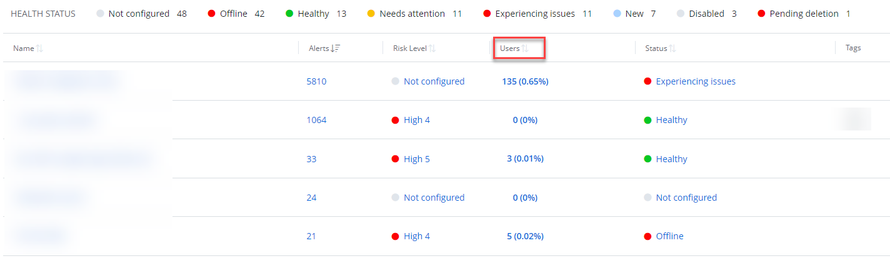
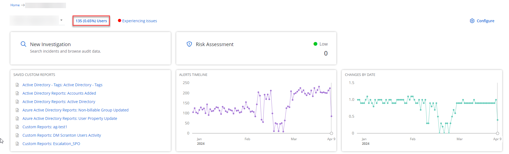

Filter: 

* All Files

Submit Search

# Billable Accounts

Netwrix 1Secure provides an information on the billable accounts – the enabled Active Directory/Microsoft Entra ID (formerly Azure AD) accounts for your organization. You can review these accounts (in numbers and percentage from total numbers of served users) in the Users column on the main dashboard of your Home page.

**NOTE:** To view the numbers of the column, your organization should add the Active Directory/Microsoft Entra ID sources and connectors.

You can review the Active Directory/Microsoft Entra ID users on the following dashboards:

* Managing Organization

* Managed Organization

You can also review the Billable Users reports with the detailed information for each account. See the [Billable Users Report](../SearchAndReports/BillableUsers "Billable Users Report") topic for additional information.

## Calculation of the Numbers

Netwrix 1Secure calculates and dedupes the users that are synced across AD and Microsoft Entra ID.

The system calculates:

* a total number of on-prem AD users
* a total number of Microsoft Entra ID native users (not synced with on-prem)
* a total number of synced users from on-prem Microsoft Entra ID (or hybrid users)

The number of synced users from on-prem is registered against the on-prem tenant reference. Netwrix 1Secure uses the highest number out of on-prem users reported by the Agent and the number of hybrid users reported by the Microsoft Entra ID connector as the on-prem total. Then the Microsoft Entra ID users, which are not synced with on-prem envinronment, are added.

**Example:**

|  |  |  |
| --- | --- | --- |

| Company has: | The numbers provided to Netwrix 1Secure: | The numbers given by Netwrix 1Secure in the app: |
| **On-prem AD**: 200 users | **Agent**  On-prem: 200 | User Counts  **On-prem**: Max (200, 150) = 200 |
| **Microsoft Entra ID**: 250 users (150 users synced from on-prem + 100 Azure AD only users) | **Microsoft Entra ID**  o 150 from on-prem domain  o 100 Azure AD | **Microsoft Entra ID**: 100 |
|  |  | **Total**: 300 |

The percentage is calculated as follows:

percentage = users calculated in the environment / users for which the license is purchased

## Omits From the Accounts

The accounts with the following attributes are not counted against a total number of Active Directory accounts by default:

* \*\System\Policies\{\*}\*
* \*\Configuration\Deleted Objects\CRUpdate\*
* \*\Configuration\LostAndFoundConfig\*
* \*System\BCKUPKEY\\*
* \*System\IP Security\\*
* \*System\FileLinks\VolumeTable\\*
* \*\Deleted Objects\*
* \*\Configuration\Extended-Rights\ms-Exch-\*
* \*\Microsoft Exchange System Objects\SystemMailbox\*
* \*\HealthMailbox\*

You can also exclude service accounts from your billable accounts. To do this, add these accounts to an Azure Group or Active Directory Organizational Unit respectively and specify it in the source settings. See the [Add a Source and Connectors for Microsoft Entra ID](SourcesAndConnectors/EntraID "Add a Microsoft Entra ID Source and Connectors") or [Add a Source and Connectors for Active Directory](SourcesAndConnectors/ActiveDirectory "Add an Active Directory Source and Connectors") topics for additional information.