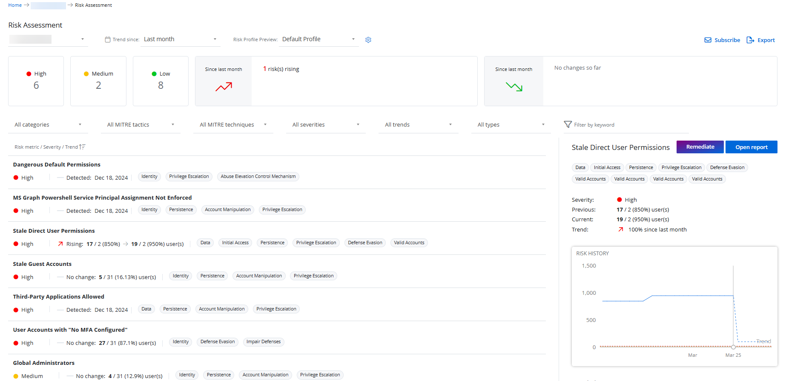
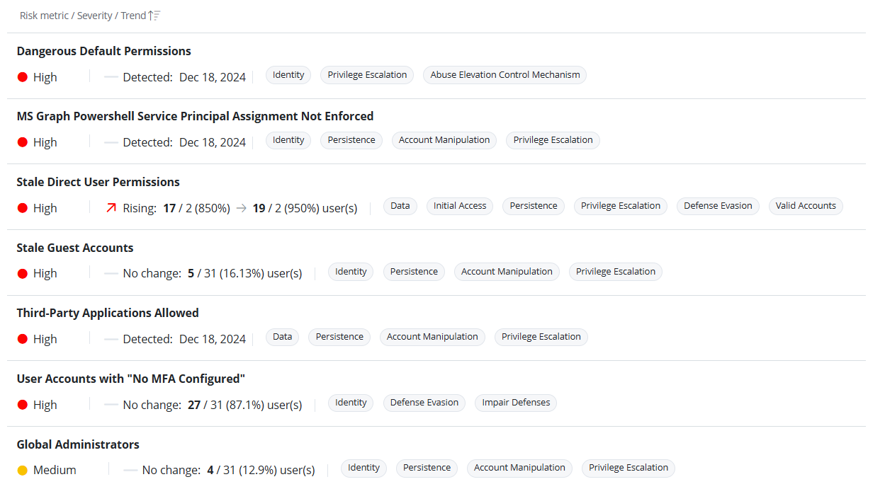
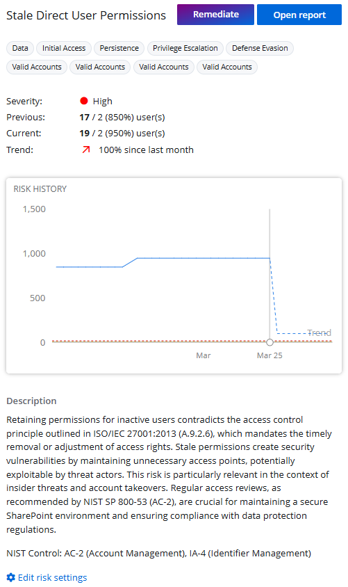
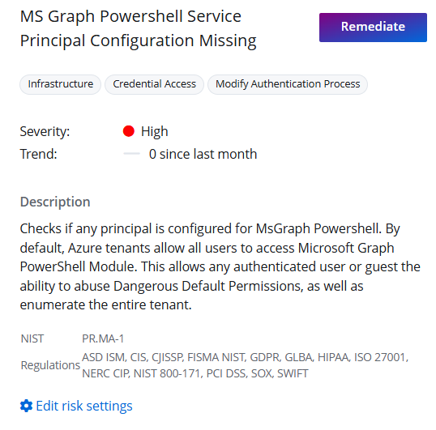
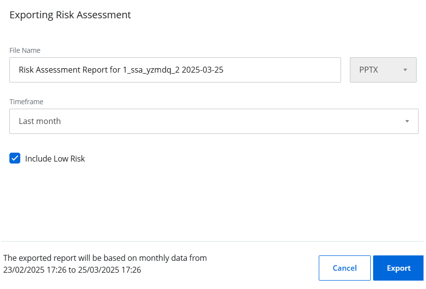

Filter: 

* All Files

Submit Search

# Risk Assessment Dashboard

The Risk Assessment dashboard is designed as a diagnostic tool for Managed Service Providers (MSPs) and managed organization users to assess and monitor the security posture of an organization. By regularly reviewing this dashboard, you can get a comprehensive view of the security risks for an organization, track risk levels, address vulnerabilities, and ensure that your environment aligns with industry best practices and standards such as NIST.

* If you are a managing organization (MSP) user, this page provides insights for all your organizations.
* If you are a managed organization user, this page displays insights specific to your organization.

On the Risk Assessment dashboard, you can check:

* What are the security risks of this organization? Are they low, medium, or high?
* How has the risk posture changed over time? Has the organization’s security position improved or worsened compared to the previous week, month, or quarter?
* Does your organization's security posture aligns with security frameworks like NIST?

*Remember,* each organization has a risk profile associated with it and the risk analysis of an organization is based on the metrics included in the risk profile. See the [Manage Risk Profiles](RiskProfiles "Manage Risk Profiles") topic for additional information.

## View the Risk Assessment Dashboard

To access the Risk Assessment dashboard, click **Home** at the top. On the 1Secure dashboard, do one of the following:

* On the Top 5 Organizations at Risk chart, click an organization. It opens the Risk Assessment dashboard that displays risk-related data for the organization .
* In the organizations list, click the risk value for an organization. It opens the Risk Assessment dashboard that displays risk-related data for the organization.
* In the organizations list, click an organization name to navigate to the Organization Statistics page, then click the Risk Assessment card. It opens the Risk Assessment dashboard that displays risk-related data for the organization.

## Filter Data

Multiple filters are available on this page to enable you to filter data as desired. You can apply one or more filters at a time.

* Organizations – Select an organization from the drop-down menu located at the top left of the dashboard. This option is only available to managing organization (MSP) users.
* Trend since – Select a time period from this drop-down menu to view the risk-related data for that period. For example, if you select Last week, the data will reflect information for the last week. By default, Last month is selected. Options are:

  * Last week
  * Last month
  * Last 3 months
* Risk profile preview – Select a risk profile from the Risk profile preview drop-down menu

Card Filters

The following cards are available for filtering data:

* High – This card displays the number of high severity risks detected for the organization. Click it to view only the high severity risks on this page.
* Medium – This card displays the number of medium severity risks detected for the organization. Click it to view only the medium severity risks on this page.
* Low – This card displays the number of low severity risks detected for the organization. Click it to view only the low severity risks on this page.
* Since  (upward red arrow) – This card displays the following statistics for the risks that have increased during the time period selected in the Trend since drop-down menu.

  *  risks rising – Displays the number of risks that have increased during the time period selected in the Trend since drop-down menu
  *  more high – Displays the number of risks that have escalated to high severity during the time period selected in the Trend since drop-down menu
  *  more medium – Displays the number of risks that have escalated to medium severity during the time period selected in the Trend since drop-down menu
  * No change so far – Indicates that there has been no change to the risk data during the time period selected in the Trend since drop-down menu
* Since  (downward green arrow) – This card displays the following statistics for the risks that have decreased during the time period selected in the Trend since drop-down menu.

  *  risks falling – Displays the number of risks that have decreased during the time period selected in the Trend since drop-down menu
  *  less high – Displays the number of risks whose severity has decreased from high during the time period selected in the Trend since drop-down menu
  *  less medium – Displays the number of risks whose severity has decreased from medium during the time period selected in the Trend since drop-down menu
  * No change so far – Indicates that there has been no change to the risk data during the time period selected in the Trend since drop-down menu

Drop-down Menu Filters

The following drop-down menus are available for filtering data:

* Category – Select a category from the drop-down menu. The Risks list is filtered to display risk metrics that belong to the selected category. The risk profile associated with the organization includes risk metrics, and each metric is assigned a category. By default, *All Categories* is selected. Other options are:

  * Data
  * Identity
  * Infrastructure
* MITRE tactics – Select an MITRE tactic from the drop-down menu to view the risks that belong to it. The MITRE tactic options may vary based on the selected organization.
* MITRE techniques – Select an MITRE technique from the drop-down menu to view the risk that belong to that technique. By default, All MITRE techniques is selected. The MITRE technique options may vary based on the selected organization.
* Severity – Select a risk severity level from the drop-down menu to view the risks that fall under it. By default, All severities is selected. Other options are:

  * High
  * Medium
  * Low

  You can also click a card (High, Medium, Low) to filter the risks based on a severity level.
* Trend – Select a risk trend from the drop-down menu to view the risks for that trend. By default, All trends is selected. Other options are:

  * Upwards
  * Downwards
* Type – Select a risk type from the drop-down menu to view the risks of that type. By default, All types is selected. Other options are:

  * Enumerated – Risks that are evaluated in numbers or percentages, for example, the number of inactive accounts
  * Boolean – Risks that are evaluated based on a true/false condition. For example, if a third party application is not allowed and the system does not detect any, the risk level will be low. However, if the system detects one, the severity level will be high or medium as configured.
* Filter by keyword – Type a search string in the Filter by keyword field. Risk names containing the string are displayed as you type.

## View the Risks List

The Risk Assessment dashboard provides a list of risks detected for an organization based on the applied filters.

*Remember,* each risk is basically a metric included in the risk profile associated with the organization. See the [Risk Metrics List](Metrics List "Risk Metrics List") topic for details on each of the risk metrics.

Risks are categorized into two types:

* Enumerated – Risks that are evaluated in numbers or percentages, for example, the number of inactive accounts
* Boolean – Risks that are evaluated based on a true/false condition. For example, if a third party application is not allowed and the system does not detect any, the risk level will be low. However, if the system detects one, the severity level will be high or medium as configured.

In the Risks list, the information displayed for each risk varies depending on its type – enumerated or Boolean.

Enumerated Risks

The Risks list displays the following information for enumerated risks:

* Severity – Displays the risk's severity level, which can be High, Medium, or Low
* Trend – Indicates how the risk level has changed over the selected time period. The trend can be Rising, Falling, or No change
* Previous – Displays the risk’s value at the beginning of the selected time period. For example, if the selected period is 1 month and the previous value for inactive user accounts is 5/31 (16.13%), it means that one month ago, 5 inactive user accounts were detected out of 31 total user accounts, and the percentage of inactive user accounts was 16.13%.
* Current value – Displays the most recent value of the risk based on the latest data. For example, if the selected period is 1 month and the current value for inactive user accounts is 26/31 (83.87%), it means there are currently 26 inactive user accounts out of 31 total user accounts, and the percentage of inactive user accounts is 83.87%.
* Tags – Displays the tags that indicate the risk's category, MITRE tactics, and MITRE techniques

Boolean Risks

The Risks list displays the following information for Boolean risks:

* Severity – Displays the risk's severity level, which can be High, Medium, or Low
* Status – Indicates whether the risk is detected or not detected
* Tags – Displays the tags that indicate the risk's category, MITRE tactics, and MITRE techniques

## View Risk Details

The Risk Assessment dashboard provides detailed information about each risk faced by your organization, including the risk name, severity level, tags, risk history graph, and more. You can also review the measure of the risk - "%" (percentage) or "k" (thousands).

On the Risk Assessment dashboard, click a risk in the Risks list; its details are displayed in the left pane.

Enumerated Risk Details

The left pane displays the following details for an enumerated risk:

* Name – The name of the risk, for example, Stale Direct User Permissions

* Tags – Displays the tags that indicate the risk's category, MITRE tactics, and MITRE techniques
* Severity – Displays the risk's severity level, which can be High, Medium, or Low
* Previous – Displays the risk’s value at the beginning of the selected time period. For example, if the selected period is 1 month and the previous value for inactive user accounts is 5/31 (16.13%), it means that one month ago, 5 inactive user accounts were detected out of 31 total user accounts, and the percentage of inactive user accounts was 16.13%.
* Current value – Displays the most recent value of the risk based on the latest data. For example, if the selected period is 1 month and the current value for inactive user accounts is 26/31 (83.87%), it means there are currently 26 inactive user accounts out of 31 total user accounts, and the percentage of inactive user accounts is 83.87%.
* Trend – Indicates how the risk level has changed over the selected time period. The trend can be Rising, Falling, or No change.
* Risk History – This section displays a line chart illustrating the risk's value (in number or percentage) during the selected time period. Hover over the graph to view the exact value (in number or percentage) for a risk on any specific date.  
  This chart consists of the following lines:

  * Blue line – Indicates the risk's value at any specific date
  * Red line – Indicates the minimum value of the high risk threshold set for the risk metric
  * Yellow line – Indicates the minimum value of the medium risk threshold set for the risk metric
* Description – A description of the risk metric
* NIST Regulations – Displays the NIST regulation names associated with the risk metric
* Open Report – Click this button to navigate to the State In Time Risk Reports page, where you can view a detailed report for that risk metric. See the [State In Time Risks Reports](../SearchAndReports/StateInTime "State In Time Risks Reports") topic for additional information.
* Remediate – On clicking this button, the Remediate  pane is displayed, which provides AI-generated step-by-step guidance to help you remediate the risk.
* Edit risk settings – Click this link to navigate to the Risk Profiles page where you can manage the risk profiles. See the [Manage Risk Profiles](RiskProfiles "Manage Risk Profiles") topic for additional information.

Boolean Risk Details

The left pane displays the following details for a Boolean risk:

* Name – The name of the risk
* Tags – Displays the tags that indicate the risk's category, MITRE tactics, and MITRE techniques
* Severity – Displays the risk's severity level, which can be High, Medium, or Low
* Trend – Indicates how the risk level has changed over the selected time period. The trend can be Rising, Falling, or No change.

  Description – A description of the risk metric
* NIST Regulations – Displays the NIST regulation names associated with the risk metric
* Remediate – On clicking this button, the Remediate  pane is displayed, which provides AI-generated step-by-step guidance to help you remediate the risk.
* Edit risk settings – Click this link to navigate to the Risk Profiles page where you can manage the risk profiles. See the [Manage Risk Profiles](RiskProfiles "Manage Risk Profiles") topic for additional information.

## Export a Risk Assessment Report for an Organization

You can export a managed organization's risk-related data to a report for easier review. The exported report is sent to you as a .PPTX file by email.

Follow the steps to export a report.

**Step 1 –** 
On the Risk Assessment dashboard, select an organization from the drop-down menu to view its risk-related data. An organization is selected by default, but you can choose a different one if needed.

**Step 2 –** Click **Export** in the upper right corner; the Exporting Risk Assessment pane is displayed.

**Step 3 –** In the **File Name** field, specify the name of the file the intended recipient(s) will receive. The default name is: Risk Assessment Report for  . For example, Risk Assessment Report for test organization 2025-03-25

**Step 4 –** Select a time period from the Timeframe drop-down menu to export risk-related data starting from the selected point. For example, if you select Last 3 months, the report will include data from the past three months up to the current date.

You can view the export timing details in the footer of the pane.

**Step 5 –** Select the **Include Low Risks** check box to include data for low risks in your report. By default, this option is selected.

**Step 6 –** Click **Export**.

## Subscribe to a Risk Assessment Report

You can subscribe to the Risk Assessment report of a managed organization. A subscription is a regularly-scheduled report, which you can send to specific email addresses automatically, or upload it to a designated folder in SharePoint Online. See the [Subscriptions](../SearchAndReports/Subscriptions "Subscriptions") topic for additional information.

Follow the steps to subscribe to a Risk Assessment report for an organization.

**Step 1 –** 
On the Risk Assessment dashboard, select an organization from the drop-down menu to view its risk-related data. An organization is selected by default, but you can choose a different one if needed.

**Step 2 –** Click **Subscribe** in the upper right corner; the Subscription to  Risk Assessment pane is displayed. See the [Add a Subscription](../SearchAndReports/Subscriptions#Add "Add a Subscription") topic for additional information on adding a subscription, starting at Step 6. Remember to select the Include Low Risks check box if you want to include low risks in the report.