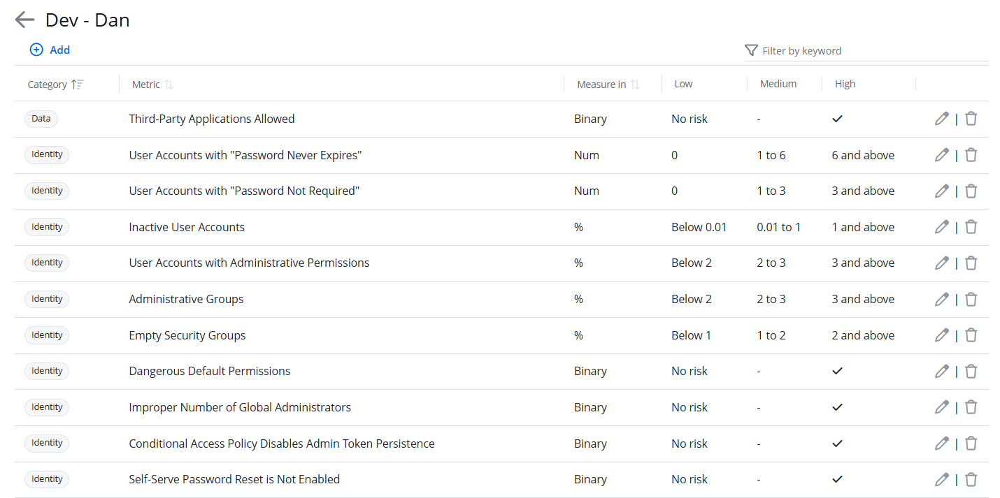
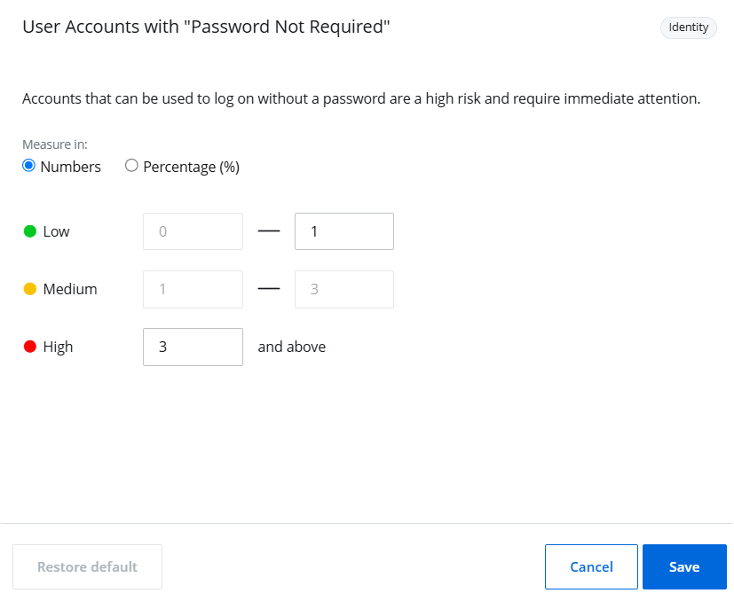
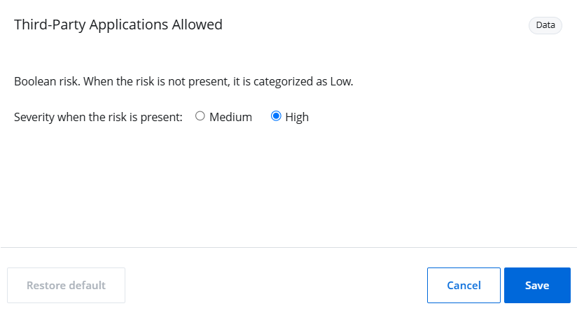
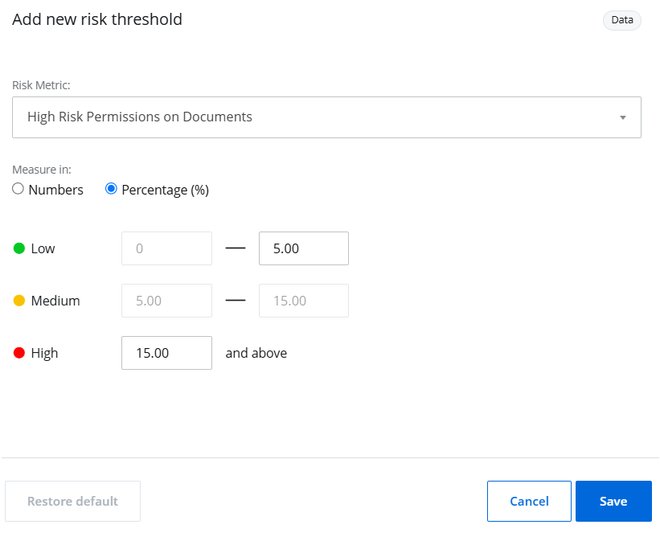
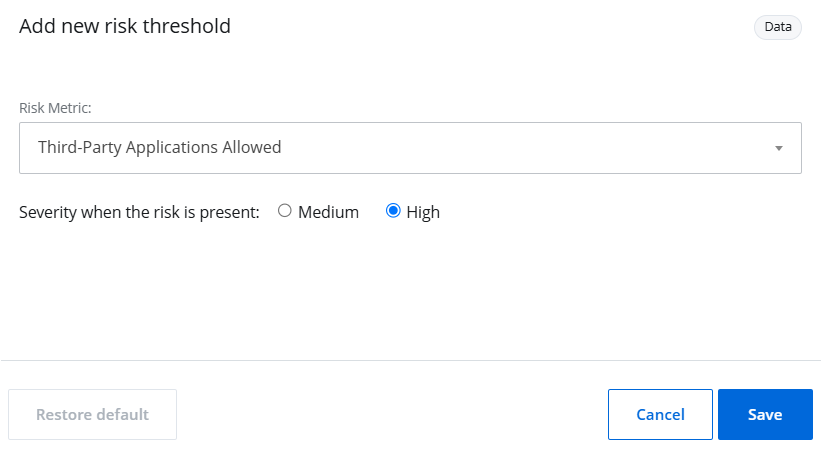

Filter: 

* All Files

Submit Search

# Manage Risk Metrics

A risk profile includes a set of risk metrics, each with preconfigured risk thresholds. A risk metric is a measurable security parameter that helps analyze potential vulnerabilities in an environment, such as disabled computer accounts, stale direct user permission, inactive user accounts, etc. When you create a risk profile, risk thresholds are preconfigured for each risk metric. You can, however, modify the thresholds for a risk metric or even remove a risk metric.

Follow the steps to view risk metrics within a risk profile.

**Step 1 –** Click **Configuration** in the top bar. The Managed organizations page is displayed, that lists the managed organizations defined in 1Secure.

**Step 2 –** In the left pane, click **Risk profiles**.The Risk profiles page is displayed.

**Step 3 –** Click a risk profile. The risk metrics for the profile are displayed in a list. See the [Risk Metrics List](Metrics List "Risk Metrics List") topic for a description of each risk metric.

You can view the following for each risk metric:

* Category – The name of the preconfigured category a risk metric belongs to, which can be Data, Identity, or Infrastructure. The State In Time Risk report generated for this metric can be found under this particular category on the Risk reports page, See the [State In Time Risks Reports](../SearchAndReports/StateInTime "State In Time Risks Reports") topic for additional information.
* Metric – The name of the risk metric. A risk metric is a measurable security parameter that helps analyze potential vulnerabilities in an environment, such as disabled computer accounts, stale direct user permission, inactive user accounts, etc.
* Measures in – The measurement type used to calculate risk thresholds for a risk metric. Measurement types are:

  * Number – Indicates that risk thresholds are calculated in absolute numbers (e.g., the number of inactive user accounts).
  * Percentage – Indicates that risk thresholds are calculated as a proportion of a total value (e.g., the percentage of user accounts with password never expires).
  * Binary – Indicates that risk level is calculated on the basis of a true/false condition ( e.g., whether third-party applications are allowed or not).
* Low – The low risk threshold for a risk metric.
* Medium – The medium risk threshold for a risk metric
* High – The high risk threshold for a risk metric

## Modify Thresholds For a Number or Percentage Risk Metric

Follow the steps to modify thresholds for a risk metric that is measured in numbers or percentage.

**Step 1 –** Click **Configuration** in the top bar. The Managed organizations page is displayed, that lists the managed organizations defined in 1Secure.

**Step 2 –** In the left pane, click **Risk profiles**.The Risk profiles page is displayed.

**Step 3 –** Click a risk profile. The risk metrics for the profile are displayed in a list.

**Step 4 –** Click the **Edit** icon for a risk metric. The  pane is displayed.

**Step 5 –** Select a measurement type to calculate risk thresholds for the metric. Options are:

* Number – Indicates that risk thresholds are calculated in absolute numbers (e.g., the number of inactive user accounts). This option is selected by default.
* Percentage – Indicates that risk thresholds are calculated as a proportion of a total value (e.g., the percentage of user accounts with password never expires).

**Step 6 –** Specify a range of values to set the low risk threshold for the metric. For example, if you set the low risk threshold for inactive user accounts to 0-3, the risk level will be considered low as long as the number of inactive user accounts remains between 0 and 3.

Follow these rules when setting the low risk threshold:

* The minimum value of the low risk threshold must be equal to 0.
* The maximum value of the low risk threshold is equal to the minimum value of the medium risk threshold.

The medium risk threshold is calculated automatically and you cannot modify it. It follows these rules:

* The minimum value of the medium risk threshold is equal to the maximum value of the low risk threshold.
* The maximum value of the medium risk threshold is equal to the minimum value of the high risk threshold.

**Step 7 –** Specify a range of values to set high risk threshold for a metric. For example, if you set the high risk threshold for inactive user accounts to 10 and above, the risk level will be considered high as long as the number of inactive user accounts exceeds 10.

Follow this rule when setting the high risk threshold:

* The minimum value of the high risk threshold is equal to the maximum value of the medium risk threshold.

**Step 8 –** (Optional) Click the **Restore default** button to reset the risk metric to its default settings. This button is enabled if the default settings have been modified.

**Step 9 –** Click **Save**.

The risk thresholds have been modified for the metric.

## Modify Severity For a Boolean Risk Metric

Some risks are evaluated based on a true/false condition. For example, if a third party application is not allowed and the system does not detect any, the risk level will be low. However, if the system detects one, the severity level will be set to medium or high, depending on what you set here.

Follow the steps to modify severity for a Boolean risk metric.

**Step 1 –** Click **Configuration** in the top bar. The Managed organizations page is displayed, that lists the managed organizations defined in 1Secure.

**Step 2 –** In the left pane, click **Risk profiles**.The Risk profiles page is displayed.

**Step 3 –** Click a risk profile. The risk metrics for the profile are displayed in a list.

**Step 4 –** Click the Edit icon for a Boolean risk metric. The  pane is displayed.

**Step 5 –** Select a severity level to apply when the risk is detected.

* High – Set the risk severity level to High
* Medium – Set the risk severity level to Medium

**NOTE:** When the risk is not detected, the severity level is automatically set to Low.

For example, if a third party application is not allowed and the system does not detect any, the risk level will be low. However, if the system detects one, the severity level will be set to medium or high, depending on what you set here.

**Step 6 –** (Optional) Click the **Restore default** button to reset the risk metric to its default settings. This button is enabled if the default settings have been modified.

**Step 7 –** Click **Save**.

The risk thresholds have been modified for the metric.

## Remove a Risk Metric From a Risk Profile

**NOTE:** When you remove a risk metric from a profile, organizations using that risk profile will no longer be assessed against this metric.

Follow the steps to remove a risk metric from a risk profile.

**Step 1 –** Click **Configuration** in the top bar. The Managed organizations page is displayed, that lists the managed organizations defined in 1Secure.

**Step 2 –** In the left pane, click **Risk profiles**.The Risk profiles page is displayed.

**Step 3 –** Click a risk profile. The risk metrics for the profile are displayed in a list.

**Step 4 –** Click the Delete icon for a risk metric to remove it. A dialog box is displayed, prompting you to confirm the removal of the metric.

**Step 5 –** Click **Delete**. The risk metric is removed from the profile.

## Add a Number or Percentage Risk Metric to a Risk Profile

If a risk metric is removed from a profile, you can add it back anytime. Re-adding the metric ensures that organizations using the profile will once again be assessed against that metric.

Follow the steps to add a risk metric to a profile.

**Step 1 –** Click **Configuration** in the top bar. The Managed organizations page is displayed, that lists the managed organizations defined in 1Secure.

**Step 2 –** In the left pane, click **Risk profiles**.The Risk profiles page is displayed.

**Step 3 –** Click a risk profile. The risk metrics for the profile are displayed in a list.

**Step 4 –** Click **Add**. The Add new risk threshold pane is displayed.

**Step 5 –** In the Risk Metric drop-down menu, select a number or percentage risk metric you want to add.

**Step 6 –** Use the Measure in option buttons to select a measurement type and specify risk thresholds for the metric. See the [Modify Thresholds For a Number or Percentage Risk Metric](#Modify "Modify Thresholds For a Number or Percentage Risk Metric") topic, starting at Step 5 for additional information.

**Step 7 –** (Optional) Click the **Restore default** button to reset the risk metric to its default settings. This button is enabled if the default settings have been modified.

**Step 8 –** Click **Save**.

The risk metric is added back to the risk profile.

### Add a Boolean Risk Metric To a Risk Profile

If a Boolean risk metric is removed from a profile, you can add it back anytime.

Follow the steps to add a risk metric to a profile.

**Step 1 –** Click **Configuration** in the top bar. The Managed organizations page is displayed, that lists the managed organizations defined in 1Secure.

**Step 2 –** In the left pane, click **Risk profiles**.The Risk profiles page is displayed.

**Step 3 –** Click a risk profile. The risk metrics for the profile are displayed in a list.

**Step 4 –** Click **Add**. The Add new risk threshold pane is displayed.

**Step 5 –** In the Risk Metric drop-down menu, select a Boolean risk metric you want to add.

**Step 6 –** Select a severity level to apply when the risk is detected.

* High – Set the risk severity level to High
* Medium – Set the risk severity level to Medium

**NOTE:** When the risk is not detected, the severity level is automatically set to Low.

**Step 7 –** (Optional) Click the **Restore default** button to reset the risk metric to its default settings. This button is enabled if the default settings have been modified.

**Step 8 –** Click **Save**.

The risk metric is added back to the risk profile.