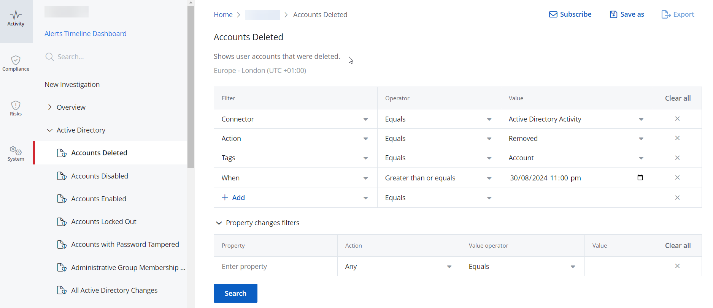
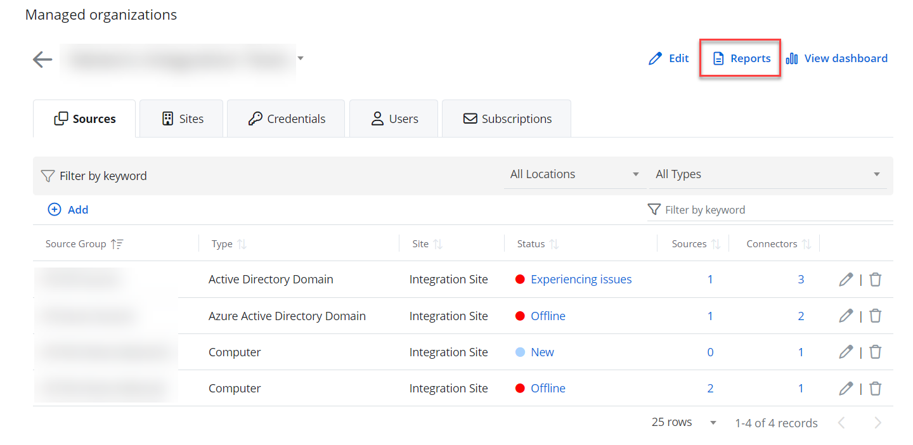
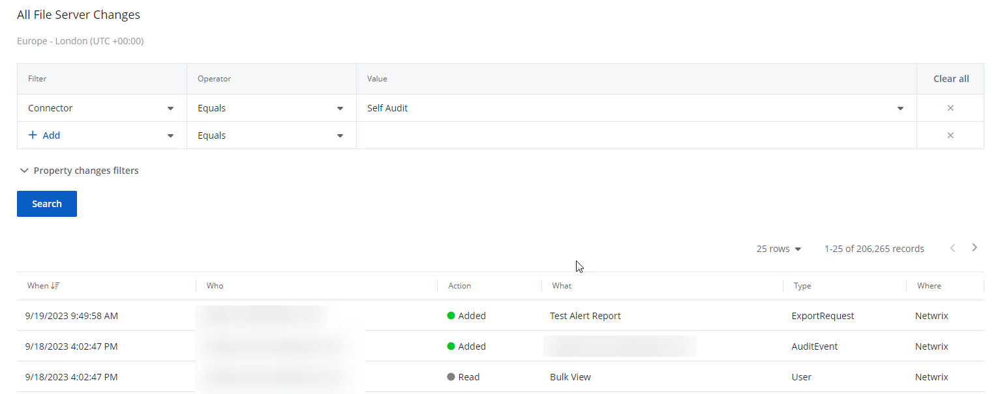
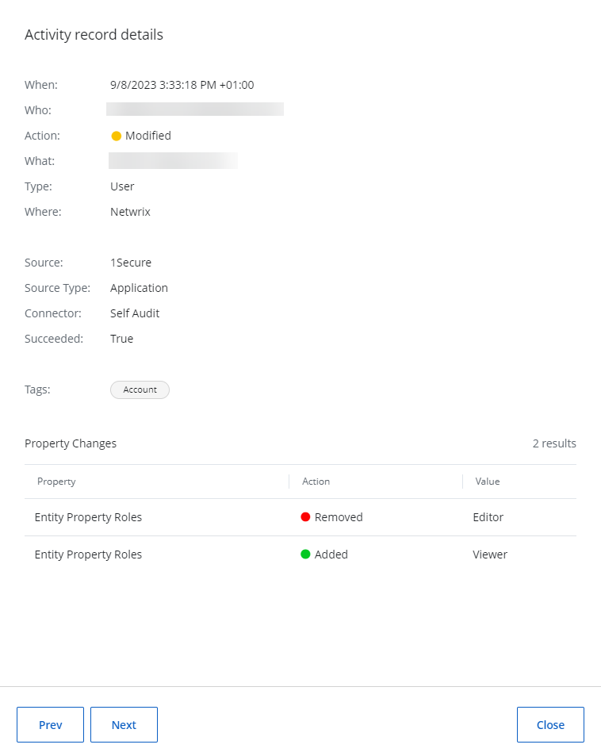

Filter: 

* All Files

Submit Search

# Apply Filters

Filters are used to narrow your search results. You can create your own filters or select one of the reports with the predefined filters. To create a unique set of filters, you can:

* Add different filters to your search. Search results will be sorted by all selected filters since they work as a logical conjunction (e.g., Who*: Administrator* AND Action*: Added*).
* Specify several values in the same filter to search for any of them (e.g., Action*: Modified* OR Action*: Removed*). To do this, select a filter again and specify a new value.
* Spaces do not separate values, so the whole expression will be included in your search as a single value. For example, if you want to search for any of three names, do not enter *Anna Mark Bill* but instead create a separate filter entry for each name.

**NOTE:** All reports on the **Reports** > **Activity** tab are associated with the respective alerts. Click the **Alerts Timeline Dashboard** in the upper left corner of the page to view the alerts for your organization. See the [Alerts](../Alerts/Alerts "Alerts") topic for additional information.

| Icon | Description |
| --- | --- |
|  | Info Icon. Click the Info Icon to view the activity records details. |

Follow the steps to apply filters to your search.

**Step 1 –** Select the **Reports**> **Activity** tab.

**NOTE:** You can also access the **Reports** > **Activity** page from your organization's page. On your Home screen, click **Configure** > **Reports** in the right upper corner of the page.

**Step 2 –**  Select a filter from the Filter drop-down menu. See the [Filter Descriptions](#Filter "Filter Descriptions") topic for additional information.

**NOTE:** You must specify three columns: Filter, Operator, and Value. You may also select more than one filter. To review the Operator filter options, see the [Filter Operators](FilterOperators "Filter Operators") topic for additional information. To review the Filter values, see the Filter Values topic for additional information.

**Step 3 –** If required, specify the property change filters.

**NOTE:** Netwrix 1Secure comes with the advanced filtering options. Not all the activity records have the property changes, but only those with the property change on that record. For example, if the permission on the Active Directory has been added or resource ID in AzureAD has been removed.

**NOTE:** The drop-down list in the **Property** field shows all the properties retrieved in your records' list below the Search bar. It varies depending on the displayed records. You can filter the required Property, Action, Value operator, and Value within the list. The property changes are dynamic and are not related to a given report directly but the activity records. If the query changes, the shown property changes may also change.

**Step 4 –** Click Search to find and view your reports. The reports are displayed with the predefined filters. Your search results will display in the table.

**Step 5 –** Click the required activity record from the grid view the activity record details. You can see who, when, or where was the activity made.

**NOTE:** Navigate from one report to another by selecting **Prev** or **Next**. This will directly upload the details of the selected report.

**NOTE:** You can also create your own reports with custom filters. See the  [Custom Reports](CustomReports "Custom Reports") topic for additional information.

## Filter Descriptions

This table provides a list of filters and descriptions.

| Filter | Description |
| --- | --- |
| Action | Select an action type from the list (Added, Removed, Modified, Read). |
| Type | Limits your search to objects of a specific type only.  Specify an type from the Value list or type it yourself.  For example, if the type is "computer" the filter shall display all the actions with the computer in the system.  In case you set the name of the computer in the What filter, you shall see the actions with the specific names of the computer. |
| What | Specify an object name (e.g., *Policy*) to find all entries containing it (e.g., *HiSecPolicy*, *\\FileSserver\Share\NewFolder\NewPolicy.docx*, *http://sharepoint/sites/collection1/Lists/Policy*).  Netwrix 1Securesearches across all audited systems. |
| Where | Specify a resource name (e.g., *Enterprise*) to find all entries containing it (e.g., *Enterprise-SQL*, *FileStorage.enterprise.local*). The resource name can be an Active Directory domain.  Netwrix 1Securesearches across all audited systems. |
| Who | Specify an account name (e.g., *John*) to find all entries containing it (e.g., *Domain1\John*, *Domain1\Johnson*, *Domain2\Johnny*). |
| When | Specify a timeframe or provide a custom date range. Netwrix 1Secureallows you to see changes that occurred today, yesterday, in the last 7 or 30 days, or within the specified date range. |
| Connector | Specify name of the file system for audit.  The available options are:   * Active Directory   Activity * Active Directory Logons * AD Logon Activity * Self Audit * Azure AD Logons * Azure AD Activity * File Server Activity * Exchange Online Activity * SharePoint Online Activity * Active Directory State |
| Source Type | Specify the source type:   * computer * contact * controlAccessRight * crossRef * crossRefContainer * domainDNS * foreignSecurityPrincipal * group * groupPolicyContainer * inetOrgPerson * msDS-ManagedServiceAccount * organizationalUnit * user |
| Source | Specify the value of the item, namely the name of the computer, or the IP-address. |
| Succeeded | Whether you specify False or True in the Value column, you will see successful (True) or non-succesful (False) actions in the system. |
| Tags | Narrow your search to specific tags. For example, if you have the linked tags "Account Disabled", "User Account Status Change", the search system will look into the activities with these tags,  The tags are linked to the Netwrix 1Secure by default. |
| Time of Day | Limits your search to specific time period by hours. For example, you can narrow your search to a period less than 12:00 AM. |