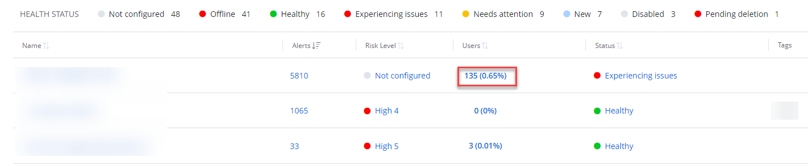
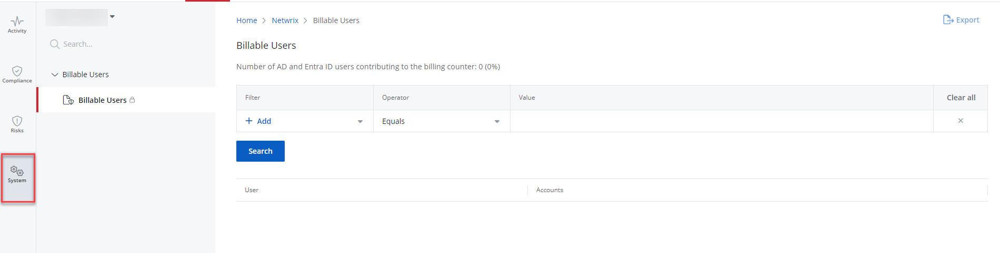

Filter: 

* All Files

Submit Search

# Billable Users Report

A Billable Users report provides information on the billable accounts – the enabled Active Directory/Microsoft Entra ID (formerly Azure AD) accounts for your organization. See the [Billable Accounts](../Organizations/BillableAccounts "Billable Accounts") topic for additional information.

| Icon | Description |
| --- | --- |
|  | Lock Icon. It shows that the business users cannot view the report. See the [Add Users](../Organizations/AddingUsers "Add Users") topic for additional information on the business users. |

## Review a Report

Follow the steps to review a billable users report.

**Step 1 –** On the Home page, click the **Users** of your organization. The **System** > **Billable Users** page opens. By default, it populates the data with the Users of your organization.

* Dashboard for Managing Organization

* Dashboard for Managed Organization

**NOTE:** You can also access the report by navigating to the **Reports** > **System** page.

**Step 2 –** If necessary, you can filter the provided data. Select a filter, operator, and value from the Filter, Operator, and Value drop-down menus respectively.

**NOTE:** You must specify three columns: Filter, Operator, and Value. You may also select more than one filter. To review the Operator filter options, see the [Filter Operators](FilterOperators "Filter Operators") topic for additional information.

**Step 3 –** Click **Search**.

**NOTE:** You can also export a report to your email by clicking **Export**  in the upper right corner of the page. You shall receive a report in XLSX to your login email.

## Filter Descriptions

This table provides a list of filters and descriptions.

| Filter | Description |
| --- | --- |
| Account | Limits your search to a specific account. Account is an instance of a user, specific to a source.  For example:  User = John.Smith  Account = AD User: John.Smith / Azure User: John.Smith |
| User | Limits your search to a specific user. |
| Source Type | Specify the source type of the user:   * AD User * Azure User * Windows Local User |