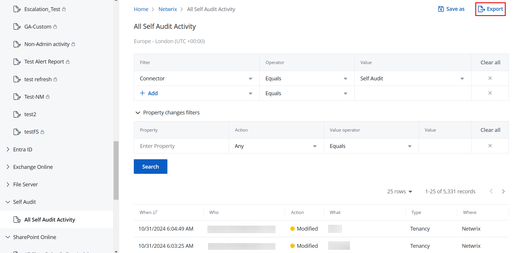

Filter: 

* All Files

Submit Search

# Export a Report or Investigation Results

You can export the results of a new investigation or a report to a file for easier review. The exported report or investigation is sent to you as an .xlsx file by email.

## Export a Report

Follow the steps to export a report.

**Step 1 –** Navigate to any of the following:

* **Reports** > **Activity** tab
* **Reports** > **Compliance** tab
* **Reports** > **Risks** tab
* **Reports** > **System** tab

**Step 2 –** Select an organization from the drop-down menu at the top of the left pane to access its reports. An organization is selected by default, but you can choose a different one if needed.

**Step 3 –** In the left pane, click a category to view its reports.

**Step 4 –** Click a report to open it. Reports without a filter are automatically generated when you open them. Click **Search** to generate reports with a predefined filter set.

**Step 5 –** Click **Export**. The report is sent to you as an .xlsx file by email.

**NOTE:** A report cannot be exported if no data is available for it. In this case, the Export button remains disabled.

## Export an Investigation

Follow the steps to export the results of an investigation.

**Step 1 –** Click **Reports** in the top bar to navigate to the Reports page. By default, the page opens to the Activity tab with New Investigation selected in the left pane.

**Step 2 –** Select an organization from the drop-down menu at the top of the left pane to access its reports. An organization is selected by default, but you can choose a different one if needed.

**Step 3 –** Define a filter criteria, then click **Search** to generate the investigation results based on it. See the [Apply Filters](ApplyFilters "Apply Filters") topic for additional information.

**Step 4 –** Click **Export**. The investigation results report is sent to you as an .xlsx file by email.