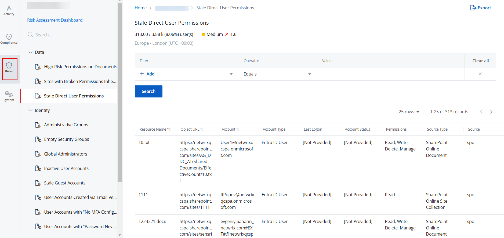

Filter: 

* All Files

Submit Search

# State In Time Risks Reports

The state-in-time reports allow you to generate reports on your environment's state at a specific point in time, helping you analyze environment configurations and permissions for a specified timeframe. For example, you can easily monitor inactive user accounts, empty security groups, and more. The state-in-time reports for an organization are generated on the basis of the risk profile assigned to the organization. A risk profile includes a set of risk metrics, each with preconfigured risk thresholds. A risk metric is a measurable security parameter that helps analyze potential vulnerabilities in an environment. You can generate a separate state-in-time report for each risk metric to get detailed information on specific security aspects of your environment.

To view detailed risk-related data for your organization, see the [Risk Assessment Dashboard](../RiskProfiles/RiskAssessmentDashboard "Review Risks using Risks Assessment Dashboard") topic.

State-in-time reports display data for the Active Directory, Microsoft Entra ID, and SharePoint Online platforms in your environment. You must enable the following connectors to collect data for the respective platforms:

* Active Directory State (AD State)  
  See Step 8 in the [Add a Source and Connectors for Active Directory](../Organizations/SourcesAndConnectors/ActiveDirectory "Add a Source and Connectors for Active Directory") topic
* Azure AD State  
  See Step 6 in the [Add a Source and Connectors for Microsoft Entra ID](../Organizations/SourcesAndConnectors/EntraID "Add a Source and Connectors for Microsoft Entra ID") topic
* SharePoint Online State  
  See Step 6 in the [Add a Source and Connectors for SharePoint Online](../Organizations/SourcesAndConnectors/SharePointOnline "Add a Source and Connectors for SharePoint Online") topic

## Review a Report

Follow the steps to review a state-in-time report.

**Step 1 –** Click **Reports** in the top bar to navigate to the Reports page. By default, the page opens to the Activity tab with New Investigation selected in the left pane.

**Step 2 –** Select an organization from the drop-down menu at the top of the left pane to access its reports. An organization is selected by default, but you can choose a different one if needed.

**Step 3 –** Click the **Risks** tab to access the state-in-time reports. This opens the Risks page with the High Risk Permissions on Documents report displayed by default.

**NOTE:** Click the Risk Assessment Dashboard link in the left pane to navigate to the Risk Assessment page, where you can monitor the risks for the selected organization. See the [Risk Assessment Dashboard](../RiskProfiles/RiskAssessmentDashboard "Risk Assessment Dashboard") topic for additional information.

**Step 4 –** In the left pane, click a category to view its reports. Categories are:

* Data
* Identity
* Infrastructure

**Step 5 –** Click a report to open it. Reports without a filter are automatically generated when you open them. Click **Search** to generate reports with a predefined filter set.

* A risk level (Low, Medium, or High) is displayed for each report under its name, which is calculated on the basis of risk thresholds configured for the metric the report relates to. For example, if the high-risk threshold for the Inactive User Accounts metric is set to 10 to above, the Inactive User Accounts report with 15 inactive users will carry a High risk level.
* Next to the risk level, the risk data used to calculate this level is displayed. For example, 15/150 (10%) accounts mean that 15 inactive user accounts are detected out of a total of 150 accounts, and the percentage of inactive user accounts is 10%.

A list of the available state-in-time reports is given below.

State In Time reports are available under the following categories.

* [Data](#Data "Data")
* [Identity](#Identity "Identity")
* [Infrastructure](#Infrastructure "Infrastructure")

## Data

| Risk Name | Description |
| --- | --- |
| High Risk Permissions on Documents | Lists permissions granted to high risk trustees, such as Everyone and Authenticated Users, to SharePoint Online documents. Excessive use of broad access groups like "Authenticated Users" or "Everyone" violates the principle of least privilege, a fundamental security concept outlined in NIST SP 800-14. This practice greatly increases the risk of data breaches and insider threats. CIS Controls v8 (5.4) recommends to restrict the administrative privileges to dedicated administrator accounts to minimize security risks. Overexposure of SharePoint content can lead to unauthorized access, data leakage, and compliance violations, especially in industries governed by regulations like GDPR or HIPAA. |
| Sites with Broken Permissions Inheritance | Lists objects with permissions that differ from their parent site, such as a folder with permissions different from its parent site. Broken inheritance disrupts the hierarchical permission structure that Microsoft recommends for the efficient management of SharePoint Online. This may result in inconsistent access controls, increased risk of privilege creep, and difficulty in maintaining the principle of least privilege. |
| Stale Direct User Permissions | Lists stale user accounts with direct permissions to specific objects. Retaining permissions for inactive users violates the access control principle outlined in ISO/IEC 27001:2013 (A.9.2.6), which mandates the timely removal or adjustment of access rights. Stale permissions create security vulnerabilities by retaining unnecessary access points that threat actors could exploit. This risk is particularly relevant in the context of insider threats and account takeovers. Regular access reviews, as recommended by NIST SP 800-53 (AC-2), are crucial for maintaining a secure SharePoint environment and ensuring compliance with data protection regulations. |

## Identity

| Risk Name | Description |
| --- | --- |
| Administrative Groups | Lists administrative groups within an environment. For each group, it displays the group name, location, members, and more. |
| Empty Security Groups | Lists the empty security groups within an environment. For each group, it displays the group name, location, and more. |
| Global Administrators | Lists global administrators within an environment. For each administrator, it displays the name, location, role, and more. |
| Inactive User Accounts | Lists inactive user accounts within an environment. For each account, it displays the name, location, last logon, and more.  By default, user accounts that have been inactive for 1 month or longer are displayed. |
| Stale Guest Accounts | Lists stale guest accounts within an environment. For each account, it displays the name, location, last logon, and more.  By default, stale guest accounts that have not logged in for 35 days or longer are displayed. |
| User Accounts Created via Email Verified Self-Service Creation | Lists user accounts created with self-service account creation. For each account, it displays the name, location, and more. |
| User Accounts with "No MFA Configured" | Lists user accounts for which multi-factor authentication (MFA) is not configured. For each account, it displays the name, location, and more. |
| User Accounts with "Password Never Expires" | Lists enabled user accounts whose passwords never expire. For each account, it displays the name, location, and more. |
| User Accounts with "Password Not Required" | Lists the user accounts that can be used to log on without a password. For each account, it displays the name, location, and more. |
| User Accounts with Administrative Permissions | Lists the groups that have administrative privileges assigned. For each group, it displays the group name, group location, members, and more. |

## Infrastructure

| Risk Name | Description |
| --- | --- |
| Disabled Computer Accounts | Lists the disabled computer accounts within an environment. For each account, it displays the name, location, and more. |
| Inactive Computer Accounts | Lists inactive computer accounts within an environment. For each account, it displays the name, location, last logon, and more.  By default, computer accounts that have been inactive for 35 days or longer are displayed. |

Sort a Report

Click a column header to sort data in a report by that column in ascending order. An arrow appears next to the column name to indicate the sort order. Click the column header again to sort the data in descending order.

Filter a Report

You can filter the data displayed in a report. Select a filter, operator, and value from the Filter, Operator, and Value drop-down menus, then click **Search**.

You can select more than one filter.

For options displayed in the Operator drop-down menu, see the [Filter Operators](FilterOperators "Filter Operators") topic.

Filter Descriptions

This table provides a list of filters and descriptions.

| Filter | Description |
| --- | --- |
| Group Location | Filters the report based on the location of an administrative group in the directory. For example, Administrators is a group name and its location is SSA-D4.local/Builtin/Administrators |
| Group Name | Filters the report based on the name of an administrative group, such as Administrators. |
| Member Location | Filters the report based on the location of a member within an administrative group. For example, Domain Admins is a member name and its location is SSA-D4.local/Users/Domain ​Admins. |
| Member Name | Filters the report based on the name of a member of an administrative group, such as Domain Admins. |
| Member through | Specify whether a group is a member of a group explicitly or inherited from another group.  For example, Group A > Admin Group (Group A is explicitly a member of Admin Group)  Group B > Group C > Admin Group (Group C is explicitly a member of Admin Group while Group B is an inherited member of Admin Group)  If you do not specify the value, it will include both. If your Value is Inherited, it will only show Group B, and if you Value is Explicit, it will show Group A and Group C |
| Status | Filters the report based on any of the following user account statuses:   * Enabled * Disabled |
| Source Type | Filters the report based on any of the following source types:   * AD Group * Entra ID Group * Windows Local Group * SharePoint Online Group |
| Source | Filters the report based on the name of a data source. The data source name corresponds to the value specified in the Source Group field when adding a data source. See the [Sources and Connectors](../Organizations/SourcesAndConnectors/Overview "Sources and Connectors") topic for additional information. |
| Name | Filters the report based on the name of a user or computer account. |
| Location | Filters the report based on the location of an account in the directory. For example, Guest is an account name and its location is SSA-D4.local/Users/Guest. |
| Role | Filters the report based on a role, such as Global Administrator. |
| Account | Filters the report based on a user account, such as admin@1secanton.onmicrosoft.com. |
| Account Type | Filters the report based on an account type, such as Entra ID User. |
| Account Status | Filters the report based on any of the following account statuses:   * Enabled * Disabled |
| Object Type | Filters the report based on an object type, such as SharePoint Online Document Library. |
| Object URL | Filters the report based on the URL of an object. For example, antoN ​4.docx is an object and its URL is https://1secanton.sharepoint.com/sites/Permissions-2/Shared ​Documents/Sorting/antoN ​4.docx. |
| Permissions | Filters the report based on the permission assigned to an account, such as Read, Write, Delete, Manage, etc. |
| Resource Name | Filters the report based on the name of an object, such as Contract Draft.docx. |
| Access Granted To | Filters the report based on the level of access granted to user(s) on an object. |
| Parent URL | Filters the report based on the name of a parent site for objects. |
| Last Logon | Filters the report based on an account's last logon date and time. |