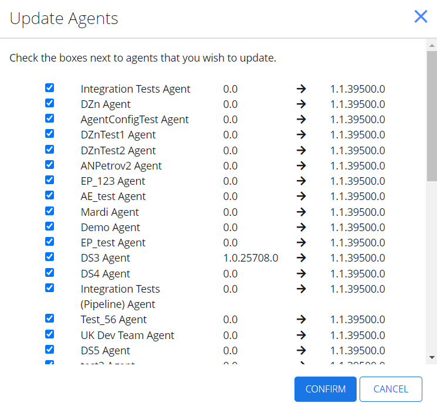
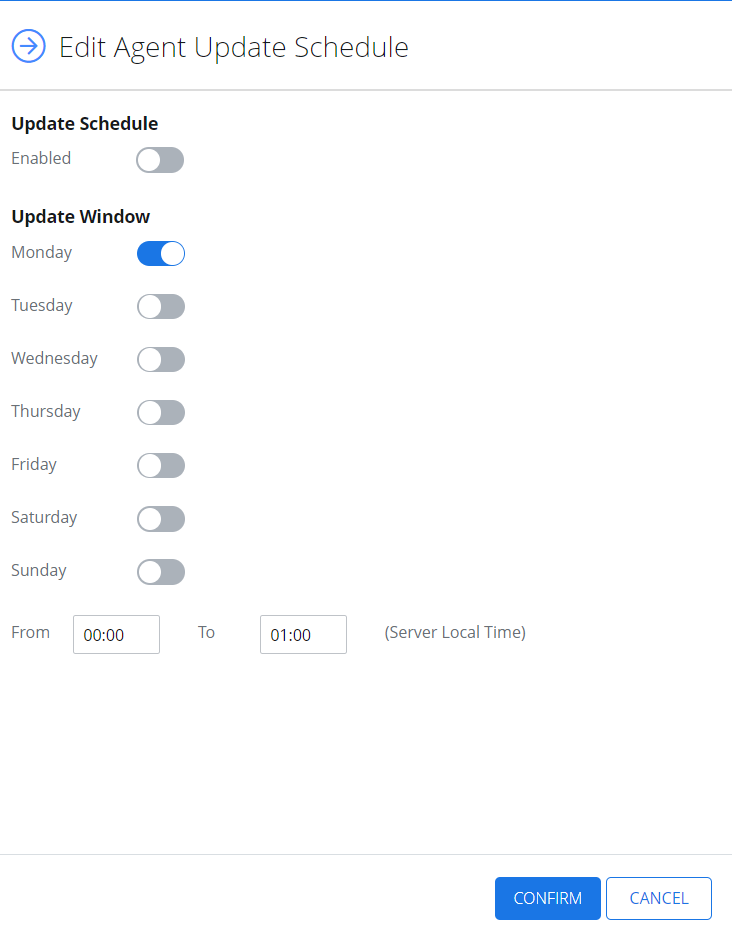
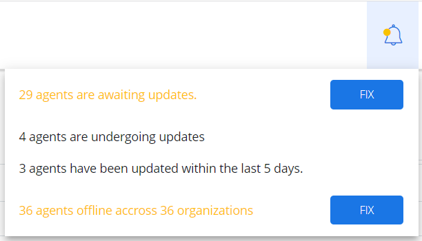
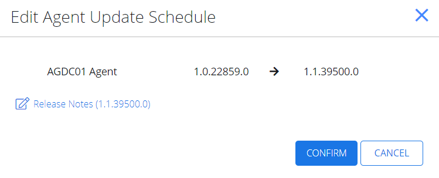

Filter: 

* All Files

Submit Search

# Update Netwrix Cloud Agent

With Netwrix 1Secure, you can both update the version of the agent by installing new agent or using Self-update function. The Self-update saves your time from installing the new version repeatedly, while providing real-time notifications, managing agent schedule, and bulk update option.

During the update process, your activity monitoring will not be disrupted.

| Icon | Description |
| --- | --- |
|  | Bell Icon. Click the Bell Icon to look up for the available updates of the Netwrix Cloud Agent. |

## Update Agents in Bulk

Follow the steps to update agents in bulk.

**Step 1 –** To update selected agents, on the Managed Organizations page, select **Bulk Update Agent**.

**Step 2 –** On the Update Agents page, check the boxes next to agents you wish to update and click **Confirm**.

The agents are now updated.

## Edit Agent Update Schedule

Follow the steps to update agent schedule.

**Step 1 –** To edit the agent update schedule, on the Managed Organizations page, select **Agent Update Settings**. The Edit Agent Update Schedule page displays.

**Step 2 –** In the Update Schedule section, select Enabled.

**Step 3 –** In the Update Window section, configure the options to specify when you want the update to occur.

**Step 4 –** Select Confirm.

The agent update schedule is now configured.

## Enable Self-Update Function

Follow the steps to enable the self-update function .

**Step 1 –** To look up the available updates, click the **Bell** icon. The panel with available updates displays.

**Step 2 –** Click **Fix** for the agents to be updated. Now you can see the list of organizations and which agents may be updated to the new version.

**Step 3 –** Click **Update available** to update the agent to the current version. The Edit Agent Update Schedule page displays, offering you the proposed version.

**Step 4 –** Select **Confirm**. The agent shall update and upload a new .msi file of your agent.

**Step 5 –** Alternately, update the version for an organization from the Managed organizations page. Select the **organization** and then the **Sites** tab.

**Step 6 –** Click Update.

**Step 7 –** Toggle on Override Tenancy Defaults if you want to change the update defaults for that organization.

**Step 8 –** Click Edit.

**Step 9 –** On the Edit Agent Update Schedule window, select Enabled and apply the required parameters to specify when you want the update occur.

**Step 10 –** Click **Confirm**.

The self-update function is now configured.

See the following topic for additional information:

* [Notifications](Notifications "Notifications")