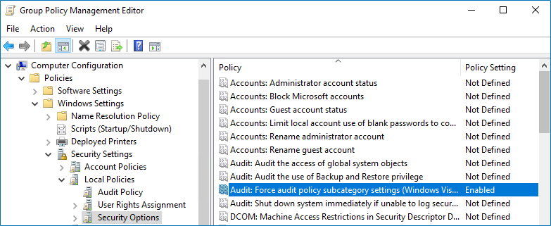
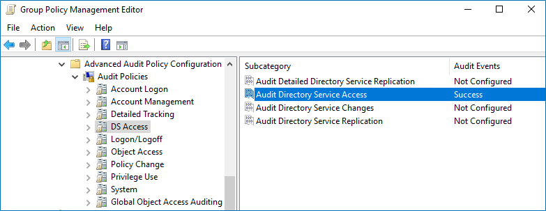

Filter: 

* All Files

Submit Search

# Configure Advanced Audit Policies

You can configure advanced audit policies instead of basic domain policies to collect Active Directory changes with more granularity. Either basic or advanced audit policies must be configured to track changes to accounts and groups, and to identify workstations where changes were made.

## To configure security options

Using both basic and advanced audit policies settings may lead to incorrect audit reporting. To force basic audit policies to be ignored and prevent conflicts, enable the Audit: Force audit policy subcategory settings to override audit policy category settings option.

Follow the steps:

**Step 1 –** Open the **Group Policy Management** console on any domain controller in the target domain: navigate to Start > Windows Administrative Tools (Windows Server 2016 and higher) or Administrative Tools (Windows 2012) >  **Group Policy Management.**

**Step 2 –** In the left pane, navigate to **Forest:  → Domains →  → Domain Controllers**. Right-click the effective domain controllers policy (by default, it is the **Default Domain Controllers Policy**), and select **Edit** from the pop-up menu.

**Step 3 –** In the Group Policy Management Editor dialog, expand the Computer Configuration node on the left and navigate to Policies > Windows Settings > Security Settings → Local Policies → Security Options.

**Step 4 –** Locate the Audit: Force audit policy subcategory settings to override audit policy category settings and make sure that policy setting is set to *"Enabled"*.

**Step 5 –** Navigate to **Start → Run** and type *"cmd"*. Input the `gpupdate /force` command and press **Enter**. The group policy will be updated.

## To configure advanced audit policies

**Step 1 –** Open the **Group Policy Management** console on any domain controller in the target domain: navigate to Start > Windows Administrative Tools (Windows Server 2016 and higher) or Administrative Tools (Windows 2012) >  **Group Policy Management.**

**Step 2 –** In the left pane, navigate to **Forest: ** > **Domains** > **** > **Domain Controllers**. Right-click the effective domain controllers policy (by default, it is the **Default Domain Controllers Policy**), and select **Edit** from the pop-up menu.

**Step 3 –** In the Group Policy Management Editor dialog, expand the Computer Configuration node on the left and navigate to Policies > Windows Settings > Security Settings > Advanced Audit Policy Configuration > Audit Policies.

**Step 4 –** Configure the following audit policies.

| Policy Subnode | Policy Name | Audit Events |
| --- | --- | --- |
| Account Management | * Audit Computer Account Management * Audit Distribution Group Management * Audit Security Group Management * Audit User Account Management | *"Success"* |
| DS Access | Audit Directory Service Access | *"Success"* |
| Logon/Logoff | * Audit Logoff * Audit Logon   These policies are only required to collect the information on the originating workstation, i.e., the computer from which a change was made. | *"Success"* |

**Step 5 –** Navigate to **Start > Run** and type *"cmd"*. Input the `gpupdate /force` command and press **Enter**. The group policy will be updated.