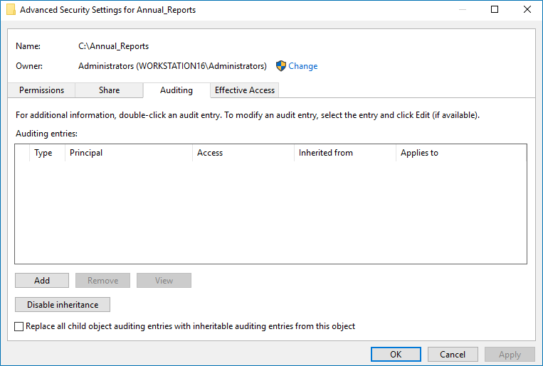

Filter: 

* All Files

Submit Search

# Configure Object-Level Access Auditing

Netwrix 1Secure can be configured to audit all the access types mentioned below:

## Configure Object-level Access Auditing on Windows Server 2012 and Above

Follow the steps to configure Object-level access auditing on Windows Server 2012 and above.

**Step 1 –** Navigate to the target file share, right-click it and select **Properties**.

**Step 2 –** In the  Properties dialog box, select the Security tab and click **Advanced**.

**Step 3 –** In the Advanced Security Settings for  dialog box, navigate to the Auditing tab.

**Step 4 –** Click **Add** to add a new principal. You can select **Everyone** (or another user-defined group containing users that are granted special permissions) and click **Edit**.

**Step 5 –** In the Auditing Entry for  dialog box, click the **Select a principal** link and specify **Everyone**.

**NOTE:** You can specify any other group as needed. The product will audit only user accounts that are members of the selected group.

**Step 6 –** Apply settings to your Auditing Entries depending on the access types you want to audit. If you want to audit all access types, you need to add separate Auditing Entries for each file share. Otherwise, reports will contain limited data and warning messages.