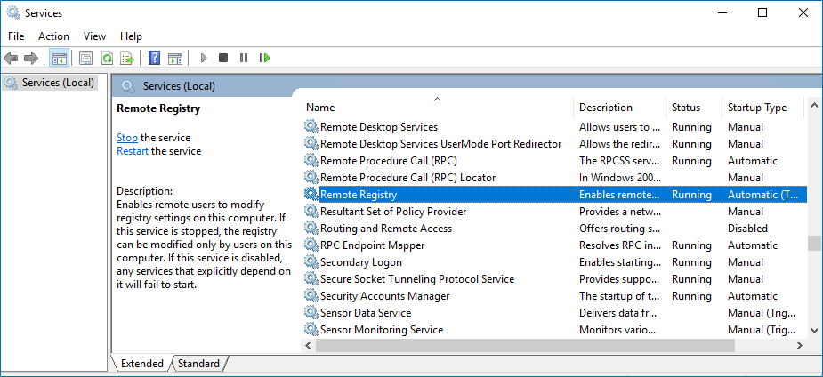
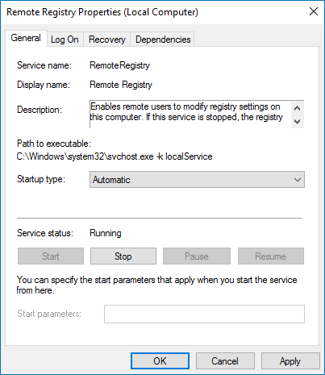

Filter: 

* All Files

Submit Search

# Enable Remote Registry Service

Follow the steps to enable the Remote Registry service.

**Step 1 –** Navigate to Start > Windows Administrative Tools > Services.

**Step 2 –** In the Services window, locate the Remote Registry service, right-click it and select **Properties**.

**Step 3 –**  In the Remote Registry Properties dialog box, make sure the Startup type parameter is set to *Automatic* and click **Start**.

**Step 4 –** In the Services window, ensure that the Remote Registry service has the *Running* status on Windows Server 2012 and above.

**NOTE:** The Remote Registry service should be enabled on the target server.