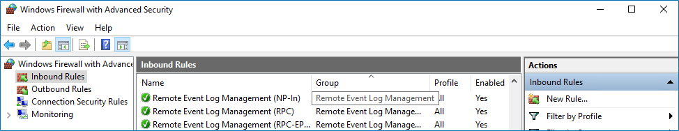

Filter: 

* All Files

Submit Search

# Configure Windows Firewall Inbound Connection Rules

For successful data collection, Netwrix 1Secure may have to create inbound Firewall rules. If you do not enable the Network traffic compression option, the product will try creating these rules automatically and will notify you it fails to do so. In this case, you have to configure Windows Firewall inbound rules manually.

Follow the steps to configure Windows Firewall Inbound Connection Rules.

**Step 1 –** On every domain controller, navigate to **Start** > **Control Panel** and select **Windows Firewall**.

**Step 2 –** In the **Help Protect your computer with Windows Firewall** page, click **Advanced settings** on the left.

**Step 3 –** In the Windows Firewall with Advanced Security dialog, select Inbound Rules on the left.

**Step 4 –** Enable the following inbound connection rules:

* Remote Event Log Management (NP-In)
* Remote Event Log Management (RPC)
* Remote Event Log Management (RPC-EPMAP)