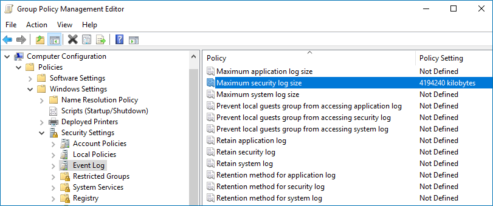

Filter: 

* All Files

Submit Search

# Configure Security Event Log Size and Retention Settings

**Step 1 –** Open the **Group Policy Management** console on any domain controller in the target domain: navigate to Start>Windows Administrative Tools (Windows Server 2016 and higher) or Administrative Tools (Windows 2012)**> Group Policy Management.**

**Step 2 –** In the left pane, navigate to **Forest: ** > **Domains** > ** → Domain Controllers**. Right-click the effective domain controllers policy (by default, it is the **Default Domain Controllers Policy**), and select **Edit** from the pop-up menu.

**Step 3 –** Navigate to **Computer Configuration** > **Policies** > **Windows Settings > Security Settings** >  **Event Log** and double-click the **Maximum security log size** policy.

**Step 4 –** In the **Maximum security log size Properties** dialog, select **Define this policy setting** and set maximum security log size to*"4194240"* kilobytes (4GB).

**Step 5 –** Select the **Retention method for security log** policy. In the **Retention method for security log Properties** dialog, check **Define this policy** and select **Overwrite events as needed**.

**Step 6 –** Navigate to **Start** > **Run** and type *"cmd"*. Input the `gpupdate /force` command and press **Enter**. The group policy will be updated.