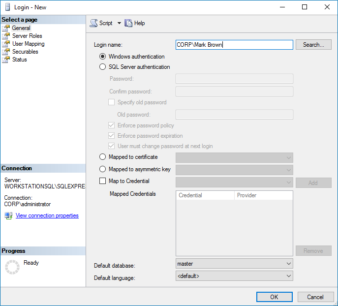

Filter: 

* All Files

Submit Search

# Permissions for SQL Server Auditing

Before you create a monitoring plan to audit your SQL Server, make sure the account to be used for data collection meets the requirements listed below. You have to provide this account in the Monitoring Plan wizard.

You can also use a Group Managed Service Account (gMSA) for collecting data.

To grant permissions to the account for SQL Server audit, do the following on the target SQL Server.

* To access SQL Server, Windows authentication will be used, so the data collection account should be a Windows account specified in the *domain\user* format (*domain\user$* for Managed Service Account).   
  SQL Server logins and authentication method are not supported.
* The account must be assigned the *System Administrator* server role for this SQL Server. See the [Assign 'System Administrator' Role](#Assignin "Assign 'System Administrator' Role") topic for additional information.
* For auditing SQL Server availability on groups, the account must have the *sysadmin* server role granted on each server added to an availability group.
* To collect state-in-time data from SQL Server, the account must also meet the following additional requirements:

  * Local Administrator rights on the target SQL Server.
  * If SQL Server is included in the Active Directory domain, the account should also be included in that domain.

## Assign 'System Administrator' Role

**Step 1 –** On the computer where the audited SQL Server instance is installed, navigate to Start > All Programs > Microsoft SQL Server > SQL Server Management Studio.

**Step 2 –** Connect to the SQL Server instance.

**Step 3 –** In the left pane, expand the Security node. Right-click the Logins node and select **New Login** from the pop-up menu. The Login - New window is displayed.

**Step 4 –** Click **Search** next to the Login Name box and specify the user you want to assign the sysadmin role.

**Step 5 –** Click the **Server Roles** tab and assign the sysadmin role to the new login.