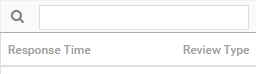
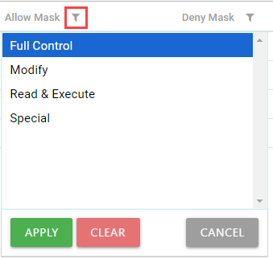
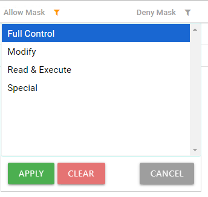
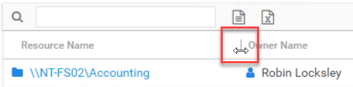
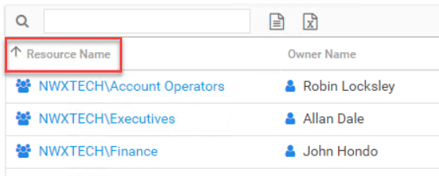
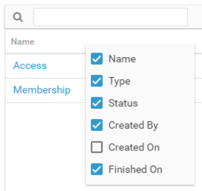
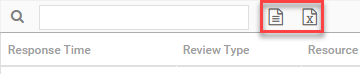

# Data Grid Features

The data grids within various tables have several features to improve your experience.

## Search & Filter

There is a Search box above a table's header row that can be used to filter the table data.

Begin typing in the Search box. The filter acts as a wildcard, filtering the table data as you type.

## Column Filters

There is a filter icon to the right of each column name that can be used to apply a column specific filter. You can apply filters to multiple columns simultaneously.

Click the filter icon for the column you want to filter. Select the values you want to filter for from the list, and click **Apply**.

**NOTE:** Hold the **Shift** key and click the first and last values to select a group of adjacent values, or hold the **Ctrl** key and click each value to select multiple values individually.

The filter icon is highlighted orange for a column where a filter is applied. To clear an applied filter, click the filter icon and click **Clear**.

## Resize Columns

Table column widths can be resized to change the width.

Simply select the edges of the column headers and drag to the desired width.

## Sort

Data within a table can be sorted alphanumerically for a column.

Click on any column header. An arrow will appear next to the column name indicating the sort to be ascending or descending order.

## Columns Selector

Columns can be hidden or unhidden. Available columns for a table are listed in the column selector menu that appears when you right-click on a column header.

The column selector menu shows all available columns for the table. Check columns are visible. Unchecked columns are hidden.

## Exports

There are two export buttons above a table's header row that can be used to export the data currently displayed within the table.

* CSV Export – Downloads the data within the table in a CSV file format
* Excel Export – Downloads the data within the table in an Excel file format

The export mimics the table with any sort, filter, or column modifications. The Excel or CSV file can then be distributed as desired. The Excel file presents an easy to read format, including information about the selected table and resource at the top. The CSV file displays column headers in the first row.