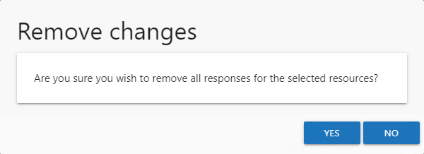

# Remove Changes Window

Select the desired resource on a Review Details page and click **Remove Changes**. The Remove changes window opens to confirm the action.

**CAUTION:** This will clear all owner-recommended changes and notes for the resource. The owner will be required to complete the review again.

Click Yes to clear owner-recommended changes. Click No to cancel it. The Remove changes window closes.