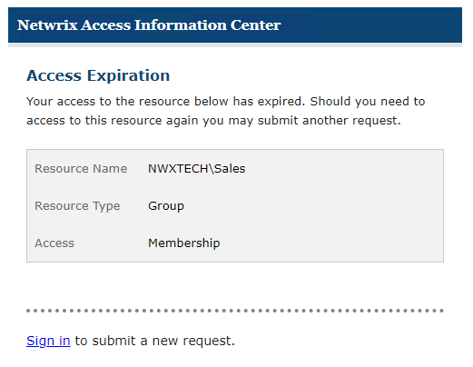

# Access Expiration Email

If only temporary access was granted, once the date expires, the user will be automatically removed from the resource, and will receive an email notification informing them of the removal.

On the [Request History Page](../YourAccessPortal/RequestHistory "Request History Page") of the Your Access portal, you can see that the icon in the Expired column has changed and it's tooltip indicates that the access has expired.