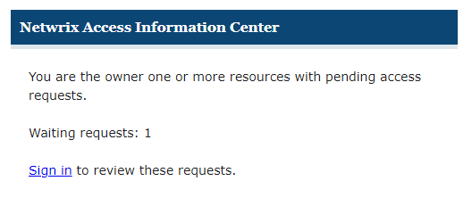

# Access Request Reminder Email

The Request Administrator may send reminder email from the Access Information Center for pending access requests.

Click **Sign in** to open the Access Information Center login page. Within the Owner portal, navigate to the Access Requests page to process the request. See the [Pending Access Requests](../Owners/PendingRequests "Pending Access Requests") topic for additional information.