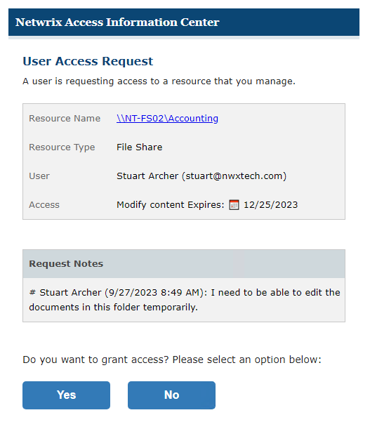
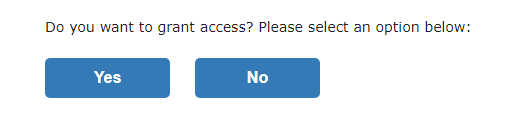
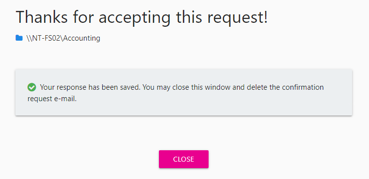
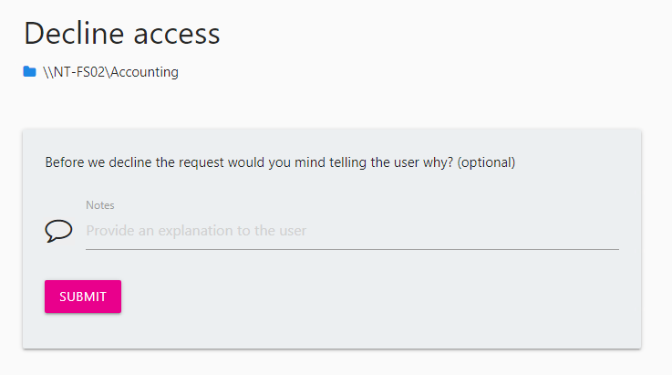
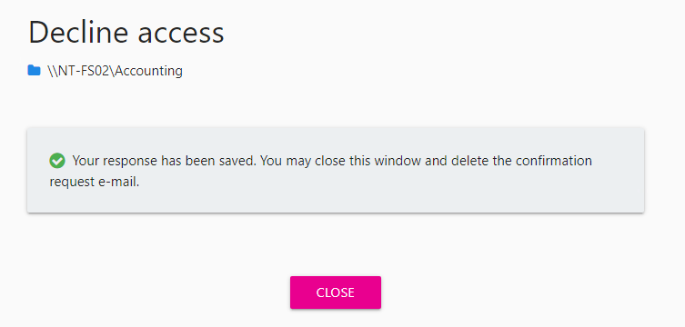

# User Access Request Email

When a domain user submits a request, you receive an email notification.

The email will include the following information:

* Resource Path — The icon indicates the type of resource. The resource name includes its location, such as the UNC path for a file system resource, the URL for SharePoint resource, or Group name (e.g., [Domain]\[Group]).
* Resource Type — Indicates the type of resource (File Share, SharePoint site, Active Directory group, etc.)
* User — Requester name and email address
* Access — Level of access being requested
* Request Notes — Note supplied by the requester

See the [Process Request Via Email](#Process "Process Request Via Email") topic for additional information.

## Process Request Via Email

There are options for accepting or declining the request in the original email notification.

You can use these buttons to either accept or decline the request from the email notification.

### Accept Request

Follow the steps to accept the request using the email buttons.

**Step 1 –**  Click **Yes** to approve the request. The Access Information Center launches in the default browser for security authentication.

**Step 2 –** Log into the Access Information Center using your domain credentials.

**Step 3 –** A message displays confirming that your response has been saved. Click **Close** to close the browser window.

The requester will receive an email notification on the updated status of the request. See the [Access Request Updated Email](Updated "Access Request Updated Email") topic for an example of this email.

You can view the history of requests processed for your resources in the Owner portal. See the [Access Request History](../Owners/RequestHistory "Access Request History Page") topic for additional information.

### Decline Request

Follow the steps to decline the request using the email buttons.

**Step 1 –**  Click **No** to decline the request. The Access Information Center launches in the default browser for security authentication.

**Step 2 –** Log into the Access Information Center using your domain credentials.

**Step 3 –** A message displays giving you the option to add an explanation for the user before the response is processed. Any note added here is included in the email nonfiction to the requesting user. Optionally enter an explanation into the Notes box, and click **Submit**.

**Step 4 –** A message displays confirming that your response has been saved. Click **Close** to close the browser window.

The requester will receive an email notification on the updated status of the request, including any note you added. See the [Access Request Updated Email](Updated "Access Request Updated Email") topic for an example of this email.

You can view the history of requests processed for your resources in the Owner portal. See the [Access Request History](../Owners/RequestHistory "Access Request History Page") topic for additional information.