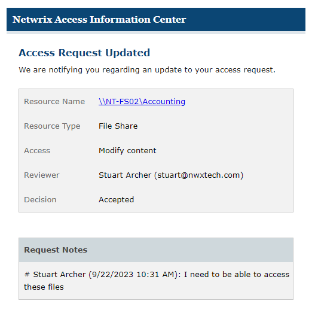
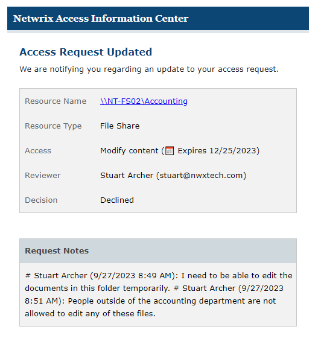

# Access Request Updated Email

When your access request has been processed by the resource owner, you will receive one of the following:

* [Decision Accepted Email](#Decision "Decision Accepted Email")
* [Decision Denied Email](#Decision2 "Decision Denied Email")

## Decision Accepted Email

When a resource owner approves your access request, you will receive an email notification.

The Decision row indicates the request was accepted. On the [Request History Page](../YourAccessPortal/RequestHistory "Request History Page") of the Your Access portal, you will see a green check mark in the Decision column.

## Decision Denied Email

When a resource owner denies your access request, you will receive an email notification.

The Decision row indicates the request was denied. The owner may have provided a note explaining the decision, which will be visible at the bottom. On the [Request History Page](../YourAccessPortal/RequestHistory "Request History Page") of the Your Access portal, you will see a Denied icon in the Decision column.