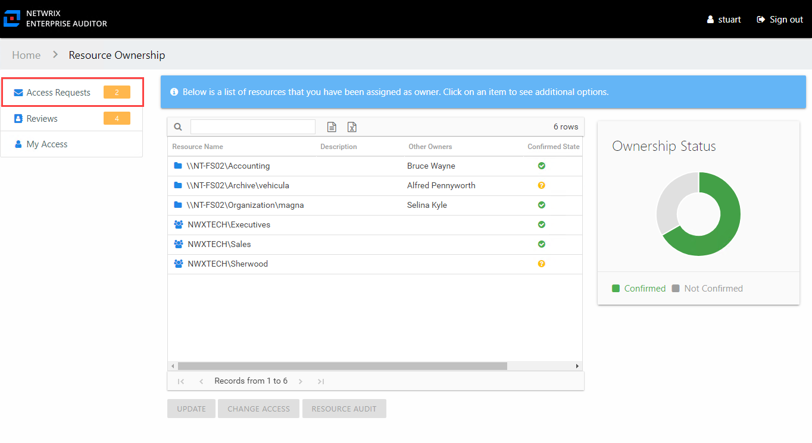

# Owners & Access Requests

When your organization enables Self-Service Access Requests on a resource for which you are the assigned owner, it means you, the business user or data custodian, are responsible for approving or denying requests by domain users for access to your resource. When a domain user submits a request, you receive an email notification.

The request can be processed by using the buttons in the email, which require an Access Information Center authentication. See the [User Access Request Email](../Email/Request "User Access Request Email") topic for additional information.

You can also process access requests through the Owner portal.

The Owner portal displays a number next to the Access Requests link to indicate how many requests are pending your approval. Click the link to open the Access Requests page. The Access Requests page has two tabs:

* Pending Requests – Shows any pending access requests waiting on your approval. See the [Pending Access Requests](PendingRequests "Pending Access Requests") topic for additional information.
* Request History – Shows the history of access requests for your resources. See the [Access Request History](RequestHistory "Access Request History Page section") topic for additional information.

You may receive a reminder email, sent via the Access Information Center from your Request Administrator. See the [Access Request Reminder Email](../Email/Reminder "Access Request Reminder Email") topic for additional information.