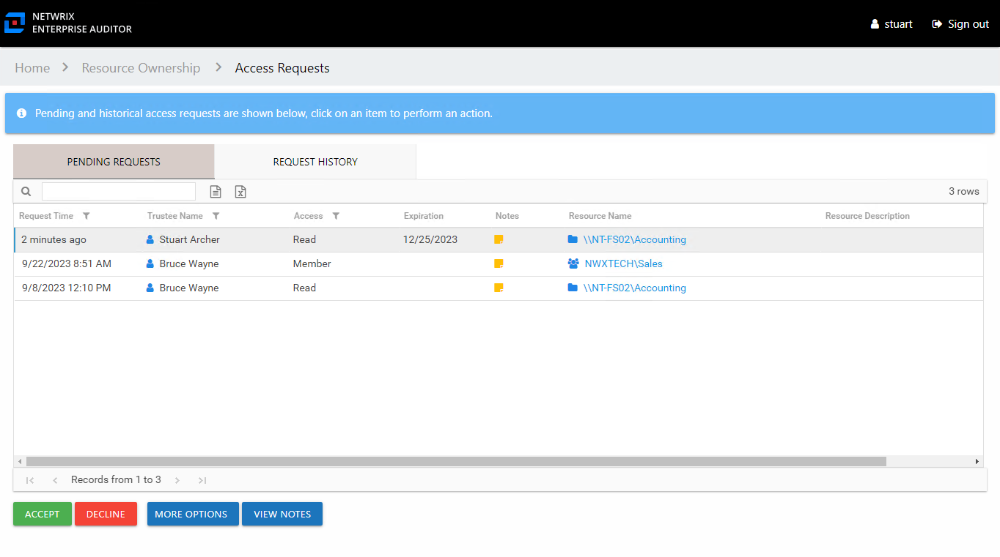
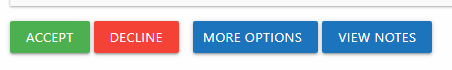

# Pending Access Requests

The Pending Requests tab of the Access Requests page accessed through the Owner portal is where you can view pending requests for your resources.

The information displayed in the table includes:

* Request Time – Date timestamp when the request was submitted
* Trustee Name – Name of the domain user requesting access
* User Title – Position in the company for the domain user who is requesting access, as read from Active Directory
* User E-Mail – Email address for the domain user who is requesting access, as read from Active Directory
* User Department – Company department for the domain user who is requesting access, as read from Active Directory
* User Employee ID – Unique identifier for the domain user who is requesting access, as read from Active Directory
* Access – Level of access requested. Possible values include:

  * For file system and SharePoint resources: Full Control, Modify, or Read
  * For groups and distribution lists: Membership
* Expiration – If the access is temporary, shows the expiration date:

  * When a user has temporary access already granted to a resource, and then requests a different type of access to the same resource with a different expiration date, once the new access is granted, the new expiration date supersedes the old date.
* Notes – Icon indicates a Note has been added. Click on the icon to read the attached note(s).
* Resource Name – The icon indicates the type of resource. The resource name includes its location, such as the UNC path for a file system resource, the URL for SharePoint resource, or Group name (e.g., [Domain]\[Group]).
* Resource Description – Description or explanation of the resource as supplied by either the Ownership Administrator or the assigned owner

The table data grid functions the same way as other table grids. See the [Data Grid Features](../../../General/DataGrid "Data Grid Features") topic for additional information.

The buttons at the bottom enable you to perform the following actions:

| Button | Function |
| --- | --- |
| Accept | Approves the request and triggers the Access Information Center to process the approved request, granting the requested access. The Saving request window displays the action status. Click **OK** to close the window. The request is visible on the [Access Request History](RequestHistory "Access Request History Page"). |
| Decline | Denies the request and opens the Decline Access window. See the [Decline Access Window](../Window/DeclineAccess "Decline Access Window") topic for additional information. |
| More Options | Opens the Select Access window, which allows you to grant an access level other than the one requested. This is only applicable to file system and SharePoint resources. See the [Select Access Window](../Window/SelectAccess "Select Access Window") topic for additional information. |
| View Notes | Opens the View Notes window for the selected request. Clicking on the Notes icon in the table will also open the View Notes window. Click **OK** to close the window. |

Once a request has been processed , it is moved from the Pending Request page to the [Access Request History](RequestHistory "Access Request History Page").