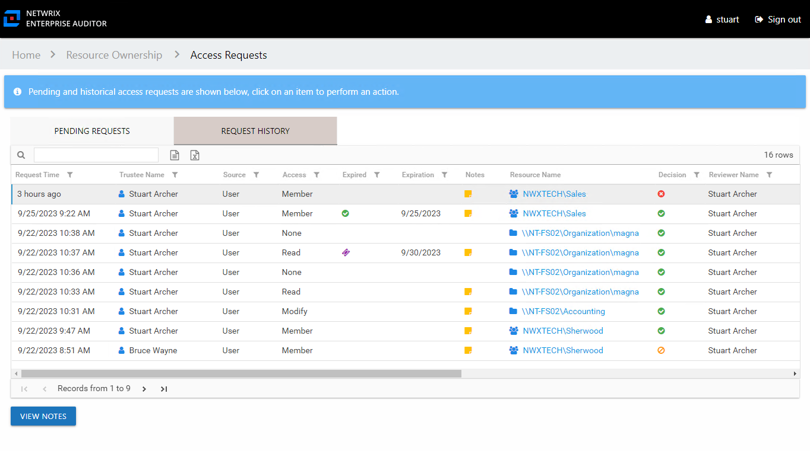
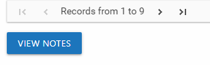

# Access Request History

The Request History tab of the Access Requests page accessed through the Owner portal is where you can view the request history for your resources.

The information displayed in the table includes:

* Request Time – Date timestamp when the request was submitted
* Trustee Name – Name of the domain user who requested access
* User Title – Position in the company for the domain user who requested access, as read from Active Directory
* User E-Mail – Email address for the domain user who requested access, as read from Active Directory
* User Department – Company department for the domain user who requested access, as read from Active Directory
* User Employee ID – Company department for the domain user who requested access, as read from Active Directory
* Source – Origin of the request or change:
  * Owner means access was changed by the owner through ad hoc changes
  * User means a request was submitted by a domain user
* Access – Level of access requested. Possible values include:

  * For file system and SharePoint resources: Full Control, Modify, or Read
  * For groups and distribution lists: Membership
* Expired – If the access is temporary, shows when the access is expired:

  * If an expiration date is superseded by another request, the previous access type will show a different icon (purple ticket), the tooltip indicates that another request changed the access. In the case that an owner removes a user’s access through ad hoc changes before the expiration date, the removed access will show the superseded icon.
* Expiration – If the access is temporary, shows the expiration date:

  * When a user has temporary access already granted to a resource, and then requests a different type of access to the same resource with a different expiration date, once the new access is granted, the new expiration date supersedes the old date.
* Notes – Icon indicates a Note has been added. Click on the icon to read the attached note(s).
* Resource Name – The icon indicates the type of resource. The resource name includes its location, such as the UNC path for a file system resource, the URL for SharePoint resource, or Group name (e.g., [Domain]\[Group]).
* Resource Description – Description or explanation of the resource as supplied by either the Ownership Administrator or the assigned owner
* Response Time – Date timestamp when the request was processed
* Decision – Decision made by the owner on the request: Accepted (green check mark), Declined (red x), or Canceled (orange circle with slash)
* Reviewer Name – Name of the owner who processed the request, as read from Active Directory
* Reviewer Account – sAMAccountName associated with the owner who processed the request, as read from Active Directory
* Reviewer Title – Position in the company for the owner who processed the request, as read from Active Directory
* Reviewer E-Mail – Email address for the owner who processed the request, as read from Active Directory
* Reviewer Department – Department in the company of the owner who processed the request, as read from Active Directory
* Reviewer Employee ID – Unique identifier for the owner who processed the request, as read from Active Directory

The table data grid functions the same way as other table grids. See the [Data Grid Features](../../../General/DataGrid "Data Grid Features") topic for additional information.

The buttons at the bottom enable you to perform the following actions:

| Button | Description |
| --- | --- |
| View Notes | Opens the View Notes window for the selected request. Clicking on the Notes icon in the table will also open the View Notes window. Click **OK** to close the window. |