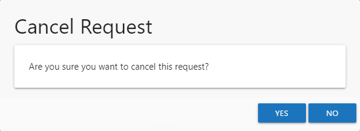
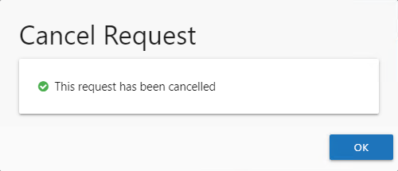

# Cancel Request Window

The Cancel Request window opens from the Request History Page of the Your Access portal when you select to cancel an access request. See the [Request History Page](../YourAccessPortal/RequestHistory "Request History Page section") topic for additional information. Follow the steps to cancel an access request.

**Step 1 –**  On the Request History Page of the Your Access portal, select the desired request and click **Cancel**. The Cancel Request window opens to confirm the action.

**Step 2 –** Click **Yes** to cancel the request.

**NOTE:** You can click **No** to keep the pending request and close the Cancel Request window.

**Step 3 –** The Access Information Center starts the action. When the action completes successfully, click **OK** to close the Cancel Request window.

The request remains on the Request History page, but is no longer pending. Its status is set to Canceled, with you as the Reviewer.