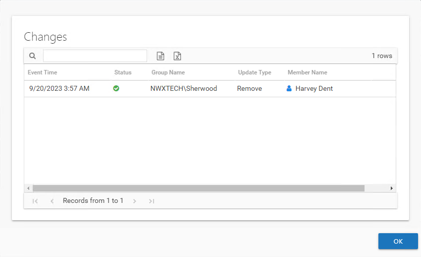

# Changes Window

Select the desired request on the [Request History Tab](../Interface#Request "Request History Tab") of the Access Requests interface and click **View Changes**. The Changes window opens.

The table displays the following information for selected trustee:

* Event Time – Date timestamp of when the change was committed
* Status – Icon indicates the decision made by the owner on the request: Accepted (green check mark), Declined (red **x**), or Canceled (orange circle with slash)
* Group Name – Name of the group where membership was modified to process the change in Active Directory. Access to File System and SharePoint resources are controlled through Access Groups. See the [Access Groups](../../ResourceOwners/AccessGroups "Access Groups") topic for additional information.
* Update Type – Indicates if group membership was added or removed to process the change
* Member Name – sAMAccountName associated with the domain user whose membership was being changed

**NOTE:** The table data grid functions the same way as other Access Information Center table grids. See the [Data Grid Features](../../../General/DataGrid "Data Grid Features") topic for additional information.

Click **OK** to close the window.