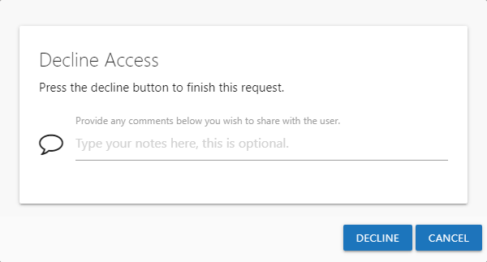
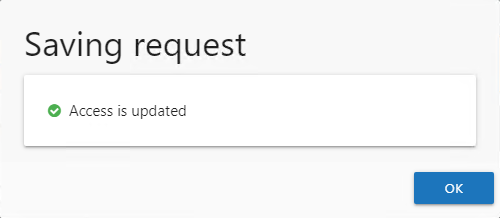

# Decline Access Window

The Decline Access window opens from the Pending Access Requests Page of the Owner portal when you select to decline an access request to your resource. See the [Pending Access Requests](../Owners/PendingRequests "Pending Access Requests Page") topic for additional information. Follow the steps to decline an access request.

**Step 1 –**  On the Pending Access Requests Page, select the desired request and click **Decline**. The Decline Access window opens.

**Step 2 –** Optionally enter a reason for denying the request, which will be included in the notification sent to the requester.

**Step 3 –**  Click **Decline** to cancel the request.

**NOTE:** You can click **Cancel** to close the window without denying the request.

**Step 4 –** The Access Information Center starts the action with the status displayed in the Saving request window. When the action completes successfully, click **OK** to close the Saving request window.

The access request has been declined and the requester sent an email notification informing them. The request is visible on the Access Request History Page. See the [Access Request History](../Owners/RequestHistory "Access Request History Page") topic for additional information.