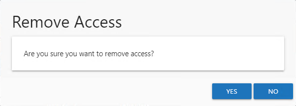
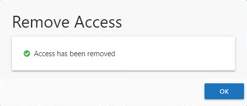

# Remove Access Window

The Remove Access window opens from the Your Access portal when you select to remove your existing access to a resource. Follow the steps to remove your access.

**Step 1 –**  In the Your Access portal, select the desired resource from the list of current access and click **Remove Access**. The Remove Access window opens to confirm the action.

**Step 2 –** Click **Yes** to cancel the remove your access for the selected resource.

**NOTE:** You can click **No** to keep the access and close the Remove Access window.

**Step 3 –** The Access Information Center starts the action. When the action completes successfully, click **OK** to close the Remove Access window.

Your access to the resource was removed. The removal action appears on the Request History page. Its status is set to Canceled, with you as the Reviewer.