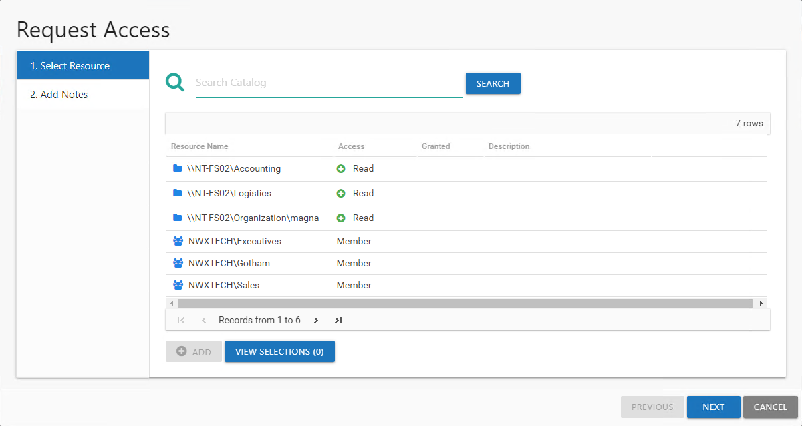
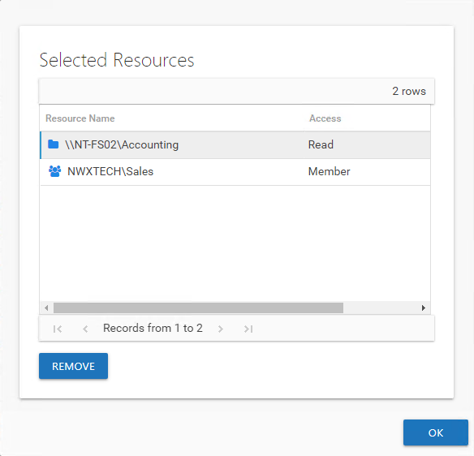
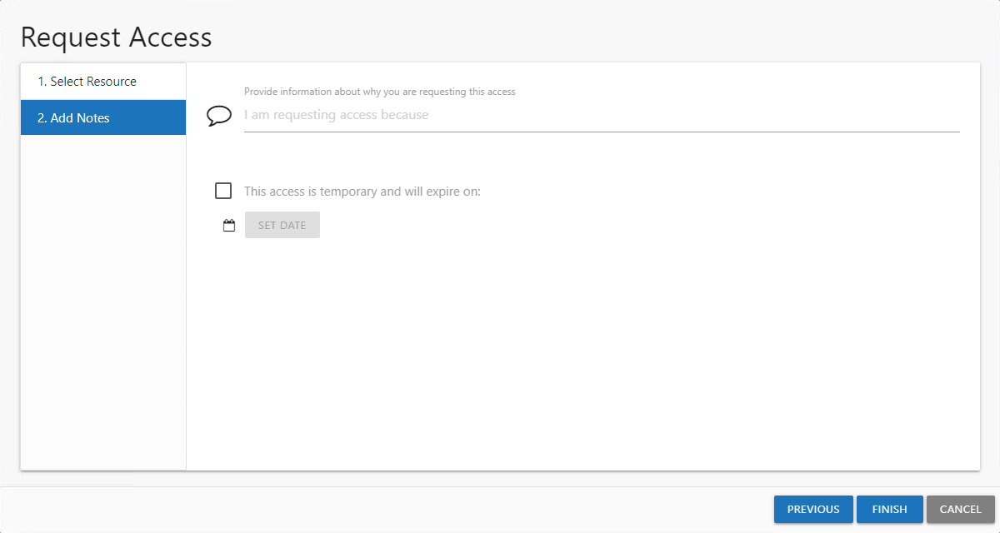
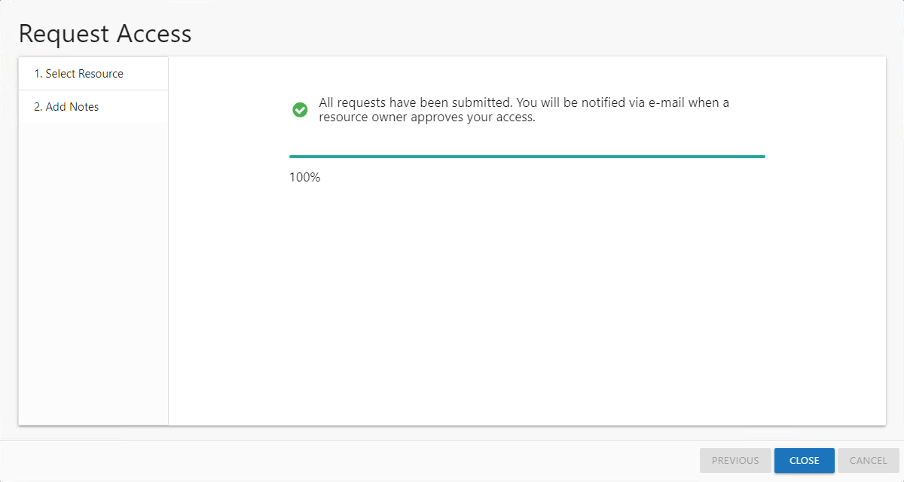

# Request Access Wizard

The Request Access wizard is opened with the **Request Access** button in the Your Access portal.

It contains two pages:

* 1. Select Resource — Select the resource or group

  **NOTE:** Only those resources or groups being managed through the Access Information Center will be available for access requests.
* 2. Add Notes — Allows you to enter a note explaining why the request is being made

See the [Submit a Request](#Submit "Submit a Request") topic for additional information.

## Submit a Request

Follow the steps to submit a resource request.

**Step 1 –** In the Your Access portal, click **Request Access**. The Request Access wizard opens.

**Step 2 –** On the Select Resource page, locate the desired resources using the Search Catalog and browse options.

* Search Catalog – Begin typing the name of the resource:

  * For File System, enter a share name or UNC path (starting with `\\`)
  * For SharePoint, enter the site URL (`http://`)
  * For groups and distribution lists, enter the group name. To focus on a particular domain or filter the search field to groups which reside in a particular domain, enter the domain name.

  *Remember,* it is possible that the resource may not be managed by the Access Information Center. Contact the Request Administrator if the desired resource does not come up with search filters.
* Browse option – Navigate through the table to select the desired resource. The table will display the following information:

  * Resource Name – The icon indicates the type of resource. The resource name includes its location, such as the UNC path for a file system resource, the URL for SharePoint resource, or Group name (e.g., [Domain]\[Group]).
  * Access – Level of access currently possessed. A green plus symbol indicates multiple access levels are available. Possible values include:

    * For file system and SharePoint resources: Full Control, Modify, or Read
    * For groups and distribution lists: Membership
  * Granted – Indicates your current access
  * Description – Resource description as provided by the resource owner

  **NOTE:** When there are more than 100 rows of resources available for access request, this page will only load 100 rows of data. You will be able to search for a specific resource that is not showing in the current view.

**Step 3 –** Select the resource in the table. If there are multiple access levels available, as indicated by the green plus (+) button, click the button to rotate through and select the desired access level. Multiple resources can be selected using ether the Ctrl or Shift key with mouse click combinations. Click **Add** to place a selected resource into your list.

**Step 4 –** Use the **View Selections** button to open the Selected Resources window. If an extra resource is in your list, select it and click **Remove**. Click **OK** to close the window.

**Step 5 –** When you selection list is set as desired, click **Next**.

**Step 6 –** On the Add Notes page, enter the following information:

* The reason for the request — This is included in the notification sent to the owner. The owner may decline the request if the reason is unknown.
* Temporary Access — *(Optional)* If only temporary access is required, select the checkbox, click **Set Date** and select an expiration date. The owner of the resource can modify this date.

  **NOTE:** When a user has temporary access already granted to a resource, and then requests a different type of access to the same resource with a different expiration date, once the new access is granted, the new expiration date supersedes the old date.

**Step 7 –** Click **Next** and the Access Information Center starts the action.

**Step 8 –** The action status displays on the page. When the action has completed (100%), click **Finish**. The Request Access wizard closes.

The Access Information Center sends an email to the owner containing the note you supplied. You also receive an email about the pending request. The access request is pending until the owner approves or denies it. You can check on the status of your request on the [Request History Page](../YourAccessPortal/RequestHistory "Request History Page").

When the request has been processed by the owner, you will be notified via email. See the [Access Request Updated Email](../Email/Updated "Access Request Updated Email") topic for additional information.