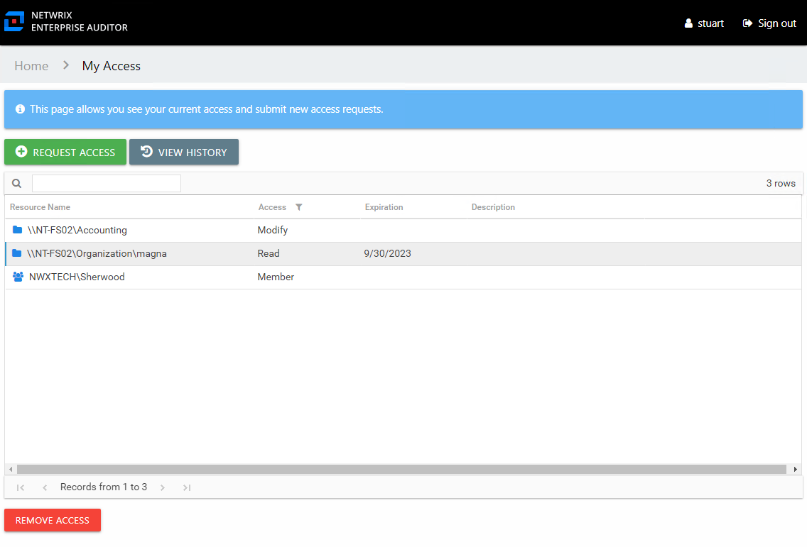
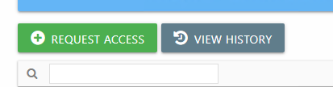

# Your Access Portal Overview

When your organization has set up Self-Service Access Requests through the Netwrix Access Information Center (Access Information Center), it means you, as a domain user, can request access to organizational resources and membership to security groups and distribution lists.

The Your Access portal is where domain users can view their current access, submit access requests, and view the status of their requests. Where the Access Information Center opens is dependent on whether or not you have Access Information Center Console access.

* For a domain user with an Access Information Center user role , the Access Information Center will open to the Home page. You will use the **Manage Your Access** link in the Your Link section to open the Your Access portal.
* For a domain user without an Access Information Center user role who has been assigned ownership of a resource, the Access Information Center will open directly to the Owner portal. You will use the **My Access** link to open the Your Access portal.
* For domain user without an Access Information Center user role who are not assigned ownership of a resource, the Access Information Center will open directly to the Your Access portal.

The Your Access portal displays your current access for resources managed through the Access Information Center.

The information displayed in the table includes:

* Resource – The icon indicates the type of resource. The resource name includes its location, such as the UNC path for a file system resource, the URL for SharePoint resource, or Group name (e.g., [Domain]\[Group]).
* Level of access requested. Possible values include:

  * For file system and SharePoint resources: Full Control, Modify, or Read
  * For groups and distribution lists: Membership
* Expiration – If the access is temporary, shows the expiration date:

  * When a user has temporary access already granted to a resource, and then requests a different type of access to the same resource with a different expiration date, once the new access is granted, the new expiration date supersedes the old date.
* Description – Description or explanation of the resource as supplied by either the Ownership Administrator or the assigned owner

The buttons above and below the table enable you to perform the following actions:

| Button | Description |
| --- | --- |
| Request Access | Opens the Request Access wizard, which allows you to submit access requests. See the [Request Access Wizard](../Wizard/RequestAccess "Request Access Wizard") topic for additional information. |
| View History | Opens the Request History page, which displays information on all of your pending and processed requests. See the [Request History Page](RequestHistory "Request History Page") topic for additional information. |
| Remove Access | Opens the Remove Access window, which allows you to remove access for yourself for the selected resource. See the [Remove Access Window](../Window/RemoveAccess "Remove Access Window") topic for additional information. |