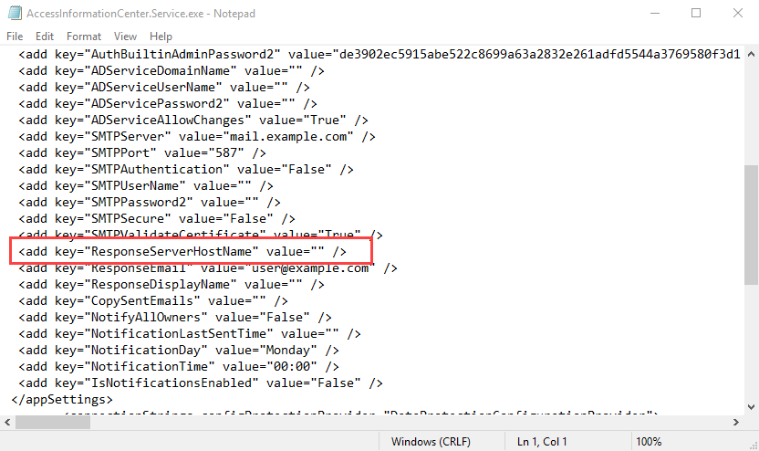

# Alias Server Host Name

The Access Information Center can be accessed through a supported browser from a machine within your company's network. The URL is the hosting machine's name and the port, http://[HOSTNAME.DOMAIN.COM]:81. For example, if the application was installed on a server named NEWYORKSRV10.NWXTech.com with the default port of 81, the URL would be http://NEWYORKSRV10.NWXTech.com:81. This URL is supplied as the hyperlinks within the body of Notification emails. It can be customized by supplying an alias server host name.

The Response Server Host Name parameter can be modified in the `AccessInformationCenter.Service.exe.config` file, which is located in the Access Information Center installation directory:

…\STEALTHbits\Access Information Center

Follow the steps to supply an alias server host name for notification hyperlinks.

**Step 1 –** Open the `AccessInformationCenter.Service.exe.config` file in a text editor, for example Notepad.



**Step 2 –** Locate the `ResponseServerHostName` parameter. By default, the value is blank. If left blank, the default URL is used in notifications. Edit this parameter value by adding an alias server host name between the double quote marks. For example, the parameter would look like this if the desired alias server host name is `AccessInformation.NWXTech.com`:

```

```
**Step 3 –** Save and close the `AccessInformationCenter.Service.exe.config` file.

Notification hyperlinks now use the supplied alias server host name.