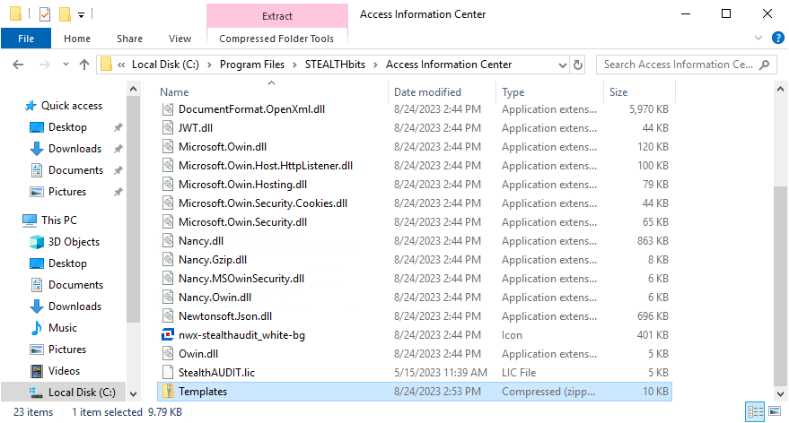
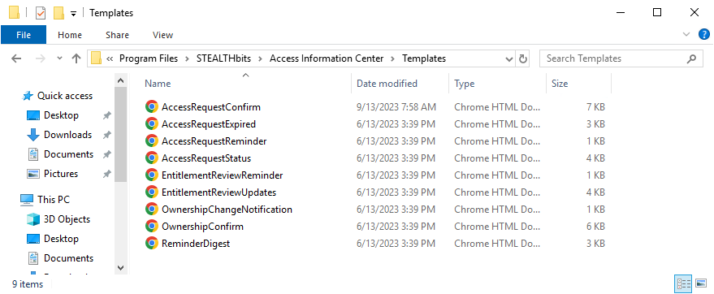

# Email Templates

The HTML templates used to format notification email can be customized. These templates are designed to make the message viewable within an email client. It is recommended to edit text and layout as desired, but NOT to embed new images or logos. The following table shows the notification email templates and describes the purpose of each.

| Template Name | Message Type Description |
| --- | --- |
| AccessRequestConfirm | Sent to owners when an access request has been submitted for their resource |
| AccessRequestExpired | Sent to users when their access to a resource has expired |
| AccessRequestReminder | Reminds owners of pending access requests; manually sent by a Request Administrator from the Access Requests interface |
| AccessRequestStatus | Sent to requesting users when an owner reviews an access request |
| EntitlementReviewReminder | Reminds owners of pending reviews; manually sent by a Review Administrator from the Resource Reviews interface |
| EntitlementReviewUpdates | Sent to the review creator when a resource owner submits a response to a resource review |
| OwnershipChangeNotification | Sent to owners when assigned ownership is changed for a resource which already has pending reviews or access requests |
| OwnershipConfirm | Sent to owners to confirm or decline ownership of a given resource; manually sent by an Ownership Administrator from the Resource Owners interface |
| ReminderDigest | Weekly reminder configured by Administrators on the Notifications page of the Configuration interface to owners with pending reviews or access requests |

While customizing the template content, take note of the inline Substitution Tokens. These exist to provide the message with dynamic content, i.e. inserting values and strings from data in line with the static portion of the message body. These Substitution Tokens begin and end with the “@” symbol, e.g. @UserName@.

Substitution Tokens are only valid for certain Notification message templates. Below is a table of the Substitution Tokens, the value or string they represent, and the message templates in which they may be used.

| Substitution Token | Description | Applicable Template(s) |
| --- | --- | --- |
| @AccessName@ | Descriptive name of the type of access being requested (Read, Modify, etc.) to a resource | AccessRequestConfirm  AccessRequestExpired  AccessRequestStatus |
| @Changes@ | Number of review changes | EntitlementReviewUpdates |
| @LoginUrl@ | URL that allows a user to access the default (login) page | AccessRequestConfirm  AccessRequestReminder  OwnershipChangeNotification  ReminderDigest |
| @RequestCount@ | Numerically formatted count of pending access requests | ReminderDigest |
| @ResourceDescription@ | Description of resource   * To use the resource's description in emails instead of the path, replace @ResourcePath@ with @ResourceDescription@ | AccessRequestConfirm  AccessRequestStatus  OwnershipConfirm  ReminderDigest |
| @ResourcePath@ | Path of the current resource   * To use the resources’ description in emails instead of the path, replace @ResourcePath@ with @ResourceDescription@ | AccessRequestConfirm  AccessRequestExpired  AccessRequestStatus  EntitlementReviewUpdates  OwnershipConfirm  ReminderDigest |
| @ResourceType@ | Type of resource | AccessRequestConfirm  AccessRequestExpired  AccessRequestStatus  EntitlementReviewUpdates  OwnershipConfirm  ReminderDigest |
| @ResourceUrl@ | URL specifically created to respond to a request | AccessRequestConfirm  EntitlementReviewReminder  OwnershipConfirm |
| @ResponseCount@ | Numerically formatted count of pending reviews or access requests | AccessRequestReminder  ReminderDigest |
| @ReviewCount@ | Numerically formatted count of pending reviews | ReminderDigest |
| @ReviewName@ | Name of the resource review | EntitlementReviewUpdates |
| @ReviewType@ | Type of resource review | EntitlementReviewUpdates |
| @StatusText@ | Status of an access request (Confirmed, Declined, Waiting) | AccessRequestStatus |
| @UserName@ | Name of the user who submitted the access request | AccessRequestConfirm  AccessRequestStatus  EntitlementReviewUpdates |
| @UserNotes@ | Any notes the user submitted as part of the access request | AccessRequestConfirm  AccessRequestStatus |

## Customize Email Templates

Email templates are shipped in a ZIP file and stored in the Access Information Center installation directory:

…\STEALTHbits\Access Information Center

Follow the steps to customize the email templates.

**NOTE:** To successfully modify these Notifications email templates, a familiarity with basic HTML is necessary.

**Step 1 –** Navigate to the Access Information Center installation directory:

…\STEALTHbits\Access Information Center

**Step 2 –** Unzip the `Templates.zip` file and save the contents to a folder within this directory named `Templates`.

**CAUTION:** The customized email templates must be in the `Templates` folder within the installation directory to be preserved during future application upgrades.

**Step 3 –** Locate the desired HTML message template.

**Step 4 –** Open the file with a text editor, e.g. Notepad, and customize the email body.

**NOTE:** Using a tool other than a text editor to edit HTML files, such as a WYSIWYG web page editor which may drastically alter the underlying HTML code, is not supported.

**Step 5 –** Email subject lines can be edited by changing the text between the opening `` tag and the closing `` tag.

**Step 6 –** After making changes, save the file and view it within a web browser to see what the changes will look like. The Substitution Tokens will display without supplied values.

**Step 7 –** After making the desired changes, save and close the text editor. Then re-launch the application.

The modifications to the HTML email templates are in use by the notification emails.