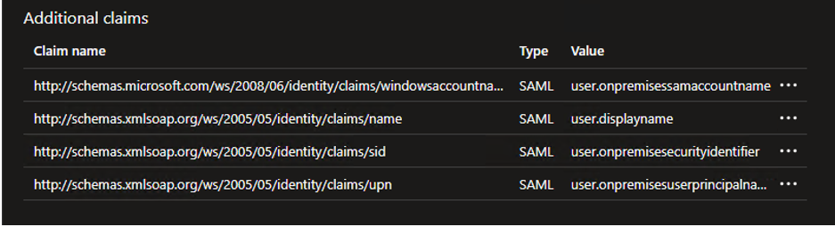
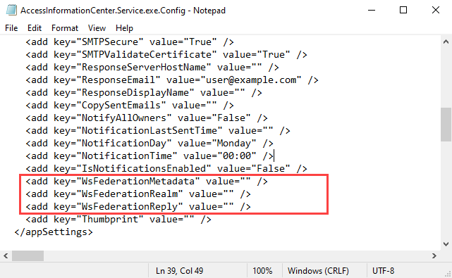

# Microsoft Entra ID Single Sign-On

The Access Information Center can be configured to use Microsoft Entra ID Single Sign-On (SSO). When configured, users are directed to the Microsoft Entra ID login page, and can log in using their existing Entra credentials.

**NOTE:** If enabled, only Microsoft Entra ID SSO can be used for logging in. Other accounts, including the default administrator account, cannot be used.

The following is required to use Microsoft Entra ID SSO:

* SSL must be enabled
* The on-premise Active Directory must be synced with Microsoft Entra ID

To enable Microsoft Entra ID SSO, you must first create a registered application in Microsoft Entra ID, and then configure the Access Information Center to use it.

## Configure an Application in Microsoft Entra ID

An application must be registered for the Access Information Center with your Microsoft Entra ID tenant and be configured with the necessary single sign-on settings. Follow the steps to create and configure the application.

**Step 1 –** Sign in to the [Microsoft Entra admin center](https://entra.microsoft.com/ "Microsoft Entra admin center").

**Step 2 –** On the left navigation menu, navigate to **Identity** > **Applications** > **Enterprise Applications**. On the top toolbar, click App registrations and then **Create your own application**.

**Step 3 –** On the Create your own application page, enter a name for your application and select the **Integrate any other application you don't find in the gallery** option. Click **Create** to finish creating the application.

**Step 4 –** In your application, go to **Manage** > **Single sign-on**. Select **SAML** as the single sign-on method.

**Step 5 –** On the Set up Single Sign-On with SAML page, click **Edit** on the Basic SAML Configuration section. Add your Identifier and Reply URL, and then click **Save**.

* As the Identifier, enter `https://:`, for example:

  ```
https://app0190.train90.local:481
  ```
* As the Reply URL, enter `https://:/v2/federation`, for example:

  ```
https://app0190.train90.local:481/v2/federation
  ```
**Step 6 –** Next, click **Edit** on the Attributes & Claims section. The four claims in the table below are required. For each of these, click **Add new claim**, enter the information from the table, and then click **Save**.

| Name | Namespace | Source attribute |
| --- | --- | --- |
| windowsaccountname | http://schemas.microsoft.com/ws/2008/06/identity/claims | user.onpremisessamaccountname |
| name | http://schemas.xmlsoap.org/ws/2005/05/identity/claims | user.displayname |
| sid | http://schemas.xmlsoap.org/ws/2005/05/identity/claims | user.onpremisessecurityidentifier |
| upn | http://schemas.xmlsoap.org/ws/2005/05/identity/claims | user.onpremisesuserprincipalname |

Once configured they should show under Additional claims as below:



**Step 7 –** In the **Manage** > **Users and groups** section for your application, add any required users or groups to give permission to access the application.

The application is now configured with the necessary settings. The next step is to enable the use of Microsoft Entra ID SSO in the Access Information Center config file.

## Enable in the Access Information Center Config File

To enable Microsoft Entra ID SSO for the Access Information Center, the config file needs to be updated with values from Microsoft Entra ID. Follow the steps to enable the SSO.

*Remember,* Enabling Entra ID SSO requires SSL to be enabled. If this was not done during the installation, then you must manually configure it. See the [Securing the Access Information Center](../../Installation/Secure "Securing the Access Information Center") topic for additional information.

**Step 1 –** Open the `AccessInformationCenter.Service.exe.config` file in a text editor, such as Notepad. The file is located in the Access Information Center installation directory:

…\Program Files\STEALTHbits\Access Information Center



**Step 2 –** Locate the **WsFederationMetaData**, **WsFederationRealm**, and **WsFederationReply** parameters in the config file. If these are not present, then manually add them to your config file as follows:

```
  
      
    
```
**NOTE:** For new installations of the Access Information Center these parameters are already in the config file. If you have upgraded from a previous version, then you need to manually add them as the config file is retained during an upgrade to maintain the existing settings.

**Step 3 –**  Add the required values for the parameters from your Microsoft Entra ID application:

* WsFederationMetaData – Metadata markup for describing the services provided

  * This value can be retrieved from your application in Microsoft Entra ID: **Manage** > **Single sign-on** > **SAML Certificates** > **App Federation Metadata Url**
* WsFederationRealm – Maps to the application identifier to Microsoft Entra ID

  * This value can be retrieved from your application in Microsoft Entra ID: **Manage** > **Single sign-on** > **Basic SAML Configuration** > **Identifier**
* WsFederationReply – This is the endpoint for the configured relying party trust

  * This value can be retrieved from your application in Microsoft Entra ID: **Manage** > **Single sign-on** > **Basic SAML Configuration** > **Reply URL**

For example:

```
  
      
    
```
**Step 4 –** Save and close the file.

**Step 5 –** Navigate to Services (`services.msc`). Restart the Netwrix Access Information Center service.

The Access Information Center has been enabled for Microsoft Entra ID single sign-on.