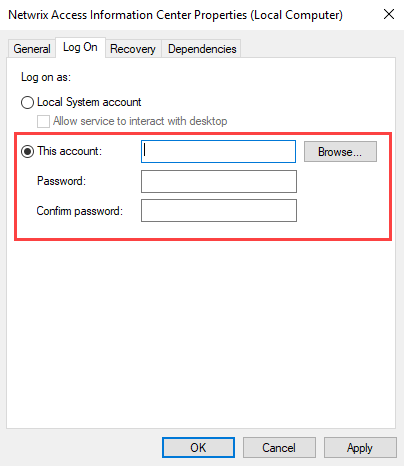
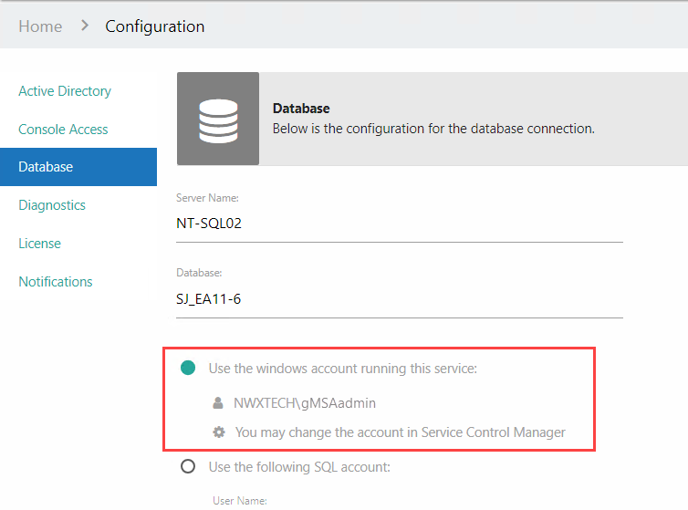

# Group Managed Service Account (gMSA) Configuration

You can use a group Managed Service Account (gMSA) account to run the Netwrix Access Information Center service. It can then also be used to connect to the database, email server, and Active Directory.

The following pre-requisites are required before configuring the Access Information Center to use a gMSA:

* The gMSA must be added to the Local Administrator Group on the host where the AIC is installed
* In SQL Server Management Studio, the gMSA needs to be added to the **Security** > **Logins** node for the SQL server where the AIC Database resides with the following settings:

  * On the General page, the **Login name** should be the `Domain\Name` of the gMSA
  * On the Server Roles page, the **public** and **sysadmin** checkboxes must be selected
* Netwrix Access Information Center has been installed using one of the regular authentication methods, and not using the gMSA. See the [Install the Access Information Center](../../Installation/Install "Install the Access Information Center") topic for additional information.
* If the gMSA is to be used to connect to Active Directory or an email server, the gMSA account must have the necessary rights to Active Directory and Exchange

For more information on group Managed Service Accounts, see the Microsoft [Group Managed Service Accounts](https://learn.microsoft.com/en-us/windows-server/security/group-managed-service-accounts/group-managed-service-accounts-overview "Group Managed Service Accounts article") article.

## Run Netwrix Access Information Center Service

Follow the steps to configure the Netwrix Access Information Center service to run using the gMSA.

**Step 1 –** Open the Services Console. Right-click on the Netwrix Access Information Center service and select **Properties**.

**Step 2 –**  On the Log On tab of the properties window, select the **This account** option. Enter the gMSA account name and leave the password fields blank.

* Click **Browse** to find and select the gMSA using the Select User window.

**Step 3 –** Restart the Netwrix Access Information Center service.

The Netwrix Access Information Center service is now running using the provided gMSA account.

## Connect to Database, Email Server, and Active Directory

If the Netwrix Access Information Center service is running with a gMSA, you can use the gMSA to connect to the Access Analyzer database, email server, and Active Directory.

Follow the steps to connect using the gMSA.

**Step 1 –** Log in to the Access Information Center.

**Step 2 –** On the Administrator home page, click **Configure Console**and then go to the relevant Configuration page.

* To configure the database connection, select the **Database** page
* To configure the connection to Active Directory, select the **Active Directory** page
* To configure the connection to your email server, select the **Notifications** page

**Step 3 –** On the Configuration page, select the **Use the account running this service** option. Click **Save**.

**Step 4 –** Log out of the Access Information Center.

The Access Information Center now connects using the gMSA account. Repeat the steps for each required connection using the gMSA.