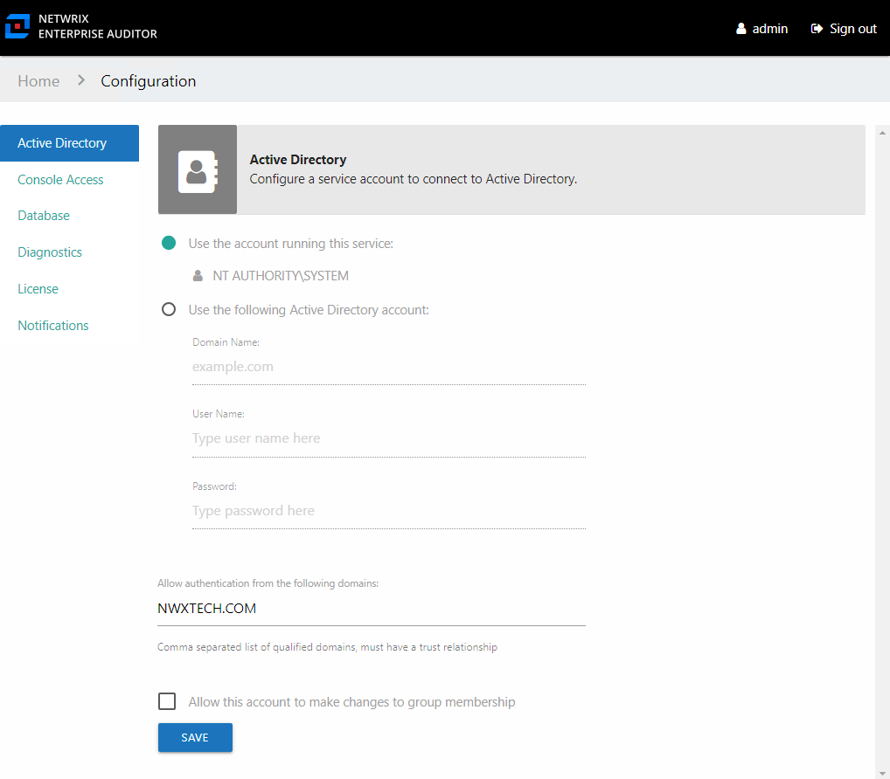
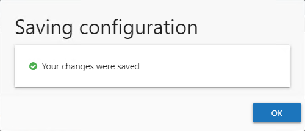

# Active Directory Page

The Access Information Centerneeds to be connected to Active Directory for user authentication and to assign resource ownership in the Resource Owners interface. The Active Directory service account is configured on the Active Directory page of the Configuration interface. Read access to Active Directory is required for this purpose.

The Active Directory service account is configured during installation based on the account used for connecting to the database. If your Database service account uses:

* SQL Server authentication credentials — Active Directory service account is configured to use the Local System, or computer account, which typically has Read rights to the domain
* Windows authentication credentials — The same domain credentials are also used for the Active Directory service account

There are two options for the type of Active Directory service account:

* Use the account running this service — Local System, or computer account (NT AUTHORITY\SYSTEM)

  * A group Managed Service Account (gMSA) can be used by configuring it to run the Netwrix Access Information Center service. See the [Group Managed Service Account (gMSA) Configuration](../AdditionalConfig/gMSA) Configuration") topic for additional information.
* Use the following Active Directory account – Uses a domain account with the required permissions to Active Directory. The supplied User Name [DOMAIN\USERNAME] and Password are used as the Active Directory service account.

## Multiple Domains

By default, only domain users from the domain where the Access Analyzer Console resides can access the Web Console and the Access Information Center. The **Allow authentication from the following domains** option is where access from other domains can be granted. Add any additional required domains to the default domain as a comma separated list.

* For example: `NWXTECH.COM,CORP.EXAMPLE.COM`

All domains provided must have a trust relationship with the domain where the Access Information Center resides.

If the Web Console is enabled for access from multiple domains, the Access Information Center should be configured to be accessible by the same domains. See the Enable Multiple Domain Access topic of the [Netwrix Access Analyzer Documentation](https://helpcenter.netwrix.com/category/accessanalyzer "Netwrix Access Analyzer Documentation") for additional information.

**NOTE:** All domains enabled to access the Access Information Center must also have data collected by the **.Active Directory Inventory** solution of Access Analyzer.

## Commit Group Membership changes

The Access Information Center can optionally be configured to commit Active Directory group membership changes via the change modeling feature, by resource owners via ad hoc changes, or as part of the Resource Reviews and Self-Service Access Requests workflows. This option require more permissions and setup. Once the prerequisites are in place, it can be enabled on this page.

When checked, the **Allow this account to make changes to group membership** option uses the Active Directory service account to commit group membership changes. See the [Commit Active Directory Changes](../AdditionalConfig/CommitChanges "Commit Active Directory Changes") topic for additional information on provisioning the Active Directory service account and best practices for group and resource management through the Access Information Center

*Remember,* click **Save** when any changes are made to this page.

## Update the Active Directory Service Account Password

Follow the steps to update the Active Directory service account password. These steps only apply for the **Use the following Active Directory account** option.

**Step 1 –** On the Active Directory page, enter the new password in the correct field.

**Step 2 –** Click **Save**. Then click **OK** to confirm. After the settings are saved, a re-authentication is required to continue using the Access Information Center.

The Active Directory service account password has been updated.