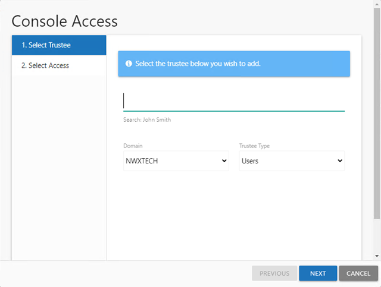
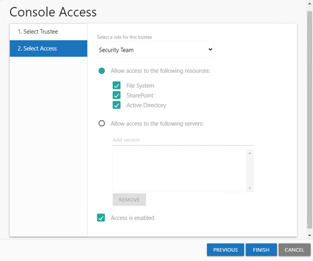
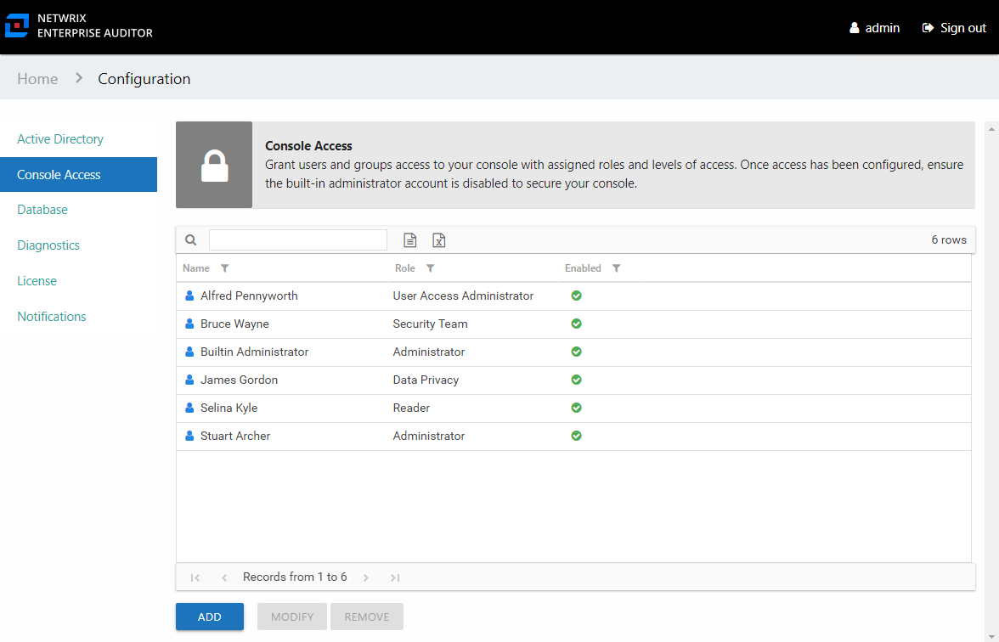
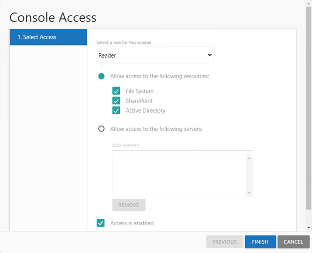
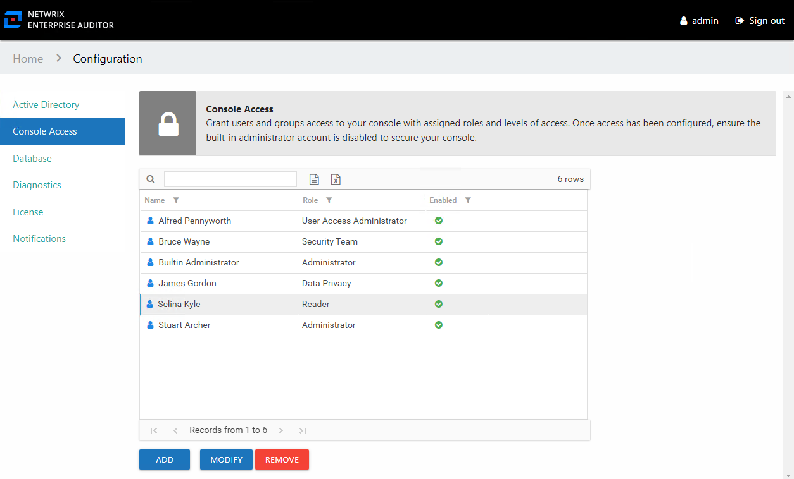
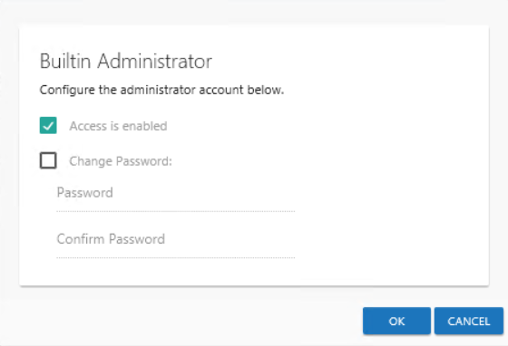

# Console Access Page

Console access to the is configured through the **Configuration** > **Console Access** page. Adding users to the Access Information Center requires data to be collected by the Access Analyzer .Active Directory Inventory Solution.

There are five levels of access, or Roles, which can be granted to domain users or groups:

* Administrator – Role allows access to all interfaces including the Configuration interface
* Security Team – Role allows access to all interfaces except for the Configuration interface
  * In the Resource Reviews interface, this role can only view resource reviews that the logged in user has created.
* Reader – Role limits the user’s access solely to reports available in the Resource Audit interface or through the Search features
* Data Privacy — Role allows the user to search metadata and identities from the Netwrix Access Analyzer (formerly Enterprise Auditor) Subject Profiles feature
* User Access Administrator — Role allows the user to configure console access for other users. This role does not grant access to any other page within the Configuration interface. Nor does it grant access to any other interface within the Access Information Center. This role also does not have rights to modify the Builtin Administrator account or their own access.

**NOTE:** If Netwrix Access Analyzer (formerly Enterprise Auditor) is storing discovered sensitive data, the Sensitive Data reports will only display the sensitive data matches for users with the Security Team and Administrator roles.

A user granted either the Reader or Security Team role can also be further restricted to accessing information for either:

* Specific resource types (File System, SharePoint, or Active Directory)
* Specific servers

**CAUTION:**  Before disabling the Builtin Administrator account, it is necessary to first assign at least one domain user account to the Administrator role. Login with another Administrator account to disable the Builtin Administrator. Failure to do this could result in being locked-out of the Configuration interface. As an alternative to disabling this account, the password can be changed. See the [Modify the Builtin Administrator Account](#Modify "Modify the Builtin Administrator Account") topic for additional information.

Once users have been granted console access, they can login with their domain credentials. Console access is not a requirement for participation as owners or domain users in the Resource Reviews and Self-Service Access Requests workflows. See the [URL & Login](../Login "URL & Login for StealthAUDIT") topic for information on how users will log in and where they are directed after login based on their assigned role or lack of role.

## Add Console Users

Follow the steps to grant domain users or groups console access.

**Step 1 –** In the Configuration interface on the Console Access page, click Add. The Console Access wizard opens.

**Step 2 –** On the Select Trustee page, enter the following information and click Next:

* Domain — If the Access Information Center has been configured for multiple domains, use the drop-down menu to select the desired domain
* Trustee Type — Choose between adding a user or a group by selecting from the drop-down menu
* Search — Begin typing the sAMAccountName or display name and the field will auto-populate options from Active Directory sAMAccountName

**Step 3 –** On the Select Access page, enter the following information and click **Finish**:

* Select a role for this trustee – Select a role from the drop down list:

  * Unlimited Access — The Administrator role grants unlimited access
  * Limited Access — All other roles can be granted limited access
* Allow access to the following resource — When enabled, users can be limited to only having visibility into data for the selected types of resources. Check the boxes for the type of resource data to be made available to this user.
* Allow access to the following servers — When enabled, users can be limited to only having visibility into data for specific servers. Begin typing server names and the field will auto-populate with known servers from scanned data. A resource type appears in parentheses after the host name for quick reference.
* Access is enabled – A user's account must be enabled in order to log into the console. Unchecking this option allows you to configure access to be granted at a future time.

**Step 4 –** The new user displays in the list on the Console Access page. Repeat these steps for each trustee to be granted console access.

Once the first user with the role of Administrator has been added, the Builtin Administrator account can be disabled by that user. See the [Modify the Builtin Administrator Account](#Modify "Modify the Builtin Administrator Account") topic for additional information.

## Modify Console Users

Follow the steps to modify a user’s console access.

**NOTE:** These steps are for modifying domain users with console access roles and do not apply to the Builtin Administrator account. See the [Modify the Builtin Administrator Account](#Modify "Modify the Builtin Administrator Account") topic for additional information.

**Step 1 –** In the Configuration interface on the Console Access page, select the user to be modified and click Modify. The Console Access wizard opens to the Select Access page.

**Step 2 –** Modify the desired settings and click **Finish**:

* Select a role for this trustee – Select a role from the drop down list:

  * Unlimited Access — The Administrator role grants unlimited access
  * Limited Access — All other roles can be granted limited access
* Allow access to the following resource — When enabled, users can be limited to only having visibility into data for the selected types of resources. Check the boxes for the type of resource data to be made available to this user.
* Allow access to the following servers — When enabled, users can be limited to only having visibility into data for specific servers. Begin typing server names and the field will auto-populate with known servers from scanned data. A resource type appears in parentheses after the host name for quick reference.
* Access is enabled – A user's account must be enabled in order to log into the console. Unchecking this option allows you to configure access to be granted at a future time.

Any modifications to the user’s role are visible in the list on the Console Access page.

## Delete Console Users

**CAUTION:** Confirmation is not requested when deleting users. An alternative to deleting a console user is to disable their access. See the [Modify Console Users](#_Modify_AIC_Users "Modify Console Users") topic for additional information.

Follow the steps to remove a user’s configured console access.

**Step 1 –** In the Configuration interface on the Console Access page, select the user.

**Step 2 –** Click Remove.

The user is removed from the list on the Console Access page.

## Modify the Builtin Administrator Account

The Builtin Administrator account can be disabled or its password can be changed. Follow the steps to modify this account.

**Step 1 –** In the Configuration interface on the Console Access page, select the Builtin Administrator account and click **Modify**. The Builtin Administrator window opens.

**Step 2 –** Modify the account as desired and click **OK**:

* Access is enabled — Indicates whether the account can be used to login
* Change Password — Allows you to change the password for this Builtin Administrator account. Check the box and enter the new password in both entry fields. The password must be eight or more characters long.

The modifications to the Builtin Administrator are processed.

**NOTE:** The new password is encrypted in the `AccessInformationCenter.Service.exe.config` file, in the `AuthBuiltinAdminPassword` parameter. If you forget the Admin password, you can clear the `AuthBuiltinAdminPassword` value in the `AccessInformationCenter.Service.exe.config` file. Then use the default first launch login credentials to set a new password.