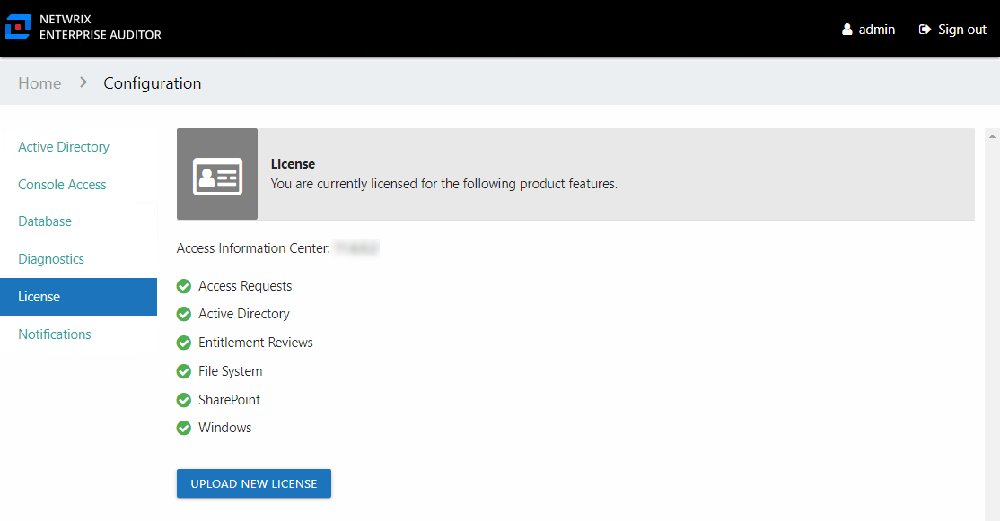
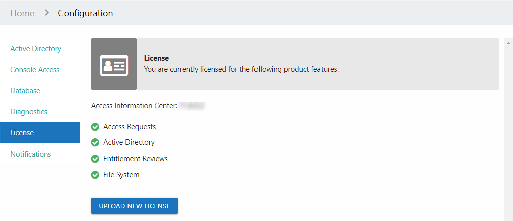
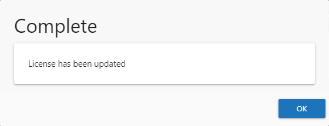

# License Page

Access to specific types of reports and workflows is controlled through the Access Information Center license, which is also the Netwrix Access Analyzer (formerly Enterprise Auditor) license key. The details of your current license can be viewed on the License page of the Configuration interface. Enabling additional features would require an updated license key, which can be discussed with your Netwrix Account Representative. If the features displayed in this tab do not reflect the features actually licensed, contact [Netwrix Support](https://www.netwrix.com/support.html "Netwrix Support"). See the [Upload License](#_Upload_License "Upload License") topic for information on updating the license key.

The Access Information Center version is displayed at the top. Then the following product features are controlled through the license:

* Access Requests – Part of the Self-Service Access Requests workflow, this feature enables the Access Requests interface and the Your Access portal. This feature will also enable the Resource Owners interface and the Owner portal, which are required parts of the Self-Service Access Requests workflow.
* Active Directory – Part of the Netwrix Access Analyzer (formerly Enterprise Auditor) Active Directory license, this feature enables access to Active Directory reports.
* Resource Reviews – Part of the Resource Reviews workflow, this feature enables the Resource Reviews interface. This feature will also enable the Resource Owners interface and the Owner portal, which are required parts of the Resource Reviews workflow.
* File System – Part of the Netwrix Access Analyzer (formerly Enterprise Auditor) File System license, this feature enables access to File System reports.
* SharePoint – Part of the Netwrix Access Analyzer (formerly Enterprise Auditor) SharePoint license, this feature enables access to SharePoint reports.
* Windows – Part of the Netwrix Access Analyzer (formerly Enterprise Auditor) Windows license, this feature enables access to local users and group reports.

The Access Information Center can receive data from other Netwrix Access Analyzer (formerly Enterprise Auditor) solutions. When the data is available in the Access Analyzer database, it will be included in the Access Information Center reports. Additionally, the Flexible Imports feature can be used to incorporate third-party data into reports.

### Upload License

Follow the steps to update the license key.

**NOTE:** The LIC file must be named to `StealthAUDIT.lic`. If it has another name, rename it before completing the steps.

**Step 1 –** In the Configuration interface on the License page, click **Upload New License**.

**Step 2 –** Navigate to the license key location. Select the `StealthAUDIT.lic` file and click **Open**.

**Step 3 –** When the upload is complete, click **OK**.

The updated licensed features are now enabled, displayed with green checkmarks.