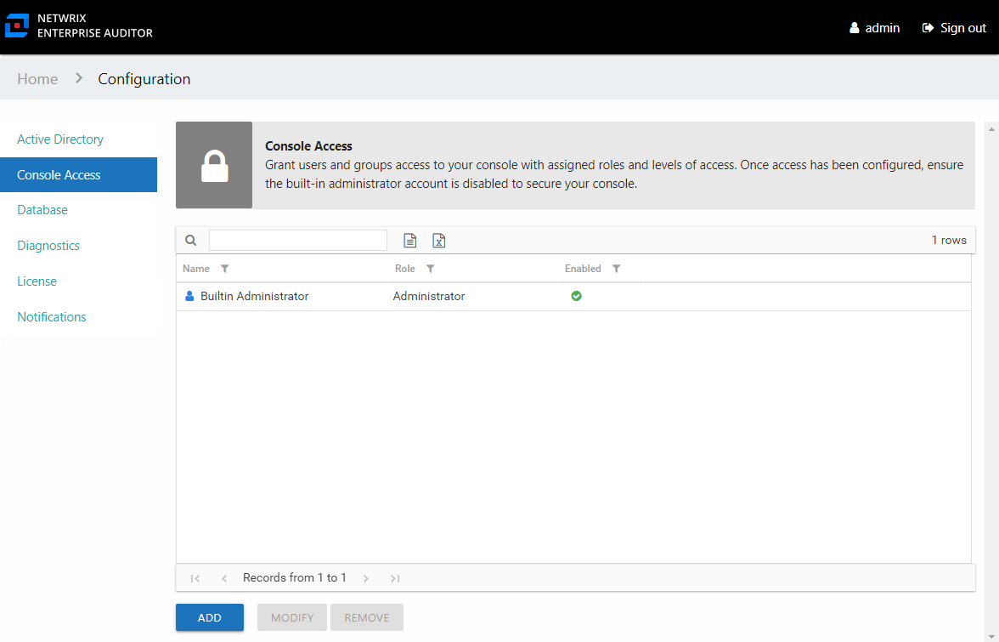

# Configuration Interface Overview

The Configuration interface is available only to users with the Administrator role. It is opened by the **Configure Console** link on the Home page.

It has the following pages:

* [Active Directory Page](ActiveDirectory "Active Directory Page") – Configure the Active Directory service account used to add console users. Optionally, enable the Access Information Center to commit changes in Active Directory.
* [Console Access Page](ConsoleAccess "Console Access Page") – Grant users console access
* [Database Page](Database "Database Page") – Configure the connection to the database
* [Diagnostics Page](Diagnostics "Diagnostics Page") – Download logs and enable debug log level for troubleshooting
* [License Page](License "License Page") – View license details and upload a new license
* [Notifications Page](Notifications "Notifications Page") – Configure the SMTP server, email security settings, notification options, and owner reminder settings