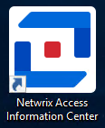
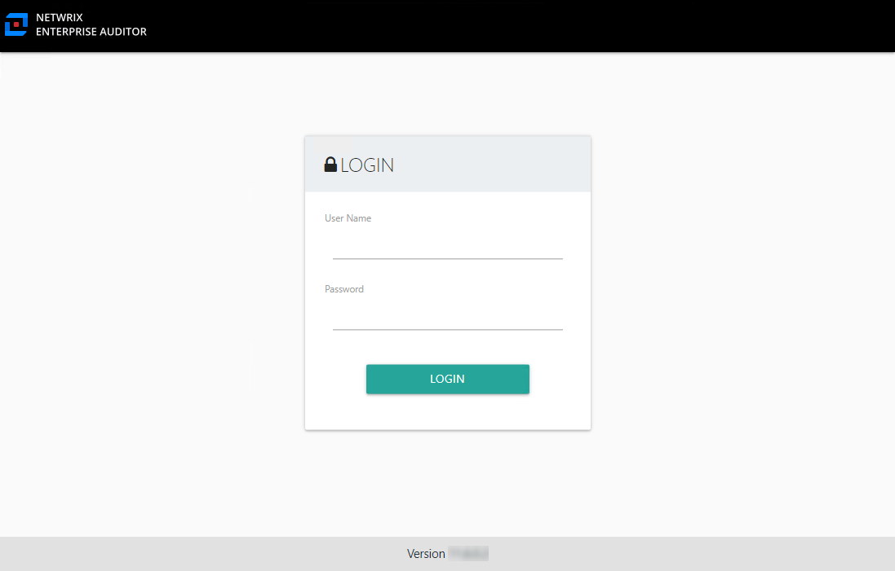
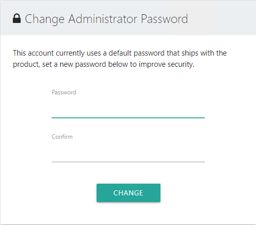
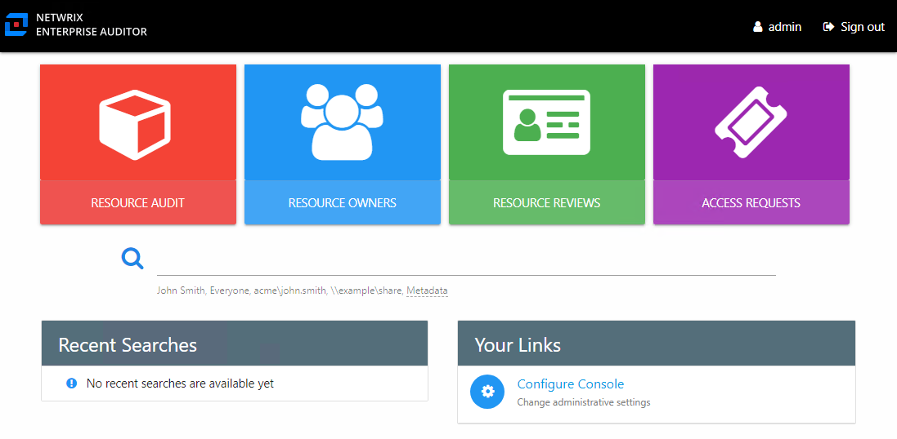

# First Launch

The installer places the following icon on the desktop which opens the Access Information Center with the independent URL:

Use this icon to launch the Access Information Center for the first time.

The Access Information Center is installed with a Builtin Administrator account. Use the following login credential for the first launch:

* Username: admin
* Password: sb

You will be prompted to change the Builtin Administrator password.

The new password must be eight or more characters long. After setting the password, you will need to login with the Builtin Administrator account.

Using the Configuration interface, the Builtin Administrator account can be disabled once a domain account has been granted the Administrator role. You can also change the password for the Builtin Administrator account. See the [Modify the Builtin Administrator Account](Configuration/ConsoleAccess#Modify "Modify the Builtin Administrator Account") topic for additional information.

After changing the Builtin Administrator password at first launch, you will be asked to login again. The Home page opens. The first thing that should be done is to configure console access for domain users. Additionally, other settings can be configured or modified through the Configuration interface. Click **Configure Console** in the Your Links section to open the Configuration interface. See the [Console Access Page](Configuration/ConsoleAccess "Console Access Page") topic for additional information.

Once console access to the has been configured, there are a few login methods you can offer users. The features available to users are controlled by the role assigned and your license key. See the [URL & Login](Login "URL & Login") topic for information on how users will log in and where they are directed after login.

See the [Navigation](Navigate "Navigation") topic for information on each of the interfaces and portals accessible from the Home page.