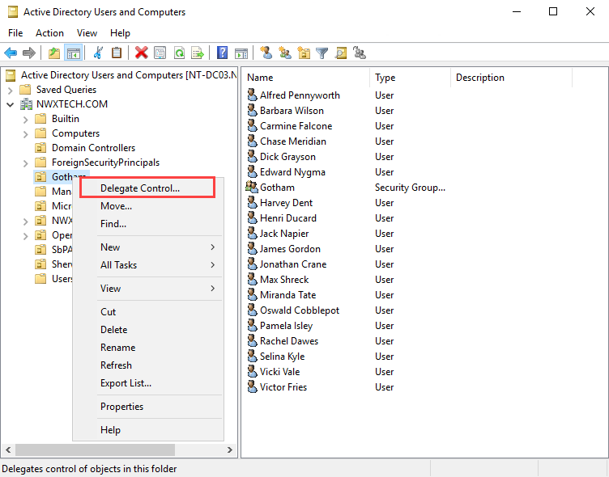
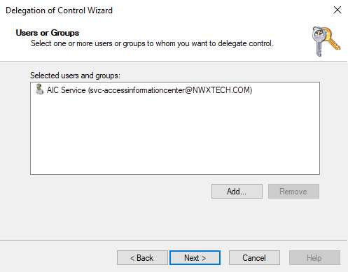
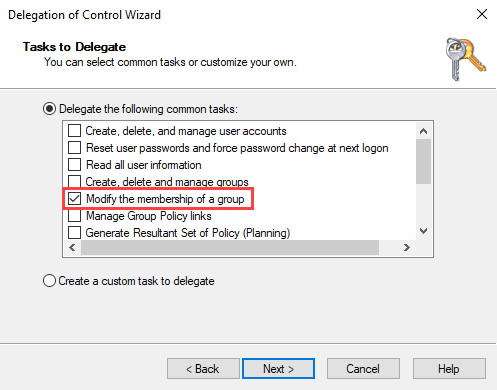

# Service Account Delegation

Delegation can be used to grant the Active Directory service account the minimal rights necessary to allow the Access Information Center to commit changes in Active Directory. Apply delegation to the OUs housing the security and distribution list groups to be managed to grant the rights of Allow Read Members and Allow Write Members to the service account. See the [Commit Active Directory Changes](../AdditionalConfig/CommitChanges "Commit Active Directory Changes") topic for best practices for group and resource management through the Access Information Center.

Follow the steps to apply delegation to the desired OUs.

**Step 1 –** In Active Directory Users and Computers, right-click on the OU housing the groups to be managed. Select **Delegate Control**. The Delegation of Control Wizard opens.

**Step 2 –** Navigate to the Users or Groups page. Click **Add**. Enter the Active Directory service account. Click **Next**.

**Step 3 –** Navigate to the Tasks to Delegate page. Select the **Delegate the following tasks** option and check the **Modify the membership of a group** task.

**Step 4 –** Navigate through the remaining wizard pages, and click **Finish**. The Delegation of Control Wizard closes.

This delegation grants the Active Directory service account Special Permissions to the OU, allowing the Read Members and Write Members rights.