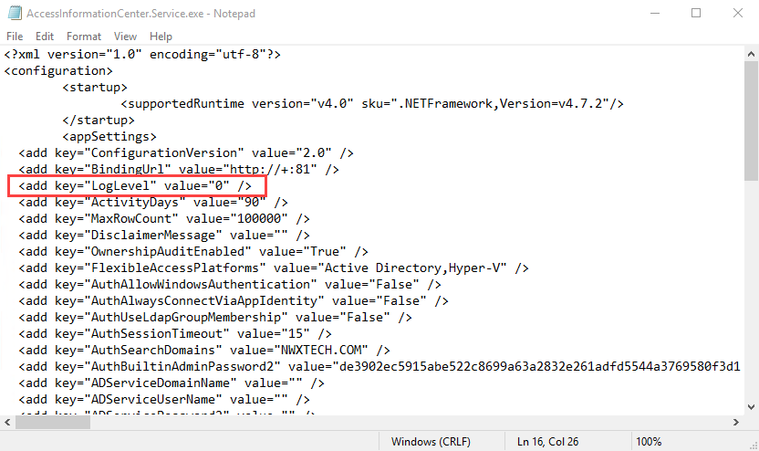

# Change Log Level

The `AccessInformationCenter.Service.exe.config` file is located in the Access Information Center installation directory:

…\STEALTHbits\Access Information Center

Follow the steps to modify the log level.

**Step 1 –** Open the `AccessInformationCenter.Service.exe.config` file in a text editor, for example Notepad.



**Step 2 –** The level value is set in the `LogLevel` parameter, where 0 is the default level. As the logging level increases from 0 to 3, the types of information and level of detail included within the log file also increase. Change to the desired log level:

```

```
* Error level is when `value="0"`
* Warning level is when `value="1"`
* Info level is when `value="2"`
* Debug level is when `value="3"`

  * Debug logging can be enabled from the Diagnostics page of the Configuration interface

**Step 3 –** Save and close the `AccessInformationCenter.Service.exe.config` file.

Once troubleshooting has finished, it is recommended to return the log level to the least verbose level, Error = 0, to prevent the log file from growing too large.