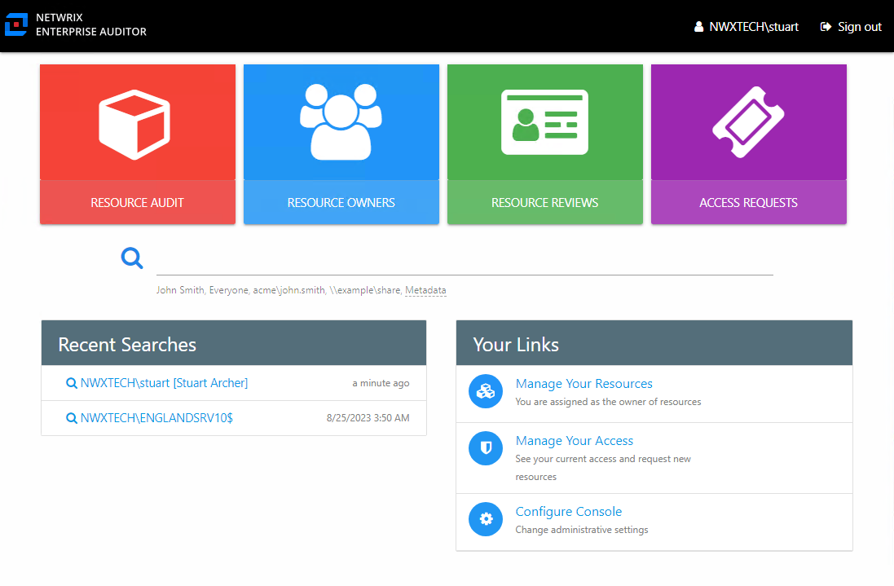
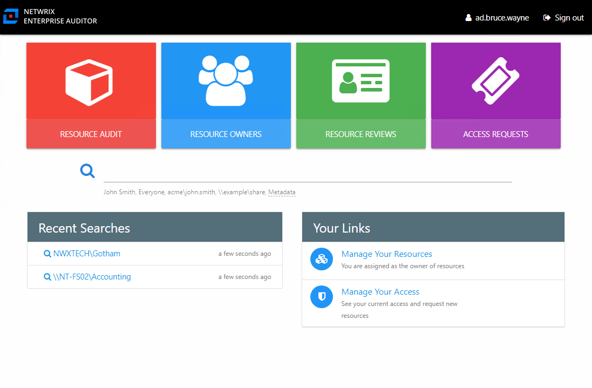
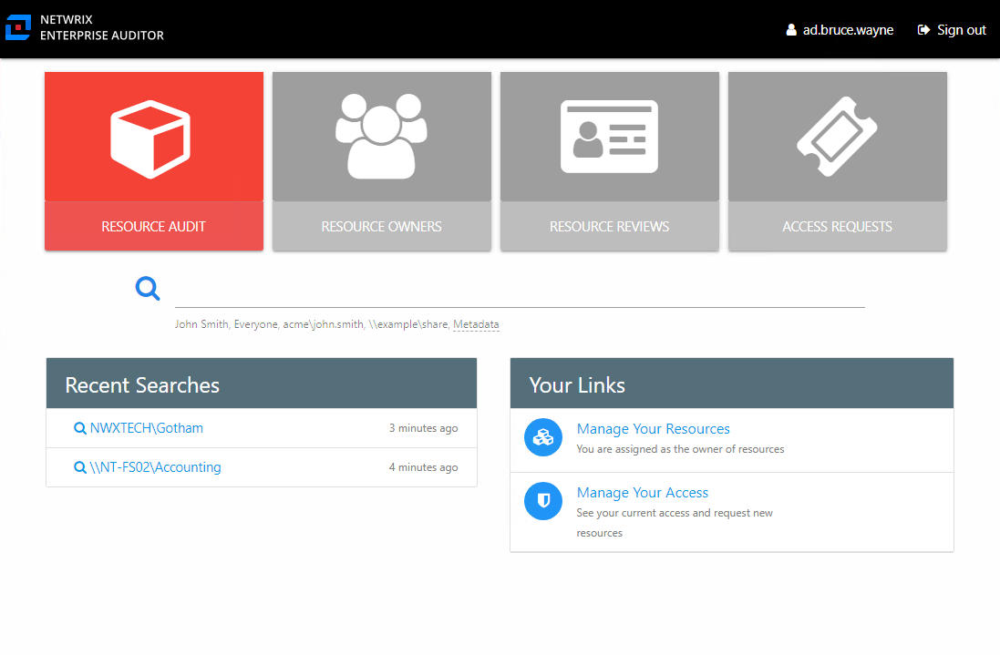
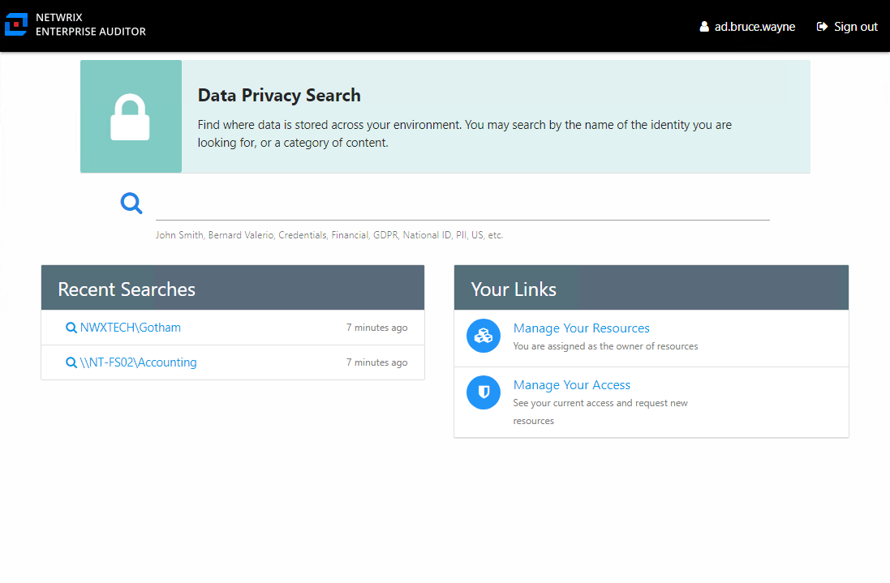
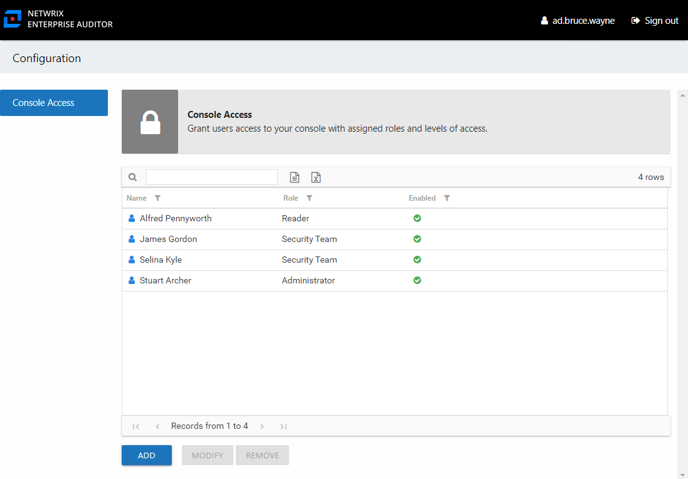
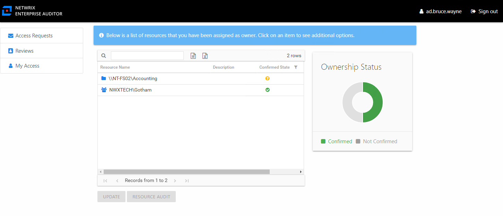
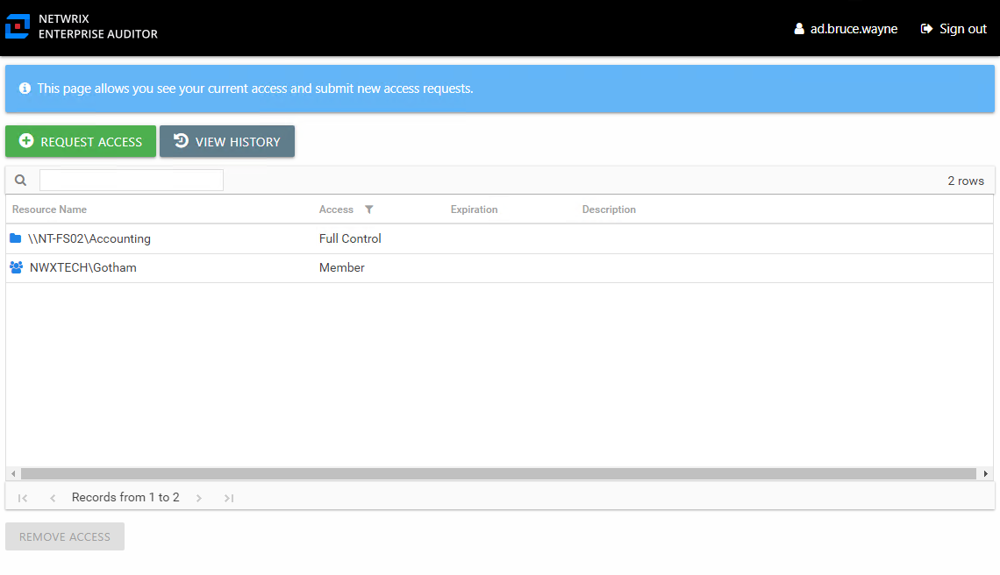

# User Landing Page

Role based access controls what interfaces users can see and where each user is directed upon login.

***RECOMMENDED:*** Send an email to your users. Let them know why you are implementing use of the application, provide the URL, and explain how to login with their domain credentials and the username format. See the [Enable Console Users](GettingStarted#Enable "Enable Console Users") topic for additional information.

## Administrator Role

Users granted the Administrator role are directed to the Home page upon login with access to all interfaces based on your organizations licensed features.

Administrators are the only ones with access to the Configuration interface through the **Configure Console** link. The Manage Your Resources link is available if the logged in user is also assigned ownership of a resource. The Manage Your Access link is available if the Self-Service Access Requests workflow has been enabled.

### Security Team Role

Users granted the Security Team role are directed to the Home page upon login.

Available buttons are limited by the organization’s license. Security Team members only lack access to the Configuration interface, which is only available to Administrators. The Manage Your Resources link is available if the logged in user is also assigned ownership of a resource. The Manage Your Access link is available if the Self-Service Access Requests workflow has been enabled.

## Reader Role

Users granted the Reader role are directed to the Home page upon login.

These users only have access to the Resource Audit interfaces and Search feature. The Manage Your Resources link is available if the logged in user is also assigned ownership of a resource. The Manage Your Access link is available if the Self-Service Access Requests workflow has been enabled.

## Data Privacy Role

Users granted the Data Privacy role are directed to the Home page upon login.

These users only have access to the Search feature. The Manage Your Resources link is available if the logged in user is also assigned ownership of a resource. The Manage Your Access link is available if the Self-Service Access Requests workflow has been enabled.

## User Access Administrator Role

Users granted the User Access Administrator role are directed to the Console Access page in the Configuration interface upon login.

These users only have access to the Console Access page.

## Owner Portal

Users assigned ownership of a resource but not granted a user role are directed to the Owner portal upon login.

Features available to owners is dependent upon the features enabled by the Owner Administrators.

## Your Access Portal

Users not granted a user role and not assigned resource ownership are directed to the Your Access portal upon login if the Self-Service Access Requests workflow has been enabled for your organization.

Users can view current access, request access, and view request history.