# Install the Access Information Center

Once the prerequisites have been met, follow the steps to install the Access Information Center.

**NOTE:** To enable SSL during the installation, a password-enabled certificate with a private key is required. See the [SSL Certificate](Overview#SSL "SSL Certificate") topic for additional information.

**Step 1 –** Run the `AccessInformationCenter.exe` executable and the Netwrix Access Information Center Setup wizard opens.

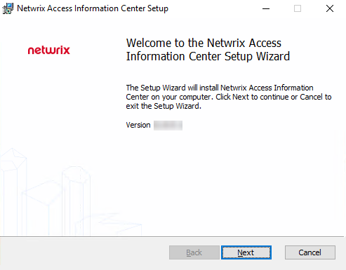

**Step 2 –** On the Welcome page, click **Next** to begin the installation process.

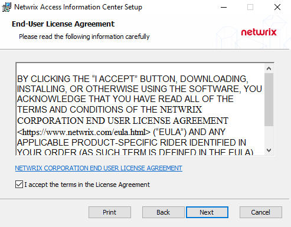

**Step 3 –** On the End-User License Agreement page, select the **I accept the terms in the License Agreement** checkbox and click **Next**.

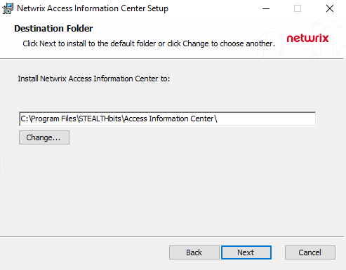

**Step 4 –** On the Destination Folder page, you can choose between the default destination folder and a custom folder. Click **Change** to browse for a different location. When the destination is set as desired, click **Next**.

**NOTE:** The default location is `C:\Program Files\STEALTHbits\Access Information Center\`. There are no specific requirements for changing the path.

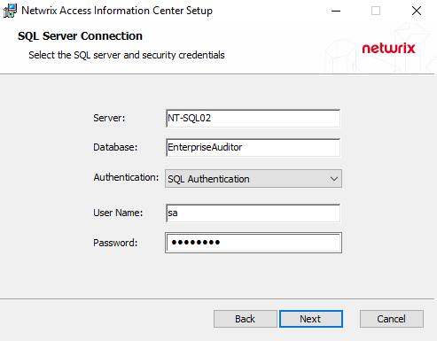

**Step 5 –** On the SQL Server Connection page, provide the required database information. Click **Next** to test the connection to the SQL Server. If there are no errors, the next wizard page opens.

* Server – Enter the database server hostname (NetBIOS name, FQDN, or IP address) with the instance name or non-standard port, if applicable, in one of the following formats:

  * No named instance, use `[SQLHostName]`, for example `NT-SQL02`
  * Named instance, use `[SQLHostName]\[SQLInstanceName]`, for example `NT-SQL02\Netwrix`
  * No named instance with non-standard port, use `[SQLHostName],[PortNumber]`, for example `NT-SQL02,72`
  * Named instance with non-standard port, use `[SQLHostName]\[SQLInstanceName],[PortNumber]`, for example `NT-SQL02\Netwrix,72`
* Database – Enter the name of the existing database

* Authentication – Select the Database service account type from the drop-down menu. Then enter the account information in the **User Name** and **Password** fields.
  * For Windows Authentication – **User Name** format must be `[DOMAIN]\[username]` , for example `NWXTECH\ad.bruce`

**NOTE:** The Server and Database information are available in the Access Analyzer Console in the **Settings** > **Storage** node, and will be auto-populated if installing the Access Information Center on the same server as Access Analyzer. The Database settings can be modified after installation. See the [Database Page](../Admin/Configuration/Database "Database Page") topic for additional information.

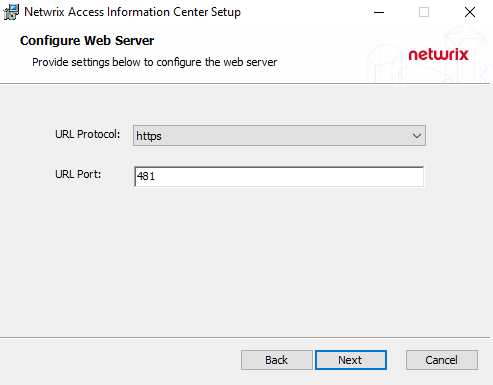

**Step 6 –**  On the Configure Web Server page, select the URL protocol and port on which the application will be accessible.

* To enable SSL, select **https** from the URL Protocol dropdown and set the URL Port number. The default port for SSL is 481.
* For a non-secured install, select **http** from the URL Protocol dropdown and set the URL Port to 81

**NOTE:** For new installations, the default configuration is https and 481. If you are upgrading an existing installation, the protocol and port are by default set to what is currently used by the Access Information Center.

When the protocol and port are set as desired, click **Next**. If you selected the http option, skip to step 8.

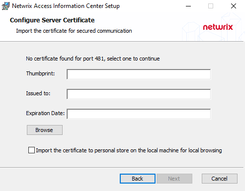

**Step 7 –** On the Configure Server Certificate page, provide the certificate for the SSL binding.

* For a new install or to change the certificate, use the Browse option to select your certificate

  * Click **Browse** to open the file explorer window. Browse to the folder where the certificate is located and select the certificate, then click **Open**.

    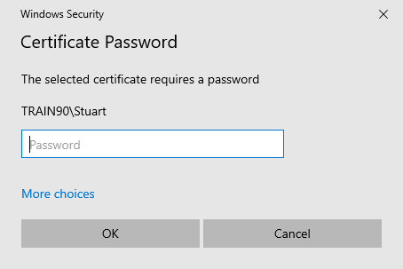
  * On the Certificate Password window, enter the password for the certificate. Click **OK**.
  * The certificate information is displayed in the fields. Optionally, select the **Import the certificate to the personal on the local machine for local browsing** option.

  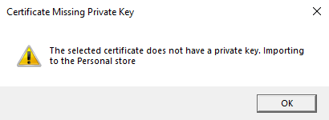

  **NOTE:** If the selected certificate resides in any of the Local Computer stores but does not have a private key, or if the certificate is not found in any of the stores, then it cannot be bound to the port. In these cases, the Certificate Missing Private Key warning message displays informing you that it will be imported to the Personal store. This means that the Import option is selected by default and grayed out to mandate the import of the certificate.

  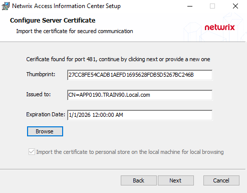
* If a valid certificate is already bound to the port used by the Access Information Center, then this is detected automatically and the fields are populated with the certificate information without needing to select the certificate or provide a password. The Import option is disabled.

  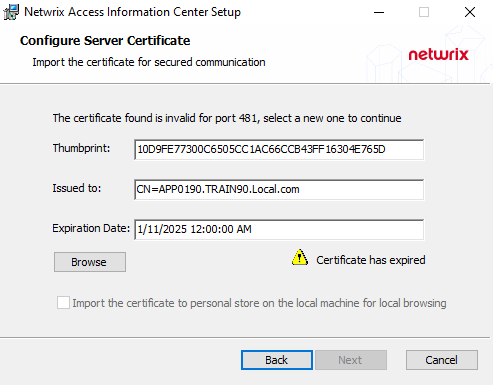
* If an expired certificate is detected, the certificate information is populated, but a warning message is displayed. You must provide a new valid certificate, before you can continue.

Once the certificate has been provided, click **Next** to continue.

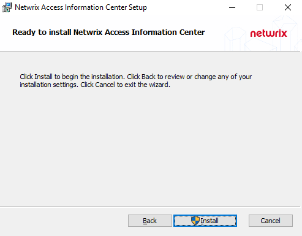

**Step 8 –** On the Ready to install page, click **Install** to begin the process.

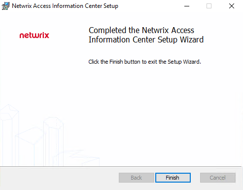

**Step 9 –** Once the installation has successfully completed, click **Finish** to exit the wizard.

The installation wizard placed an Netwrix Access Information Center icon on the desktop. Now proceed to the [First Launch](../Admin/FirstLaunch "First Launch") topic for next steps.

**NOTE:** If SSL was enabled, the provided certificate was bound to the port and the Access Information Center desktop icon contains the appropriate URL to the secured site.