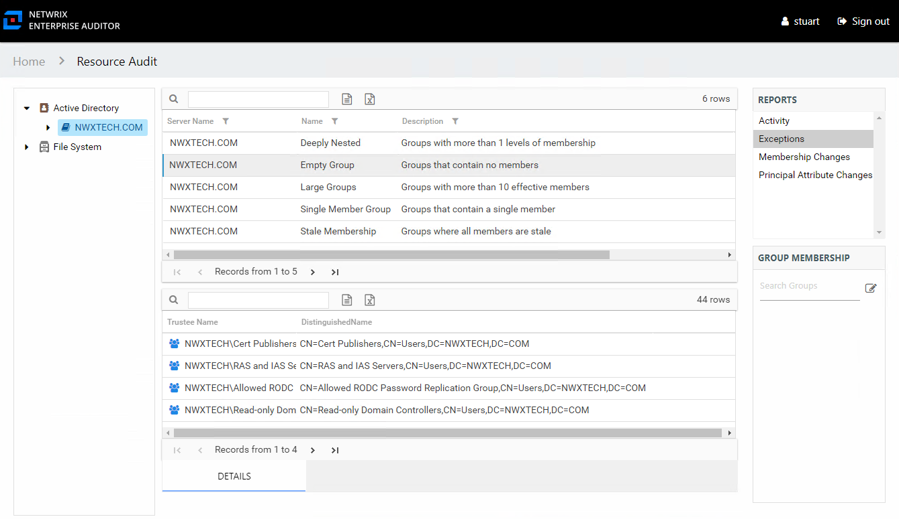

# Exceptions Report

The Exceptions report at the domain level provides a list of exceptions found on the selected domain. This report includes a Details table.

An exception is defined as a problem or risk to Active Directory security. Exceptions include deeply nested groups and stale membership. This table is blank if no exceptions are found within the targeted domain. This report is comprised of the following columns:

* Server Name – Name of the Domain
* Name – Type of exception found
* Description – Description of the exception type
* Count – Number of this type of exception found on the server

There is one table at the bottom displaying Details for the selected exception:

* Trustee Name – Name of the trustee
* DistinguishedName – Distinguished name for the trustee account