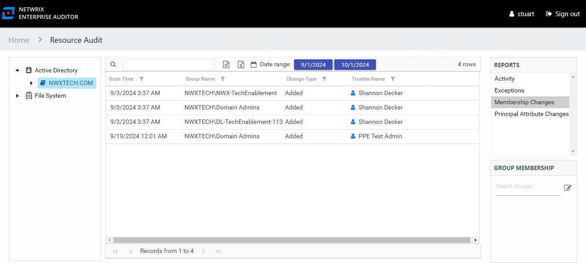

# Membership Changes Report

The Membership Changes report at the domain level provides list of groups that had membership changes on the selected domain during the specified date range.

This table is blank if no changes occurred during the specified date range. This report is comprised of the following columns:

* Scan Time – Date and timestamp of the Access Analyzer scan that identified the change
* Group Name – Name of the group
* Group Type – Type and scope of the group object: Domain Local/Global/Universal, Distribution/Security
* Description – Description of this group as read from Active Directory
* Group DN – Distinguished name for the group account
* Change Type – Type of change that occurred: Added or Removed
* Trustee Name – Owner of the trustee account
* Trustee Account – Active Directory account associated with the trustee
* Department – Department to which the trustee account belongs
* Title – Trustee’s title as read from Active Directory
* Mail – Trustee’s email account as read from Active Directory
* EmployeeId – Corporate ID for the employee as read from Active Directory
* Description – Description of the trustee object as read from Active Directory
* DistinguishedName – Distinguished name for the trustee account
* ObjectSid – Security ID of the object
* Disabled – True or False if trustee account is disabled
* Deleted – True or False if trustee account is deleted