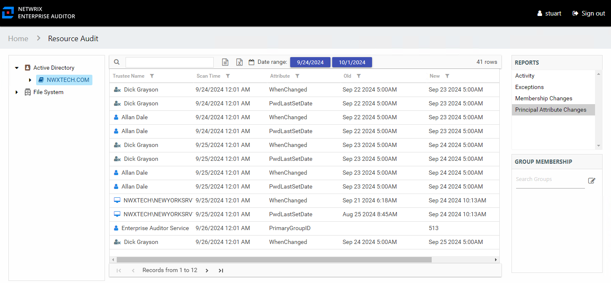

# Principal Attribute Changes Report

The Principal Attribute Changes report at the domain level provides change event information by trustee on the selected domain during the specified date range.

This table is blank if no changes occurred during the specified date range. This report is comprised of the following columns:

* Trustee Name – Owner of the trustee account
* Trustee Account – Active Directory account associated with the trustee
* Department – Department to which the trustee account belongss
* Title – Trustee’s title as read from Active Directory
* Mail – Trustee’s email account as read from Active Directory
* EmployeeId – Corporate ID for the employee as read from Active Directory
* Description – Description of the trustee object as read from Active Directory
* DistinguishedName – Distinguished name for the trustee account
* ObjectSid – Security ID of the object
* Disabled – True or False if trustee account is disabled
* Deleted – True or False if trustee account is deleted
* Scan Time – Date and timestamp of the Access Analyzer scan that identified the change
* Attribute – Attribute changed for the trustee
* Old – Original attribute value
* New – New attribute value