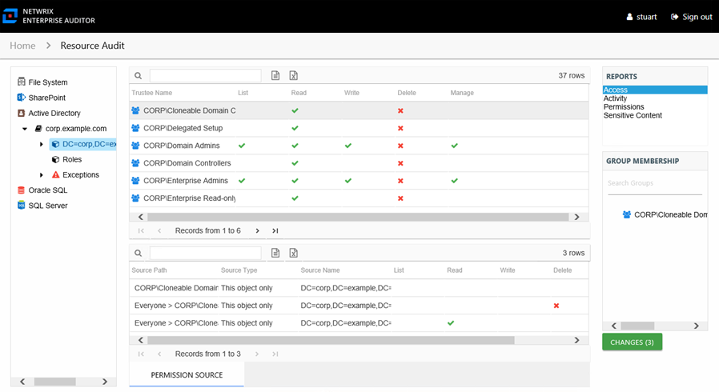

# Access Report

The Access report at the domain object level provides information on the level of access trustees have at the domain object level. This report includes a Permission Source table.

This report is comprised of the following columns:

* Trustee Type – Type of the trustee (for example, Domain User or Domain Group)
* Trustee Name – Owner of the trustee account
* Trustee Account – Active Directory account associated with the trustee
* Department – Department to which the trustee account belongs
* Title – Trustee’s title as read from Active Directory
* Mail – Trustee’s email account as read from Active Directory
* EmployeeId – Corporate ID for the employee as read from Active Directory
* Description – Description of the trustee object as read from Active Directory
* DistinguishedName – Distinguished name for the trustee account
* ObjectSid – Security ID of the object
* Disabled – True or False if trustee account is disabled
* Deleted – True or False if trustee account is deleted
* Stale – True or False if trustee account is stale (according to the length of inactive time used by the Access Analyzer data collection and analysis configuration to identify stale accounts)
* Direct – True or False if the permission is directly assigned
* List – Right to view list of resources
* Read – Right to view/read resources
* Write – Right to add or modify resources
* Delete – Right to delete resources
* Manage – Equivalent to full control over resources
* Changed – True or False if the trustee has changes modeled that would impact access to the selected resource

If the selected trustee in the top section of the report is a group, the Group Membership pane displays the group membership, including nested groups.

There is one table at the bottom displaying Permission Source for the select trustee. It contains all of the ways the selected trustee has been granted rights to the selected resource.

* Source Path – Location for which the audited object was granted rights to the selected resource, which can be represented two ways:

  * Directly Applied – Rights granted directly to the audited object
  * Access through another trustee, path starts with trustee assigned the direct rights and shows all nested groups leading to the audited object
* Source Type – Source of the permission (for example, Share, Folder, Site Permission, Web Application Policy, and so on)
* Source Name – Name of the resource where the permission is assigned
* List – Right to view list of resources
* Read – Right to view/read resources
* Write – Right to add or modify resources
* Delete – Right to delete resources
* Manage – Equivalent to full control over resources

The following columns display the combined direct and inherited rights:

* Allow Mask – Bitmask corresponding to Windows ACE permission bits for combined direct and inherited allow rights
* Deny Mask – Bitmask corresponding to Windows ACE permission bits for combined direct inherited deny rights