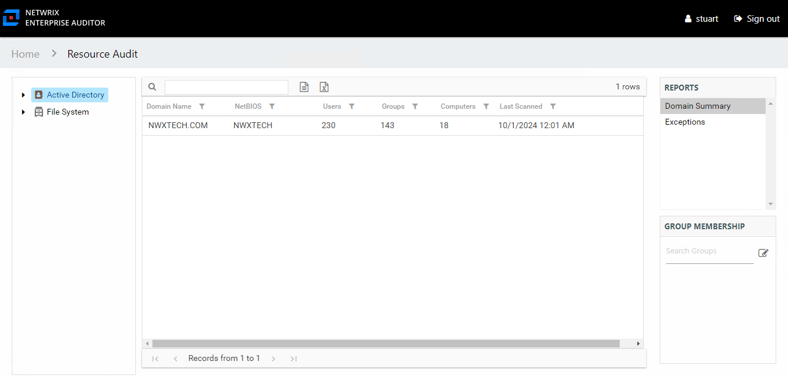

# Domain Summary Report

The Domain Summary report at the **Active Directory** node provides a top-level view of domains that have been scanned.

This report is comprised of the following columns:

* Domain Name – Name of the domain
* NetBIOS – NetBIOS name for the domain
* Users – Count of users in the domain
* Groups – Count of groups in the domain
* Computers – Count of computers in the domain
* Last Scanned – Date and timestamp of the last Access Analyzer scan